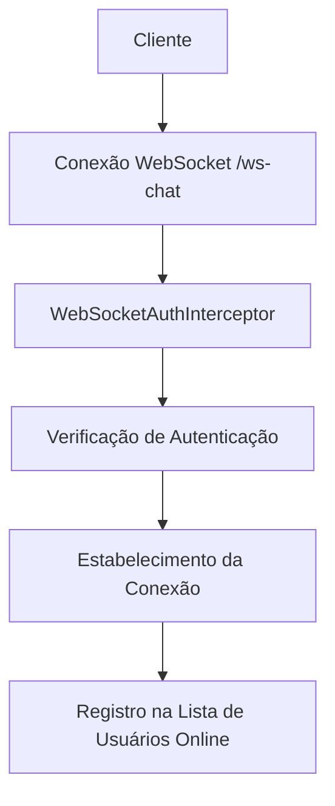
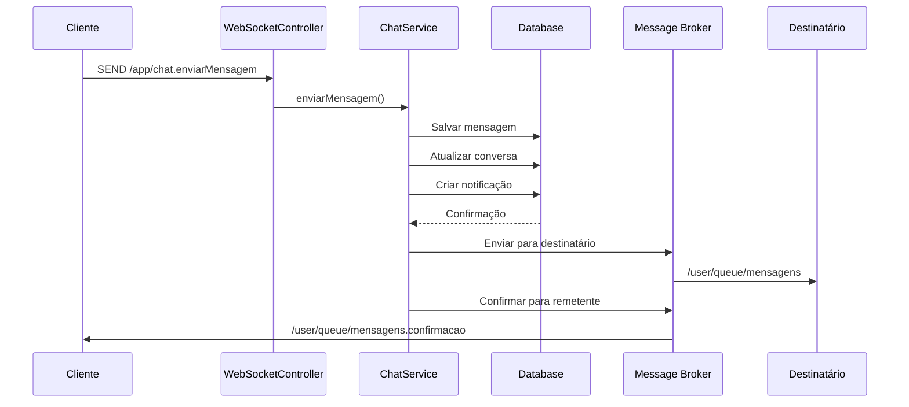
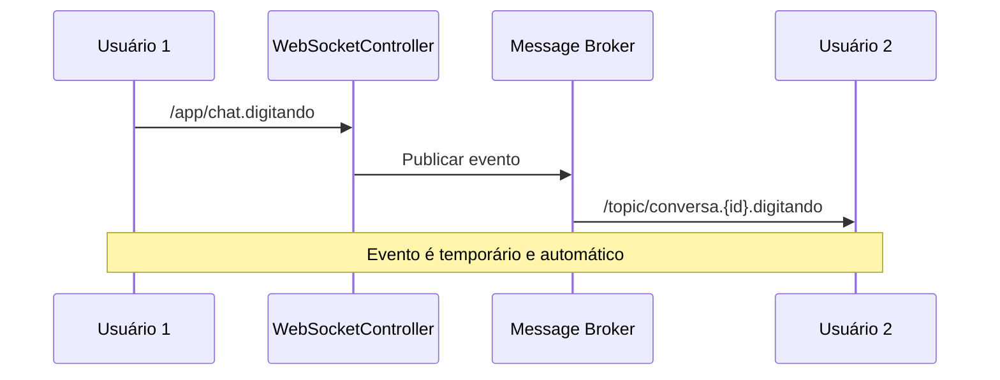
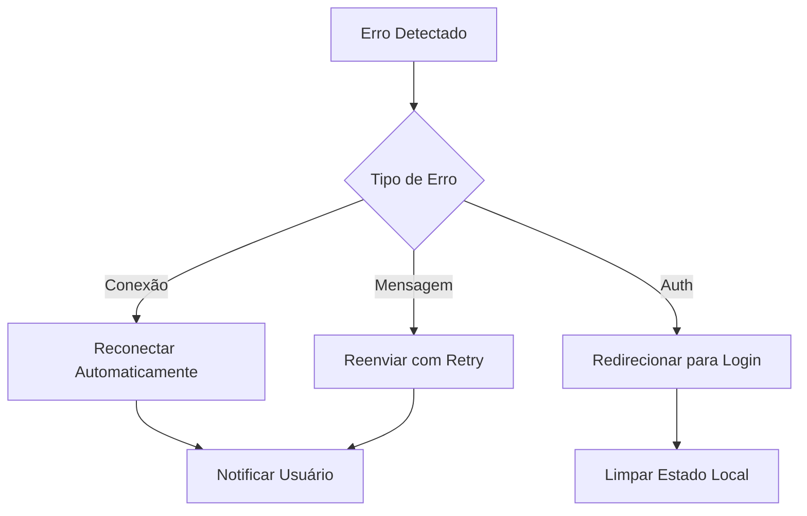

# Documentação do Sistema de Chat Interno - ERP Corporativo

## 1. Visão Geral

O sistema de chat interno do ERP Corporativo é uma funcionalidade completa de comunicação em tempo real que permite aos usuários do sistema trocar mensagens instantâneas. O sistema utiliza tecnologias modernas como WebSocket com protocolo STOMP para garantir comunicação bidirecional eficiente e em tempo real.

### Características Principais
- **Comunicação em tempo real** via WebSocket
- **Indicadores de digitação** em tempo real
- **Status de usuários online/offline**
- **Notificações de mensagens não lidas**
- **Histórico completo de conversas**
- **Interface responsiva** para desktop e mobile
- **Segurança integrada** com Spring Security

## 2. Arquitetura Técnica

### 2.1 Stack Tecnológica
- **Backend**: Spring Boot com WebSocket e STOMP
- **Frontend**: Thymeleaf, HTML5, CSS3, JavaScript vanilla
- **Protocolo**: WebSocket com STOMP (Simple Text Oriented Messaging Protocol)
- **Banco de Dados**: MySQL com JPA/Hibernate
- **Segurança**: Spring Security com interceptadores customizados

### 2.2 Padrões Arquiteturais
- **Publish-Subscribe**: Para distribuição de mensagens
- **MVC (Model-View-Controller)**: Organização do código backend
- **DTO (Data Transfer Object)**: Para transferência de dados
- **Repository Pattern**: Para acesso aos dados

## 3. Componentes do Sistema

### 3.1 Controladores

#### ChatController
Responsável pelos endpoints REST e renderização de páginas:
- `GET /chat` - Página principal do chat
- `GET /api/conversas` - Lista conversas do usuário
- `GET /api/conversas/{id}/mensagens` - Mensagens de uma conversa
- `POST /api/mensagens` - Envia nova mensagem
- `PUT /api/conversas/{id}/marcar-lidas` - Marca mensagens como lidas

#### ChatWebSocketController
Gerencia comunicação em tempo real via WebSocket:
- `/app/chat.enviarMensagem` - Envio de mensagens em tempo real
- `/app/chat.digitando` - Eventos de digitação
- `/app/chat.entrar` - Entrada de usuário no chat
- `/app/chat.sair` - Saída de usuário do chat

### 3.2 Serviços

#### ChatService
Centraliza toda a lógica de negócio do chat:
- Gerenciamento de conversas
- Envio e recebimento de mensagens
- Controle de mensagens lidas/não lidas
- Busca de usuários para chat

#### NotificacaoChatService
Gerencia notificações relacionadas ao chat:
- Criação de notificações para novas mensagens
- Controle de notificações lidas/não lidas
- Integração com sistema de notificações global

### 3.3 Modelos de Dados

#### Entidade Conversa
```sql
CREATE TABLE conversas (
    id BIGINT PRIMARY KEY AUTO_INCREMENT,
    usuario1_id BIGINT NOT NULL,
    usuario2_id BIGINT NOT NULL,
    data_criacao DATETIME NOT NULL,
    ultima_atividade DATETIME,
    ativa BOOLEAN DEFAULT TRUE
);
```

#### Entidade Mensagem
```sql
CREATE TABLE mensagens (
    id BIGINT PRIMARY KEY AUTO_INCREMENT,
    conversa_id BIGINT NOT NULL,
    remetente_id BIGINT NOT NULL,
    destinatario_id BIGINT NOT NULL,
    conteudo TEXT NOT NULL,
    data_envio DATETIME NOT NULL,
    lida BOOLEAN DEFAULT FALSE,
    data_leitura DATETIME,
    tipo ENUM('TEXTO', 'ARQUIVO', 'IMAGEM', 'SISTEMA')
);
```

#### Entidade NotificacaoChat
```sql
CREATE TABLE notificacoes_chat (
    id BIGINT PRIMARY KEY AUTO_INCREMENT,
    usuario_id BIGINT NOT NULL,
    remetente_id BIGINT NOT NULL,
    mensagem_id BIGINT NOT NULL,
    titulo VARCHAR(255) NOT NULL,
    conteudo TEXT NOT NULL,
    lida BOOLEAN DEFAULT FALSE,
    data_criacao DATETIME NOT NULL,
    data_leitura DATETIME
);
```

## 4. Fluxo de Funcionamento

### 4.1 Configuração WebSocket



#### Configuração do Message Broker
- **Broker Simples**: Habilitado para `/topic` e `/queue`
- **Prefixo de Aplicação**: `/app` para destinos da aplicação
- **Prefixo de Usuário**: `/user` para mensagens direcionadas

### 4.2 Fluxo de Envio de Mensagem



### 4.3 Fluxo de Indicador de Digitação



### 4.4 Fluxo de Status Online/Offline

```mermaid
graph TD
    A[Usuário Conecta] --> B[/app/chat.entrar]
    B --> C[Adicionar à Lista Online]
    C --> D[Notificar Outros Usuários]
    D --> E[/topic/usuarios.online]
    
    F[Usuário Desconecta] --> G[Detectar Desconexão]
    G --> H[Remover da Lista Online]
    H --> I[Notificar Offline]
    I --> J[/topic/usuarios.online]
```

## 5. Endpoints da API

### 5.1 Endpoints REST

| Método | Endpoint | Descrição |
|--------|----------|-----------|
| GET | `/chat` | Página principal do chat |
| GET | `/chat/api/conversas` | Lista todas as conversas do usuário |
| GET | `/chat/api/conversas/{id}/mensagens` | Busca mensagens paginadas |
| POST | `/chat/api/mensagens` | Envia nova mensagem |
| PUT | `/chat/api/conversas/{id}/marcar-lidas` | Marca mensagens como lidas |
| GET | `/chat/api/usuarios` | Busca usuários disponíveis |
| POST | `/chat/api/conversas` | Inicia nova conversa |
| GET | `/chat/api/mensagens-nao-lidas/count` | Conta mensagens não lidas |

### 5.2 Endpoints WebSocket

| Destino | Tipo | Descrição |
|---------|------|-----------|
| `/app/chat.enviarMensagem` | SEND | Enviar mensagem |
| `/app/chat.digitando` | SEND | Indicar digitação |
| `/app/chat.entrar` | SEND | Entrar no chat |
| `/app/chat.sair` | SEND | Sair do chat |
| `/user/queue/mensagens` | SUBSCRIBE | Receber mensagens |
| `/user/queue/mensagens.confirmacao` | SUBSCRIBE | Confirmações |
| `/topic/conversa.{id}.digitando` | SUBSCRIBE | Eventos de digitação |
| `/topic/usuarios.online` | SUBSCRIBE | Status online |

## 6. Interface do Usuário

### 6.1 Estrutura da Interface

A interface do chat é dividida em três seções principais:

#### Sidebar de Conversas
- Lista de todas as conversas do usuário
- Busca de conversas e usuários
- Indicadores de mensagens não lidas
- Status online dos usuários

#### Área Principal
- Histórico de mensagens da conversa selecionada
- Campo de digitação de mensagens
- Indicadores de digitação em tempo real
- Status de entrega das mensagens

#### Cabeçalho
- Informações do usuário da conversa atual
- Status online/offline
- Opções de configuração

### 6.2 Recursos da Interface

#### Indicadores Visuais
- **Badge de mensagens não lidas**: Contador vermelho nas conversas
- **Status online**: Círculo verde ao lado do nome do usuário
- **Indicador de digitação**: "Usuário está digitando..."
- **Status de entrega**: Ícones de enviado/entregue/lido

#### Responsividade
- Layout adaptável para desktop e mobile
- Sidebar colapsável em telas menores
- Touch-friendly para dispositivos móveis

## 7. Segurança

### 7.1 Autenticação WebSocket

```java
@Component
public class WebSocketAuthInterceptor implements ChannelInterceptor {
    @Override
    public Message<?> preSend(Message<?> message, MessageChannel channel) {
        // Verificação de autenticação do usuário
        // Validação de sessão ativa
        // Controle de acesso às mensagens
    }
}
```

### 7.2 Medidas de Segurança
- **Interceptação de mensagens**: Todas as mensagens passam por validação de autenticação
- **Validação de permissões**: Usuários só podem acessar suas próprias conversas
- **Sanitização de dados**: Prevenção contra XSS e injection
- **Rate limiting**: Controle de velocidade de envio de mensagens

## 8. Tratamento de Erros

### 8.1 Tipos de Erro

#### Erros de Conexão
- Falha na conexão WebSocket
- Timeout de conexão
- Perda de conectividade

#### Erros de Mensagem
- Falha no envio
- Destinatário não encontrado
- Conteúdo inválido

#### Erros de Autenticação
- Sessão expirada
- Usuário não autorizado
- Token inválido

### 8.2 Estratégias de Recuperação



## 9. Performance e Otimizações

### 9.1 Otimizações Implementadas

#### Paginação de Mensagens
- Carregamento sob demanda de mensagens antigas
- Limite de 20 mensagens por página
- Scroll infinito na interface

#### Cache de Conversas
- Lista de conversas mantida em memória
- Atualização incremental via WebSocket
- Redução de consultas ao banco

#### Compressão de Dados
- Uso de SockJS para fallback
- Compressão automática de mensagens grandes
- Otimização de payload JSON

### 9.2 Monitoramento

#### Métricas Coletadas
- Número de conexões ativas
- Taxa de mensagens por segundo
- Tempo de resposta médio
- Taxa de erros de conectividade

## 10. Problemas Identificados e Soluções

### 10.1 Status Atual da Funcionalidade

⚠️ **PARCIALMENTE FUNCIONAL** - O sistema de chat tem a base implementada, mas apresenta problemas de integração:

#### Problemas Identificados:

1. **APIs Não Implementadas**:
   - `/api/auth/current-user` (404)
   - `/api/chat/conversas` (404) 
   - `/api/chat/usuarios/buscar` (404)

2. **Recursos Estáticos Ausentes**:
   - `/sounds/notification.mp3` (404)
   - `/sounds/notification.ogg` (404)

3. **Incompatibilidade Frontend-Backend**:
   - JavaScript esperando APIs REST diferentes das implementadas
   - Estrutura de dados inconsistente entre frontend e backend
   - WebSocket endpoints com nomes diferentes

4. **Performance Issues**:
   - Query complexa carregando dados desnecessários do usuário
   - Múltiplos joins causando overhead

### 10.2 Soluções Necessárias

#### A. Corrigir APIs REST

**API de Usuário Atual:**
```java
@GetMapping("/api/auth/current-user")
@ResponseBody
public ResponseEntity<Usuario> getCurrentUser(Authentication authentication) {
    Optional<Usuario> usuario = usuarioService.findByUsuario(authentication.getName());
    return usuario.map(ResponseEntity::ok).orElse(ResponseEntity.notFound().build());
}
```

**API de Busca de Usuários:**
```java
@GetMapping("/api/chat/usuarios/buscar")
@ResponseBody  
public ResponseEntity<List<Usuario>> buscarUsuarios(
        @RequestParam String q,
        Authentication authentication) {
    Usuario usuario = usuarioService.findByUsuario(authentication.getName()).orElse(null);
    if (usuario == null) return ResponseEntity.badRequest().build();
    
    List<Usuario> usuarios = chatService.buscarUsuariosParaChat(usuario.getId(), q);
    return ResponseEntity.ok(usuarios);
}
```

#### B. Otimizar Query de Usuário

**Problema Atual:**
A query está fazendo múltiplos LEFT JOINs desnecessários, carregando colaboradores, cargos, departamentos e permissões.

**Solução:**
Criar um método específico para busca simples de usuário:

```java
@Query("SELECT u FROM Usuario u WHERE u.usuario = :usuario")
Optional<Usuario> findByUsuarioSimple(@Param("usuario") String usuario);
```

#### C. Adicionar Recursos de Audio

Criar diretório `/src/main/resources/static/sounds/` e adicionar:
- `notification.mp3`
- `notification.ogg`

#### D. Corrigir WebSocket Endpoints

**Frontend Atual:** `/app/chat/send`
**Backend Implementado:** `/app/chat.enviarMensagem`

**Solução:** Alinhar os nomes dos endpoints ou ajustar o frontend.

#### E. Ajustar Estrutura de Dados

**Frontend espera:**
```json
{
  "participantes": [{"id": 1, "nome": "João"}],
  "ultimaMensagem": "texto",
  "mensagensNaoLidas": 3
}
```

**Backend retorna:**
```json
{
  "outroUsuarioId": 1,
  "outroUsuarioNome": "João",
  "ultimaMensagem": "texto",
  "mensagensNaoLidas": 3
}
```

### 10.3 Cenários de Teste Após Correções

#### Teste de Comunicação Básica
1. Usuário A envia mensagem para Usuário B
2. Mensagem aparece instantaneamente para B
3. Confirmação de entrega para A
4. Contador de mensagens não lidas atualizado

#### Teste de Múltiplos Usuários
1. Vários usuários conectados simultaneamente
2. Mensagens cruzadas entre diferentes conversas
3. Status online/offline atualizando corretamente
4. Performance mantida com carga

#### Teste de Reconexão
1. Simular perda de conexão
2. Reconexão automática
3. Sincronização de mensagens perdidas
4. Estado da interface preservado

## 11. Plano de Correção

### 11.1 Prioridade Alta (Crítico)

1. **Implementar APIs ausentes** no `ChatController`
2. **Corrigir nomes dos endpoints WebSocket** para compatibilidade
3. **Adicionar recursos de áudio** para notificações
4. **Otimizar query de usuário** para melhor performance

### 11.2 Prioridade Média

1. **Padronizar estrutura de dados** entre frontend e backend
2. **Implementar fallbacks** para recursos ausentes
3. **Adicionar logs detalhados** para debugging

### 11.3 Prioridade Baixa

1. **Melhorar tratamento de erros** na interface
2. **Adicionar testes automatizados**
3. **Implementar cache** para conversas

## 12. Conclusão

O sistema de chat interno do ERP Corporativo tem uma **base sólida implementada**, mas requer correções para funcionar completamente. Os principais problemas são de integração entre frontend e backend, não de arquitetura.

**Status Atual:**
- ✅ **Backend Core**: WebSocket, serviços e modelos funcionais
- ⚠️ **APIs REST**: Precisam ser implementadas/corrigidas  
- ⚠️ **Frontend**: Precisa de ajustes para compatibilidade
- ❌ **Recursos Estáticos**: Ausentes

**Após as correções, o sistema oferecerá:**
- **Comunicação em tempo real** via WebSocket
- **Interface moderna e responsiva**
- **Notificações e indicadores visuais**
- **Segurança integrada** com Spring Security
- **Performance otimizada**