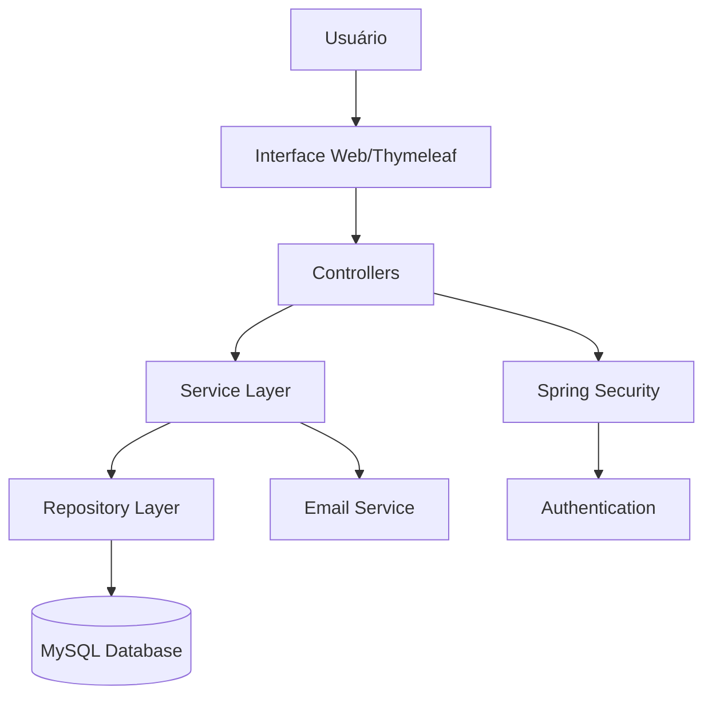
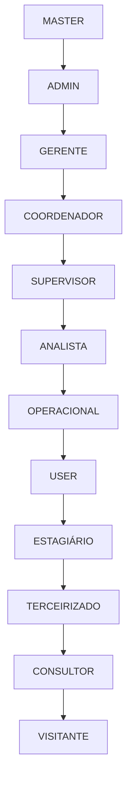
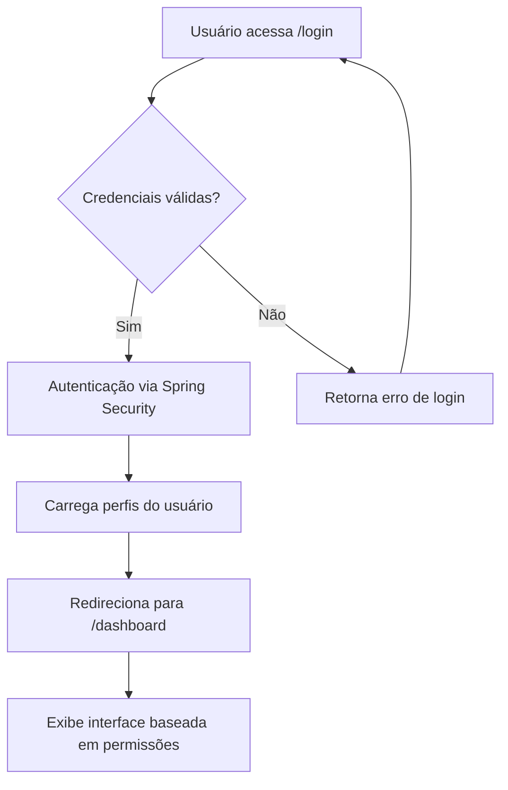
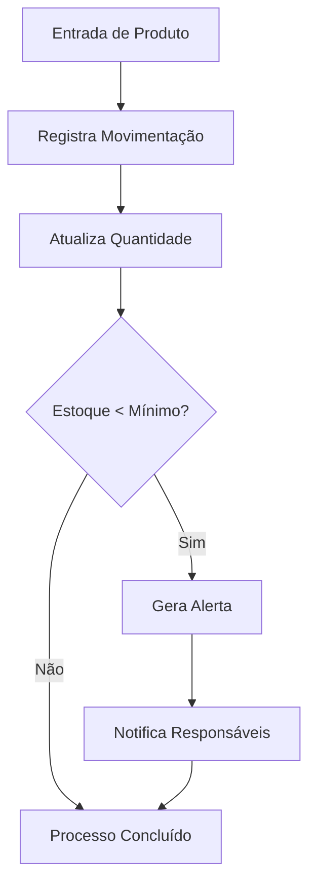
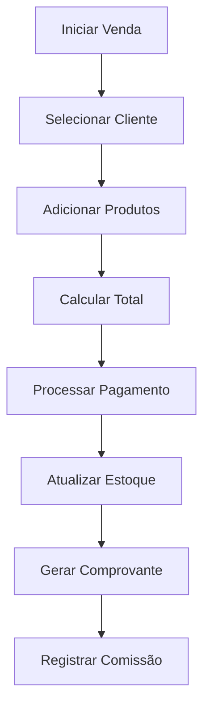

# 📊 Documentação Completa do Sistema ERP Corporativo

## 📋 Visão Geral do Sistema

### Descrição do Sistema
O ERP Corporativo é um sistema de gestão empresarial abrangente desenvolvido com **Spring Boot**, **Thymeleaf**, **MySQL** e tecnologias web modernas. O sistema é projetado para pequenas e médias empresas, oferecendo controle centralizado de processos administrativos, financeiros, de recursos humanos, vendas, estoque e muito mais.

### Tecnologias Utilizadas
- **Backend**: Java 17, Spring Boot 3.5.3, Spring Security, Spring Data JPA
- **Frontend**: Thymeleaf, HTML5, CSS3, JavaScript
- **Banco de Dados**: MySQL
- **Build**: Maven
- **Arquitetura**: Monolítica em camadas (MVC)

## 🏗️ Arquitetura do Sistema

### Padrão Arquitetural

### Estrutura de Camadas
- **Presentation Layer**: Templates Thymeleaf + Controllers
- **Business Layer**: Services (lógica de negócio)
- **Data Access Layer**: Repositories + JPA Entities
- **Security Layer**: Spring Security + Custom Authentication

## 👥 Sistema de Usuários e Permissões

### Níveis de Acesso Hierárquicos

### Permissões por Nível

| Nível | Descrição | Permissões |
|-------|-----------|------------|
| **MASTER** | Acesso total (protegido) | Todas as funcionalidades |
| **ADMIN** | Administrador completo | Gestão de usuários, configurações, relatórios |
| **GERENTE** | Gestão departamental | Supervisão, relatórios, aprovações |
| **COORDENADOR** | Coordenação de equipe | Operações departamentais |
| **SUPERVISOR** | Supervisão direta | Acompanhamento de equipe |
| **ANALISTA** | Operações analíticas | Relatórios, análises |
| **OPERACIONAL** | Operações básicas | Executar processos |
| **USER** | Usuário padrão | Funcionalidades básicas |

### Usuários Padrão do Sistema
| Usuário | Email | Senha | Nível | Função |
|---------|-------|--------|-------|--------|
| Master | master@sistema.com | master123 | MASTER | Administração total |
| Gerente RH | rh@empresa.com | rh123 | GERENTE | Gestão de RH |
| Coordenador | coordenador@empresa.com | coord123 | COORDENADOR | Coordenação de vendas |
| Operacional | operacional@empresa.com | op123 | OPERACIONAL | Operações básicas |

## 📊 Manual do Usuário

### Acesso ao Sistema
1. **Login**: Acesse `http://localhost:8080`
2. **Credenciais**: Use email e senha fornecidos
3. **Dashboard**: Interface principal com resumo executivo

### Navegação Principal

#### Dashboard
- **Visão Executiva**: Métricas consolidadas
- **Gráficos Interativos**: Vendas, faturamento, performance
- **Alertas**: Notificações importantes
- **Widgets**: KPIs por área (vendas, RH, estoque, financeiro)

#### Módulos Principais

##### 👤 Gestão de Usuários
- **Cadastro**: Criar novos usuários com perfis específicos
- **Edição**: Alterar dados, foto de perfil, status
- **Permissões**: Atribuir perfis e permissões específicas
- **Status**: Ativo, Inativo, Bloqueado, Demitido

##### 👥 Clientes
- **Cadastro PF/PJ**: Dados completos de clientes
- **Histórico**: Interações e pedidos
- **Contratos**: Gestão de contratos ativos
- **Relatórios**: Análises de clientes

##### 📦 Estoque
- **Inventário**: Controle completo de produtos
- **Movimentações**: Entradas, saídas, ajustes
- **Alertas**: Estoque baixo, vencimento
- **Transferências**: Entre localidades
- **Auditoria**: Rastreabilidade completa

##### 🛒 Vendas
- **PDV**: Ponto de venda integrado
- **Pedidos**: Gestão completa de vendas
- **Comissões**: Cálculo para vendedores
- **Relatórios**: Performance e análises

##### 🏭 Fornecedores
- **Cadastro**: Dados completos
- **Avaliações**: Sistema de rating
- **Contratos**: Gestão de acordos
- **Pagamentos**: Controle financeiro

## 🏢 Módulos do Sistema

### Status de Implementação

#### 🟢 Módulos Funcionais (80-95% Completos)

##### 1. Dashboard (95% Completo)
**Funcionalidades Implementadas:**
- Interface executiva completa
- Gráficos de vendas últimos 12 meses
- Métricas consolidadas (clientes, vendas, estoque, funcionários)
- Widgets de performance por área
- Integração com todos os módulos principais

**Localização:** `DashboardController.java`, `templates/dashboard/`

##### 2. Usuários (90% Completo)
**Funcionalidades Implementadas:**
- CRUD completo com validações
- Sistema de perfis e permissões hierárquico
- Upload de foto de perfil
- Gestão de status (Ativo, Inativo, Bloqueado, Demitido)
- Controle de acesso baseado em níveis

**Localização:** `UsuarioController.java`, `templates/usuarios/`

##### 3. Estoque (85% Completo)
**Funcionalidades Implementadas:**
- Controle completo de inventário
- Sistema de alertas de estoque baixo
- Movimentações (entrada, saída, ajuste)
- Transferências entre localidades
- Auditoria de movimentações
- Relatórios de estoque

**Localização:** `EstoqueController.java`, `MovimentacaoEstoqueController.java`

##### 4. Clientes (80% Completo)
**Funcionalidades Implementadas:**
- Cadastro completo PF/PJ
- Histórico de interações
- Integração com vendas
- Busca avançada
- Controle de status

**Localização:** `ClienteController.java`, `templates/clientes/`

##### 5. Produtos (75% Completo)
**Funcionalidades Implementadas:**
- Catálogo completo de produtos
- Sistema de categorização
- Controle de preços
- Integração com estoque
- API REST básica

**Localização:** `ProdutoController.java`, `ProdutoRestController.java`

#### 🟡 Módulos Parcialmente Implementados (50-70%)

##### 6. Vendas (60% Completo)
**Funcionalidades Implementadas:**
- Cadastro básico de vendas
- Interface PDV inicial
- Relatórios básicos de vendas
- Cálculos de comissão

**Pendente:**
- Integração completa com produtos
- Relatórios avançados
- Finalização do PDV
- Controle de devoluções

**Localização:** `VendaController.java`, `templates/vendas/`

##### 7. Fornecedores (70% Completo)
**Funcionalidades Implementadas:**
- CRUD básico completo
- Sistema de avaliação
- Contratos básicos
- Histórico de compras

**Pendente:**
- Dashboard específico para fornecedores
- Relatórios avançados
- Integração financeira completa

**Localização:** `FornecedorController.java`, `templates/fornecedor/`

##### 8. RH - Recursos Humanos (50% Completo)
**Funcionalidades Implementadas:**
- Estrutura básica de colaboradores
- Modelos de dados para benefícios
- Controllers básicos para gestão
- Estrutura de escalas e ponto

**Localização:** `controller/rh/`, `model/` (entidades relacionadas)

**Submodelos Implementados:**
- **Colaboradores**: Cadastro básico, hierarquia
- **Benefícios**: Plano saúde, vale transporte, vale refeição
- **Ponto**: Estrutura para registro de ponto
- **Folha**: Estrutura básica de folha de pagamento

**Pendente:**
- Implementação completa da folha de pagamento
- Interface de usuário para benefícios
- Sistema de ponto eletrônico
- Relatórios de RH

##### 9. Chat (30% Completo)
**Funcionalidades Implementadas:**
- Interface básica de chat
- Modelos de mensagens
- WebSocket configurado

**Pendente:**
- Funcionalidade de mensagens em tempo real
- Notificações
- Histórico de conversas

**Localização:** `ChatController.java`, `templates/chat/`

##### 10. Contratos (60% Completo)
**Funcionalidades Implementadas:**
- Cadastro e listagem de contratos
- Controle de status
- Integração básica com clientes/fornecedores

**Pendente:**
- Gestão de renovações
- Alertas de vencimento
- Sistema de aprovações

**Localização:** `ContratosController.java`, `templates/contrato/`

#### 🔴 Módulos com Estrutura Básica (5-20%)

##### 11. Financeiro (20% Completo)
**Estrutura Criada:**
- Templates básicos criados
- Controller básico implementado

**Pendente:**
- Contas a pagar/receber
- Fluxo de caixa
- Relatórios financeiros
- Conciliação bancária

**Localização:** `FinanceiroController.java`, `templates/financeiro/`

##### 12. Marketing (15% Completo)
**Estrutura Criada:**
- Templates básicos
- Controller inicial

**Pendente:**
- Gestão de campanhas
- Controle de leads
- ROI e métricas
- Integração com vendas

**Localização:** `MarketingController.java`, `templates/marketing/`

##### 13. TI (15% Completo)
**Estrutura Criada:**
- Templates básicos
- Controller inicial

**Pendente:**
- Sistema de tickets
- Inventário de TI
- Monitoramento de sistemas
- Base de conhecimento

**Localização:** `TiController.java`, `templates/ti/`

##### 14. Jurídico (10% Completo)
**Estrutura Criada:**
- Templates básicos
- Controller inicial

**Pendente:**
- Gestão de processos
- Compliance
- Contratos jurídicos
- Documentação legal

**Localização:** `JuridicoController.java`, `templates/juridico/`

##### 15. Agenda (10% Completo)
**Estrutura Criada:**
- Template básico
- Controller inicial

**Pendente:**
- Calendário interativo
- Gestão de eventos
- Lembretes
- Integração com outros módulos

**Localização:** `controller/agenda/`, `templates/agenda/`

##### 16-19. Outros Módulos (5-10% Completos)
- **Serviços**: Template básico criado
- **Relatórios**: Template básico criado
- **Configurações**: Template básico criado
- **Metas**: Template básico criado
- **Documentos**: Template básico criado
- **Favoritos**: Template básico criado
- **Suporte**: Template básico criado

## 🔄 Fluxos do Sistema

### Fluxo de Login e Autenticação

### Fluxo de Gestão de Estoque

### Fluxo de Vendas

## 📈 Backlog de Desenvolvimento

### FASE 1: Finalização dos Módulos Core (Prioridade ALTA)

#### 1.1 Módulo RH - Completar (50% → 90%)
**Épico: Implementação Completa do RH**

**User Stories:**
- Como gerente de RH, quero calcular folha de pagamento automaticamente
- Como colaborador, quero visualizar meu holerite online
- Como administrador, quero gerenciar benefícios dos funcionários
- Como supervisor, quero controlar ponto eletrônico da equipe

**Tarefas Técnicas:**
1. **Folha de Pagamento**
   - Implementar cálculos de salário base, horas extras, descontos
   - Criar interface para geração de holerites
   - Desenvolver relatórios de folha por período
   - Implementar aprovação de folha

2. **Benefícios**
   - Completar gestão de planos de saúde
   - Implementar vale transporte e vale refeição
   - Criar telas de adesão e cancelamento
   - Desenvolver relatórios de benefícios

3. **Ponto Eletrônico**
   - Implementar registro de ponto via web
   - Criar sistema de correção de ponto
   - Desenvolver relatórios de frequência
   - Implementar integração com folha

**Entregáveis:**
- Controllers completos para RH
- Templates Thymeleaf funcionais
- APIs REST para integração
- Testes unitários

**Estimativa:** 3-4 semanas

#### 1.2 Módulo Financeiro - Implementar (20% → 90%)
**Épico: Sistema Financeiro Completo**

**User Stories:**
- Como gerente financeiro, quero controlar contas a pagar e receber
- Como administrador, quero visualizar fluxo de caixa em tempo real
- Como contador, quero gerar relatórios financeiros padronizados
- Como CEO, quero acompanhar indicadores financeiros no dashboard

**Tarefas Técnicas:**
1. **Contas a Pagar**
   - Criar entidade `ContaPagar` e repository
   - Implementar CRUD completo
   - Desenvolver sistema de aprovações
   - Criar alertas de vencimento

2. **Contas a Receber**
   - Criar entidade `ContaReceber` e repository
   - Implementar controle de inadimplência
   - Desenvolver cobrança automática
   - Integrar com vendas

3. **Fluxo de Caixa**
   - Implementar dashboard financeiro
   - Criar projeções de caixa
   - Desenvolver gráficos interativos
   - Implementar exportação de relatórios

4. **Conciliação Bancária**
   - Implementar importação de extratos
   - Criar reconciliação automática
   - Desenvolver relatórios de divergências

**Entregáveis:**
- Módulo financeiro completo
- Dashboard financeiro
- Relatórios DRE e Balanço
- Integração com outros módulos

**Estimativa:** 4-5 semanas

#### 1.3 Módulo Vendas - Finalizar (60% → 95%)
**Épico: Sistema de Vendas Avançado**

**User Stories:**
- Como vendedor, quero um PDV completo e intuitivo
- Como gerente de vendas, quero relatórios detalhados de performance
- Como cliente, quero receber comprovantes automáticos
- Como administrador, quero controlar devoluções e trocas

**Tarefas Técnicas:**
1. **PDV Completo**
   - Finalizar interface de ponto de venda
   - Implementar cálculos automáticos (impostos, descontos)
   - Integrar múltiplas formas de pagamento
   - Criar impressão de cupom fiscal

2. **Relatórios Avançados**
   - Desenvolver relatórios por vendedor
   - Criar análises de produtos mais vendidos
   - Implementar métricas de conversion rate
   - Desenvolver comparativos mensais/anuais

3. **Devoluções e Trocas**
   - Implementar sistema de devoluções
   - Criar controle de trocas
   - Desenvolver estorno automático para estoque
   - Implementar relatórios de devoluções

**Entregáveis:**
- PDV completamente funcional
- Suite de relatórios de vendas
- Sistema de devoluções
- Integração completa com estoque

**Estimativa:** 2-3 semanas

### FASE 2: Módulos Estratégicos (Prioridade MÉDIA)

#### 2.1 Módulo Marketing - Implementar (15% → 80%)
**Épico: CRM e Marketing Digital**

**User Stories:**
- Como gerente de marketing, quero gerenciar campanhas publicitárias
- Como analista, quero acompanhar ROI das campanhas
- Como vendedor, quero acessar leads qualificados
- Como CEO, quero métricas de marketing no dashboard

**Tarefas Técnicas:**
1. **Gestão de Campanhas**
   - Criar entidade `Campanha` com orçamento e métricas
   - Implementar calendário de campanhas
   - Desenvolver relatórios de ROI
   - Integrar com mídias sociais (APIs)

2. **CRM Básico**
   - Implementar funil de vendas
   - Criar gestão de leads
   - Desenvolver scoring automático
   - Integrar com módulo de vendas

3. **Análise de Marketing**
   - Criar dashboard específico de marketing
   - Implementar métricas de conversão
   - Desenvolver relatórios de canais
   - Integrar Google Analytics

**Estimativa:** 3-4 semanas

#### 2.2 Módulo Jurídico - Implementar (10% → 80%)
**Épico: Gestão Jurídica e Compliance**

**Tarefas Técnicas:**
1. **Gestão de Contratos**
   - Implementar versionamento de contratos
   - Criar sistema de assinatura digital
   - Desenvolver alertas de renovação
   - Implementar workflow de aprovação

2. **Gestão de Processos**
   - Criar controle de processos judiciais
   - Implementar acompanhamento de prazos
   - Desenvolver controle de custos jurídicos
   - Integrar com sistema de documentos

3. **Compliance**
   - Implementar checklists de conformidade
   - Criar sistema de auditoria
   - Desenvolver relatórios de compliance
   - Implementar alertas regulatórios

**Estimativa:** 3-4 semanas

#### 2.3 Módulo TI - Implementar (15% → 80%)
**Épico: Gestão de TI e Suporte**

**Tarefas Técnicas:**
1. **Sistema de Tickets**
   - Implementar sistema de chamados
   - Criar controle de SLA
   - Desenvolver base de conhecimento
   - Implementar dashboard de atendimento

2. **Inventário de TI**
   - Criar controle de equipamentos
   - Implementar gestão de licenças
   - Desenvolver controle de garantias
   - Criar relatórios de inventário

3. **Monitoramento**
   - Implementar logs de sistema
   - Criar alertas de performance
   - Desenvolver dashboard de infraestrutura
   - Implementar backup automático

**Estimativa:** 4-5 semanas

### FASE 3: Módulos Complementares (Prioridade BAIXA)

#### 3.1 Módulos Básicos - Completar (5% → 70%)
**Épicos menores:**

1. **Agenda e Calendário**
   - Implementar calendário interativo
   - Criar gestão de eventos corporativos
   - Desenvolver sistema de lembretes
   - Integrar com outros módulos

2. **Documentos**
   - Implementar repositório de documentos
   - Criar controle de versões
   - Desenvolver sistema de busca
   - Implementar permissões de acesso

3. **Relatórios Dinâmicos**
   - Criar construtor de relatórios
   - Implementar exportação múltiplos formatos
   - Desenvolver agendamento de relatórios
   - Criar dashboard personalizado

4. **Configurações do Sistema**
   - Implementar configurações globais
   - Criar gestão de parâmetros
   - Desenvolver backup e restore
   - Implementar logs de auditoria

**Estimativa Total Fase 3:** 4-6 semanas

## 🎯 Roadmap de Implementação

### Cronograma Geral

| Fase | Módulos | Duração | Status |
|------|---------|---------|--------|
| **Fase 1** | RH, Financeiro, Vendas | 8-12 semanas | 🔄 Em andamento |
| **Fase 2** | Marketing, Jurídico, TI | 10-13 semanas | ⏳ Planejado |
| **Fase 3** | Agenda, Docs, Relatórios | 4-6 semanas | ⏳ Futuro |

### Marcos Importantes

1. **Marco 1**: Sistema RH Completo (Semana 4)
2. **Marco 2**: Sistema Financeiro Operacional (Semana 9)
3. **Marco 3**: PDV Vendas Finalizado (Semana 12)
4. **Marco 4**: CRM Marketing Implementado (Semana 16)
5. **Marco 5**: Sistema Completo em Produção (Semana 25)

## 🛠️ Aspectos Técnicos

### Melhorias de Arquitetura Recomendadas

1. **Performance**
   - Implementar cache Redis para consultas frequentes
   - Otimizar queries JPA com índices apropriados
   - Implementar paginação em todas as listagens

2. **Segurança**
   - Implementar audit logs para todas as operações
   - Adicionar 2FA para usuários administrativos
   - Implementar rate limiting nas APIs

3. **Escalabilidade**
   - Considerar migração para microserviços gradual
   - Implementar message queues para operações assíncronas
   - Adicionar load balancing para alta disponibilidade

4. **Monitoramento**
   - Implementar APM (Application Performance Monitoring)
   - Adicionar health checks em todos os serviços
   - Criar dashboard de observabilidade

### Tecnologias Futuras a Considerar

1. **Frontend Moderno**
   - React/Vue.js para interfaces mais dinâmicas
   - Progressive Web App (PWA) para mobile
   - WebSockets para real-time features

2. **Backend Avançado**
   - Spring Cloud para microserviços
   - Apache Kafka para event streaming
   - Elasticsearch para busca avançada

3. **DevOps**
   - Docker containerization completa
   - Kubernetes para orquestração
   - CI/CD pipeline automático