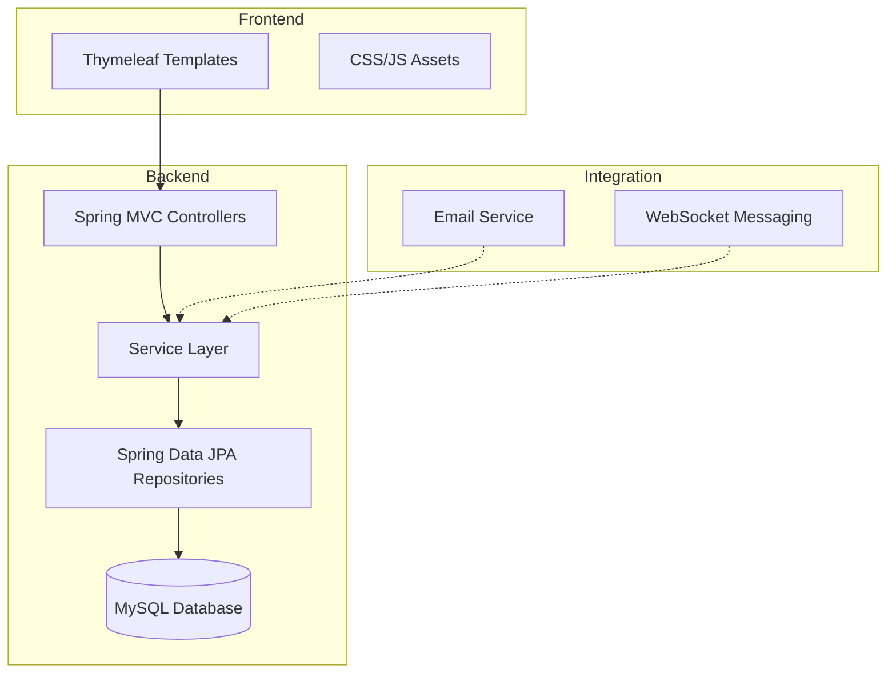

# Análise da Documentação do Sistema ERP Corporativo

## 1. Visão Geral

### 1.1 Descrição do Sistema
O ERP Corporativo é um sistema de planejamento empresarial abrangente desenvolvido com Spring Boot, Thymeleaf, MySQL e HTML/CSS puro. O sistema é projetado para pequenas e médias empresas, com foco em modularidade, usabilidade e escalabilidade.

### 1.2 Arquitetura do Sistema
O sistema segue uma arquitetura monolítica em camadas com os seguintes componentes principais:

- **Camada de Apresentação**: Templates Thymeleaf, CSS e JavaScript
- **Camada Web**: Controladores Spring MVC que tratam requisições HTTP
- **Camada de Serviço**: Lógica de negócio encapsulada em classes de serviço
- **Camada de Acesso a Dados**: Interfaces de repositório Spring Data JPA
- **Camada de Banco de Dados**: MySQL como armazenamento persistente
- **Camada de Integração**: Serviços externos para e-mail, mensagens em tempo real (WebSocket) e manipulação de arquivos

### 1.3 Estrutura Organizacional
O sistema é organizado em módulos funcionais independentes que seguem um padrão de fatiamento vertical:

- Cada módulo (RH, Financeiro, Estoque, Vendas, etc.) possui seus próprios controladores, serviços e templates
- Os modelos e repositórios são compartilhados entre módulos quando necessário
- A navegação entre módulos é feita através de uma barra lateral consistente

## 2. Módulos Implementados

### 2.1 Módulos Principais

#### Dashboard e Relatórios
- Controlador principal: `DashboardController`
- Funcionalidades: Métricas em tempo real, indicadores de desempenho, alertas
- Integração com todos os principais módulos do sistema

#### Gestão de Usuários
- Controladores: `UsuarioController`, `PerfilController`, `PermissaoController`
- Funcionalidades: CRUD completo, gestão de perfis e permissões, redefinição de senha
- Integração com sistema de e-mail para notificações

#### Módulo de Estoque
- Controladores: `EstoqueController`, `MovimentacaoEstoqueController`, `TransferenciaEstoqueController`, `InventarioController`, `AuditoriaEstoqueController`
- Funcionalidades: Controle de inventário, movimentações, transferências, auditorias
- Alertas de estoque baixo e relatórios

#### Gestão de Clientes
- Controladores: Localizados no diretório `cliente/`
- Funcionalidades: Cadastro completo de clientes PF/PJ, histórico de interações

#### Gestão de Produtos
- Controladores: `ProdutoController`, `CategoriaController`
- Funcionalidades: Catálogo de produtos, categorização, precificação

#### Módulo de Vendas
- Controlador principal: `VendaController`
- Funcionalidades: Processamento de pedidos, gestão de comissões, devoluções
- Integração com módulo de produtos/estoque

#### Módulo de Recursos Humanos (RH)
- Controladores: Estrutura organizada no diretório `rh/` com submódulos
  - `RhController`
  - `WorkflowAdesaoController`
  - Submódulos: benefícios, colaborador, folha, ponto
- Funcionalidades: Gestão de colaboradores, folha de pagamento, benefícios, ponto e escalas

#### Sistema de Chat Interno
- Controladores: `ChatController`, `ChatRestController`, `ChatWebSocketController`
- Funcionalidades: Mensagens em tempo real, salas de chat
- Integração com WebSocket para comunicação em tempo real

### 2.2 Módulos Secundários

#### Fornecedores
- Controladores: `FornecedorController`, `AvaliacaoFornecedorController`
- Funcionalidades: Cadastro de fornecedores, avaliações, contratos

#### Financeiro
- Controlador principal: `FinanceiroController`
- Funcionalidades: Contas a pagar/receber, fluxo de caixa

#### Contratos
- Controlador: `ContratosController`
- Funcionalidades: Gestão de contratos com clientes e fornecedores

#### Marketing
- Controlador: `MarketingController`
- Funcionalidades: Campanhas, leads, eventos

#### Jurídico
- Controlador: `JuridicoController`
- Funcionalidades: Gestão de processos jurídicos

#### TI
- Controlador: `TiController`
- Funcionalidades: Gestão de sistemas e suporte

## 3. Comparação com Documentação Existente

### 3.1 Estado Atual vs Documentação
A documentação "Documento Completo do Sistema" apresenta uma visão do estado do sistema que não reflete com precisão a implementação atual:

#### Discrepâncias Identificadas:

1. **Módulo de RH**:
   - Documentação afirma 50% de implementação
   - Implementação real mostra estrutura completa com múltiplos controladores e serviços
   - Submódulos como benefícios, folha de pagamento e ponto já possuem implementação significativa

2. **Módulo Financeiro**:
   - Documentação afirma 20% de implementação
   - Código fonte mostra controladores e serviços implementados
   - Existe `FinanceiroController` com funcionalidades de contas a pagar/receber

3. **Módulo de Chat**:
   - Documentação afirma 30% de implementação
   - Código fonte mostra implementação completa com controladores REST e WebSocket
   - Existe integração com WebSocket para mensagens em tempo real

4. **Módulo de Vendas**:
   - Documentação afirma 60% de implementação
   - `VendaController` possui 37KB de código, indicando implementação substancial

### 3.2 Estrutura de Módulos
A estrutura real do sistema é mais completa do que descrita na documentação:

- Todos os módulos principais possuem implementação significativa
- A organização por diretórios reflete uma arquitetura modular bem definida
- Existe uma separação clara entre controladores, serviços e modelos

## 4. Necessidade de Atualização da Documentação

### 4.1 Áreas que Requerem Atualização Imediata

1. **Percentuais de Implementação**:
   - Todos os percentuais precisam ser revisados e atualizados
   - A maioria dos módulos está significativamente mais avançada do que indicado

2. **Estado dos Módulos**:
   - Classificações como "Estrutura Básica" não refletem a realidade
   - Módulos considerados parcialmente implementados na verdade possuem funcionalidades completas

3. **Cronograma de Implementação**:
   - O plano de implementação precisa ser revisado
   - Muitas funcionalidades já estão implementadas e deveriam ser marcadas como concluídas

### 4.2 Recomendações de Atualização

1. **Revisão Completa dos Percentuais**:
   - Realizar auditoria linha por linha dos controladores e serviços
   - Atualizar os percentuais com base na cobertura de funcionalidades reais

2. **Atualização da Estrutura de Módulos**:
   - Documentar a estrutura atual de diretórios
   - Mapear todas as dependências entre módulos

3. **Revisão do Cronograma**:
   - Identificar funcionalidades realmente pendentes
   - Ajustar o cronograma para refletir o trabalho restante

4. **Documentação Técnica**:
   - Criar documentação técnica detalhada para cada módulo
   - Documentar APIs e pontos de integração

## 5. Conclusão

A documentação atual do sistema ERP Corporativo não reflete com precisão o estado de implementação real. A maioria dos módulos está significativamente mais avançada do que indicado, e vários estão completamente implementados.

É fundamental atualizar a documentação para refletir com precisão o estado atual do sistema, especialmente os percentuais de implementação e o cronograma de trabalhos futuros. Uma documentação precisa é essencial para:

- Planejamento de novas funcionalidades
- Onboarding de novos desenvolvedores
- Manutenção do sistema
- Comunicação com stakeholders

Recomenda-se uma auditoria completa da implementação atual para atualizar os percentuais de progresso e revisar o plano de implementação.