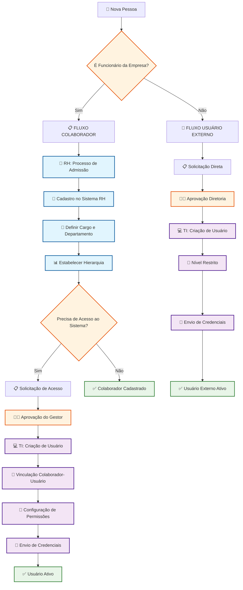
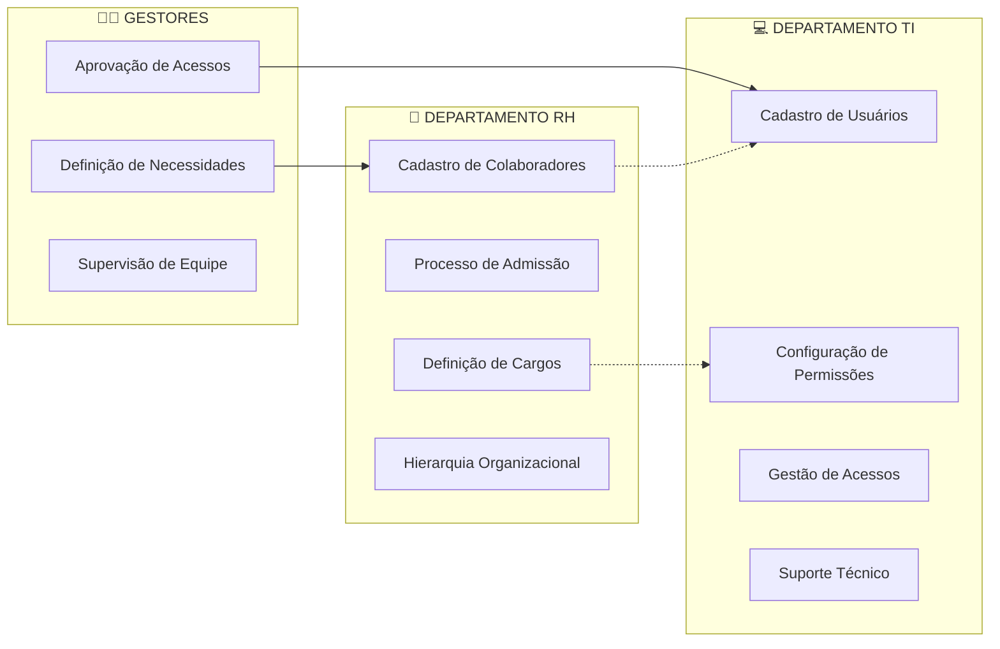
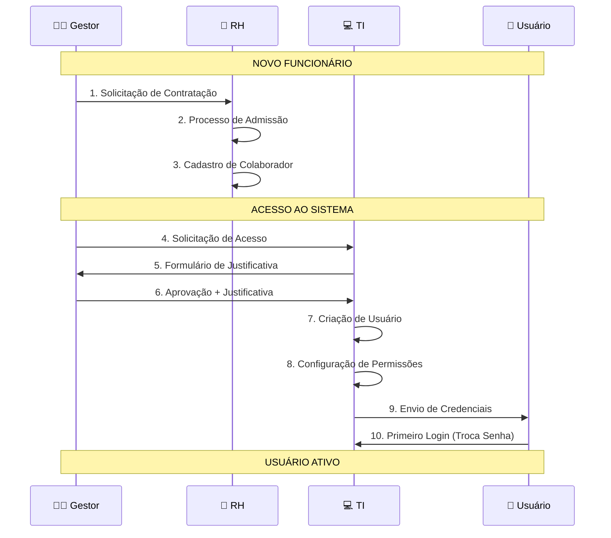
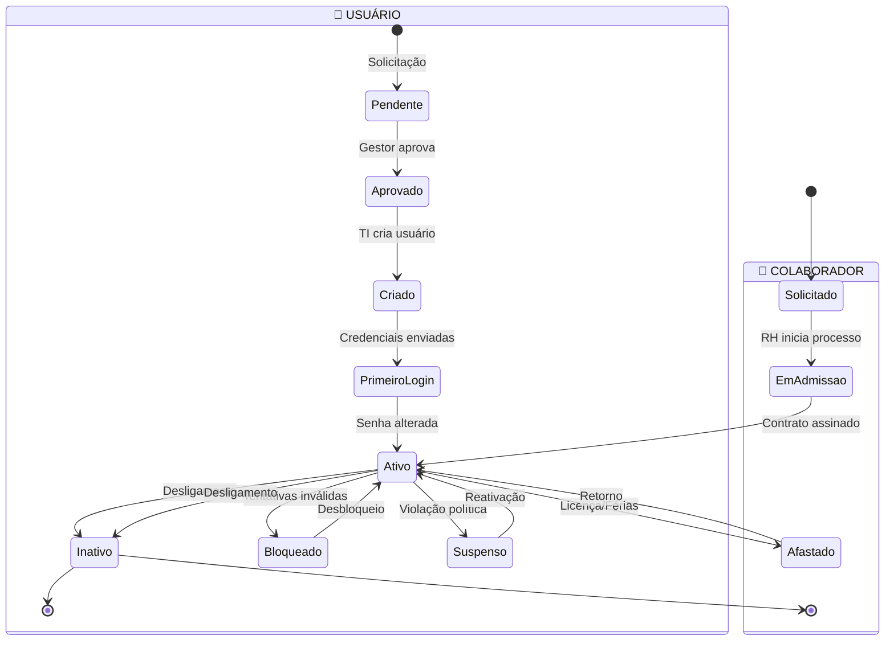
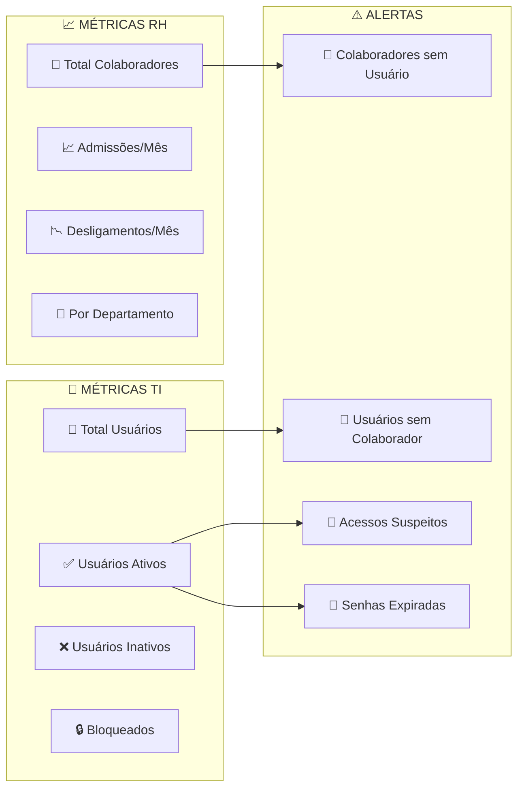

# 🔄 Diagrama de Fluxo: Cadastro de Usuários e Colaboradores

## 📊 Fluxo Visual Completo

---

## 🎯 Matriz de Responsabilidades

---

## 🔐 Níveis de Acesso por Área

```mermaid
flowchart TD
    subgraph "🏢 ESTRUTURA ORGANIZACIONAL"
        MASTER[🔴 MASTER<br/>Acesso Total]
        ADMIN[🟠 ADMIN<br/>Administrativo]
        GERENTE[🟡 GERENTE<br/>Gerencial]
        COORD[🟢 COORDENADOR<br/>Coordenação]
        SUPER[🔵 SUPERVISOR<br/>Supervisão]
        ANALISTA[🟣 ANALISTA<br/>Analítico]
        OPER[⚫ OPERACIONAL<br/>Operacional]
    end
    
    subgraph "👥 ÁREA RH"
        RH1[Gerente RH - GERENTE]
        RH2[Analista RH - ANALISTA]
        RH3[Assistente RH - OPERACIONAL]
    end
    
    subgraph "💻 ÁREA TI"
        TI1[Gerente TI - GERENTE]
        TI2[Analista Sistemas - ANALISTA]
        TI3[Suporte - OPERACIONAL]
    end
    
    subgraph "💰 ÁREA FINANCEIRO"
        FIN1[Controller - GERENTE]
        FIN2[Analista Financeiro - ANALISTA]
        FIN3[Assistente - OPERACIONAL]
    end
    
    subgraph "🛒 ÁREA COMERCIAL"
        COM1[Gerente Comercial - GERENTE]
        COM2[Vendedor - OPERACIONAL]
        COM3[Representante - OPERACIONAL]
    end
    
    GERENTE --> RH1
    GERENTE --> TI1
    GERENTE --> FIN1
    GERENTE --> COM1
    
    ANALISTA --> RH2
    ANALISTA --> TI2
    ANALISTA --> FIN2
    
    OPER --> RH3
    OPER --> TI3
    OPER --> FIN3
    OPER --> COM2
    OPER --> COM3
```

---

## 📋 Processo de Aprovação

---

## 🔄 Estados do Usuário/Colaborador

---

## 📊 Dashboard de Controle

---

## 🎯 Checklist de Implementação

### ✅ Fase 1: Preparação
- [ ] Definir políticas de acesso
- [ ] Treinar equipe RH
- [ ] Treinar equipe TI
- [ ] Criar templates de documentos

### ✅ Fase 2: Implementação
- [ ] Configurar sistema
- [ ] Migrar dados existentes
- [ ] Testar fluxos
- [ ] Validar permissões

### ✅ Fase 3: Operação
- [ ] Monitorar métricas
- [ ] Ajustar processos
- [ ] Treinar novos usuários
- [ ] Manter documentação atualizada

---

*Este diagrama complementa o documento principal de fluxo de cadastros*