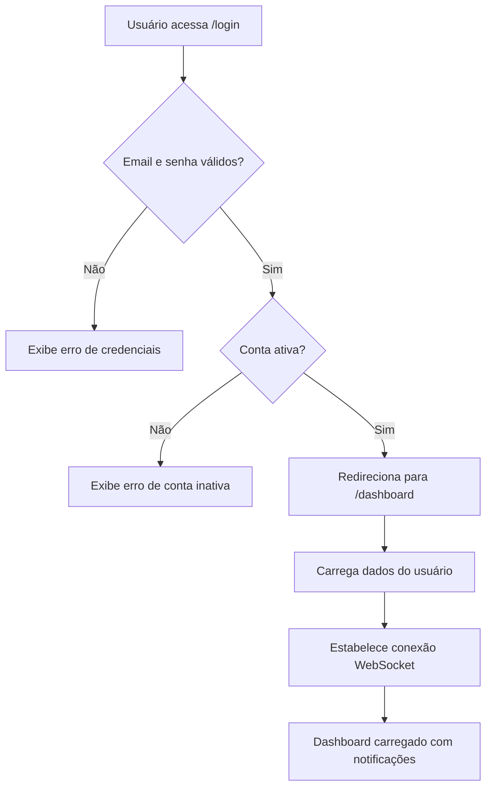
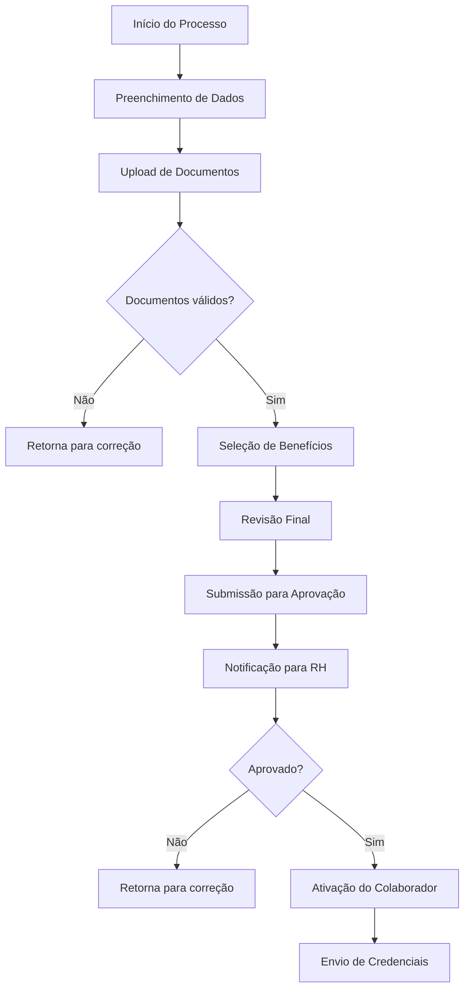
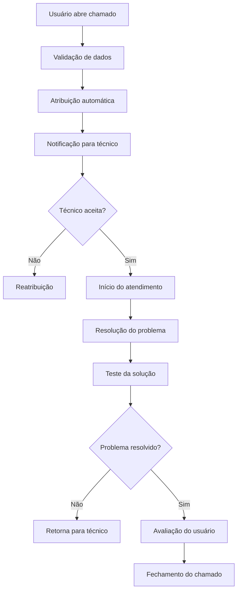
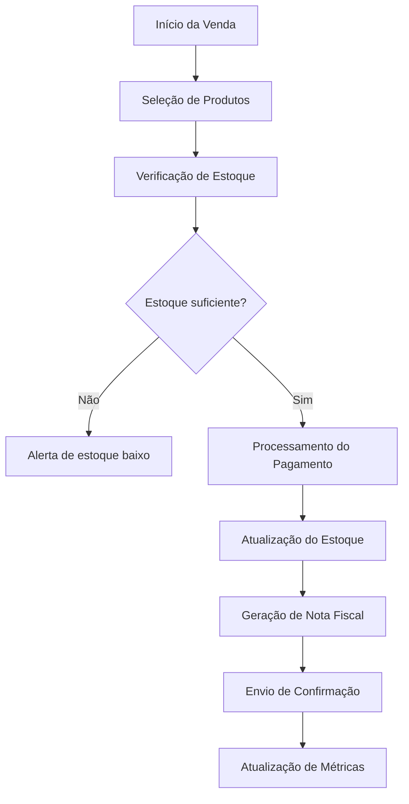

# DOCUMENTAÇÃO COMPLETA - PORTAL CEO
## Sistema Integrado de Gestão Empresarial

---

## 📋 ÍNDICE

1. [Visão Geral do Sistema](#visão-geral-do-sistema)
2. [Arquitetura e Tecnologias](#arquitetura-e-tecnologias)
3. [Módulos do Sistema](#módulos-do-sistema)
4. [Manual do Usuário](#manual-do-usuário)
5. [Fluxos de Trabalho](#fluxos-de-trabalho)
6. [APIs e Endpoints](#apis-e-endpoints)
7. [Configuração e Instalação](#configuração-e-instalação)
8. [Segurança](#segurança)
9. [Notificações em Tempo Real](#notificações-em-tempo-real)
10. [Troubleshooting](#troubleshooting)

---

## 🎯 VISÃO GERAL DO SISTEMA

### Descrição
O **Portal CEO** é um sistema integrado de gestão empresarial desenvolvido em Spring Boot que centraliza todas as operações de uma empresa, desde vendas e estoque até recursos humanos e suporte técnico.

### Principais Características
- **Interface Web Responsiva**: Desenvolvida com Bootstrap 5 e Thymeleaf
- **Notificações em Tempo Real**: WebSocket para alertas instantâneos
- **Dashboard Executivo**: Métricas e KPIs em tempo real
- **Módulos Integrados**: Vendas, RH, Estoque, Suporte, Financeiro
- **Sistema de Permissões**: Controle granular de acesso por perfil
- **Auditoria Completa**: Rastreamento de todas as operações

### Tecnologias Utilizadas
- **Backend**: Spring Boot 3.5.5, Spring Security, Spring Data JPA
- **Frontend**: Thymeleaf, Bootstrap 5, Chart.js, jQuery
- **Banco de Dados**: MySQL 8.0
- **Tempo Real**: WebSocket com STOMP
- **Build**: Maven 3.9+

---

## 🏗️ ARQUITETURA E TECNOLOGIAS

### Estrutura do Projeto
```
src/main/java/com/jaasielsilva/portalceo/
├── config/          # Configurações (Security, WebSocket, etc.)
├── controller/      # Controladores REST e MVC
├── dto/            # Data Transfer Objects
├── model/          # Entidades JPA
├── repository/     # Repositórios Spring Data JPA
├── service/        # Lógica de negócio
├── security/       # Configurações de segurança
└── validation/     # Validações customizadas
```

### Padrões Arquiteturais
- **MVC (Model-View-Controller)**: Separação clara de responsabilidades
- **Repository Pattern**: Abstração da camada de dados
- **Service Layer**: Encapsulamento da lógica de negócio
- **DTO Pattern**: Transferência otimizada de dados
- **Observer Pattern**: Sistema de notificações

---

## 📦 MÓDULOS DO SISTEMA

### 1. 🏠 DASHBOARD EXECUTIVO
**Localização**: `/dashboard`

**Funcionalidades**:
- Métricas de vendas e faturamento
- Gráficos de performance por categoria
- Indicadores de RH (contratações, processos de adesão)
- Alertas de estoque crítico
- Status de solicitações pendentes

**Principais KPIs**:
- Faturamento mensal e crescimento
- Total de clientes e novos clientes (30 dias)
- Produtos em estoque e produtos críticos
- Funcionários ativos e contratações (12 meses)
- Processos de adesão por status

### 2. 👥 MÓDULO DE RECURSOS HUMANOS
**Localização**: `/rh`

#### 2.1 Gestão de Colaboradores
- **Cadastro**: `/rh/colaboradores/novo`
- **Listagem**: `/rh/colaboradores/listar`
- **Edição**: `/rh/colaboradores/editar/{id}`
- **Ficha Completa**: `/rh/colaboradores/ficha/{id}`

#### 2.2 Processo de Adesão
- **Início**: `/rh/colaboradores/adesao/inicio`
- **Documentos**: `/rh/colaboradores/adesao/documentos`
- **Benefícios**: `/rh/colaboradores/adesao/beneficios`
- **Revisão**: `/rh/colaboradores/adesao/revisao`
- **Status**: `/rh/colaboradores/adesao/status`

#### 2.3 Benefícios
- **Vale Transporte**: `/rh/beneficios/vale-transporte`
- **Vale Refeição**: `/rh/beneficios/vale-refeicao`
- **Plano de Saúde**: `/rh/beneficios/plano-de-saude`

#### 2.4 Folha de Pagamento
- **Geração**: `/rh/folha-pagamento/gerar`
- **Holerites**: `/rh/folha-pagamento/holerite`
- **Relatórios**: `/rh/folha-pagamento/relatorios`

#### 2.5 Ponto e Escalas
- **Registros**: `/rh/ponto-escalas/registros`
- **Escalas**: `/rh/ponto-escalas/escalas`
- **Correções**: `/rh/ponto-escalas/correcoes`

### 3. 🛒 MÓDULO DE VENDAS
**Localização**: `/vendas`

**Funcionalidades**:
- Gestão de produtos e categorias
- Controle de estoque
- Processamento de vendas
- Relatórios de performance
- Gestão de clientes

### 4. 📦 MÓDULO DE ESTOQUE
**Localização**: `/estoque`

**Funcionalidades**:
- Controle de entrada e saída
- Alertas de estoque baixo
- Inventário e auditoria
- Transferências entre locais
- Relatórios de movimentação

### 5. 🎫 MÓDULO DE SUPORTE
**Localização**: `/suporte`

**Funcionalidades**:
- Abertura de chamados
- Atribuição e acompanhamento
- Sistema de prioridades
- Chat interno
- Avaliação de atendimento

### 6. 💰 MÓDULO FINANCEIRO
**Localização**: `/financeiro`

**Funcionalidades**:
- Contas a pagar e receber
- Fluxo de caixa
- Relatórios financeiros
- Controle de inadimplência

### 7. 👤 GESTÃO DE USUÁRIOS
**Localização**: `/usuarios`

**Funcionalidades**:
- Cadastro e edição de usuários
- Controle de perfis e permissões
- Solicitações de acesso
- Relatórios de usuários

---

## 📖 MANUAL DO USUÁRIO

### Acesso ao Sistema

#### 1. Login
1. Acesse `http://localhost:8080/login`
2. Digite seu email e senha
3. Clique em "Entrar"

#### 2. Recuperação de Senha
1. Na tela de login, clique em "Esqueci minha senha"
2. Digite seu email cadastrado
3. Verifique sua caixa de entrada
4. Siga as instruções do email

### Navegação Principal

#### Dashboard
- **Acesso**: Menu lateral → Dashboard
- **Funcionalidades**:
  - Visualizar métricas principais
  - Acessar gráficos interativos
  - Ver notificações em tempo real
  - Navegar para módulos específicos

#### Menu Lateral
- **Dashboard**: Visão geral do sistema
- **Vendas**: Gestão de vendas e produtos
- **Estoque**: Controle de inventário
- **RH**: Recursos humanos
- **Suporte**: Sistema de chamados
- **Financeiro**: Gestão financeira
- **Usuários**: Gestão de usuários

### Formulários e Preenchimento

#### Cadastro de Colaborador
1. **Acesse**: RH → Colaboradores → Novo
2. **Preencha os campos obrigatórios**:
   - Nome completo
   - Email corporativo
   - CPF (formato: 000.000.000-00)
   - Data de nascimento
   - Cargo e departamento
   - Data de admissão
3. **Campos opcionais**:
   - Telefone
   - Endereço completo
   - Dados bancários
   - Informações de emergência
4. **Clique em "Salvar"**

#### Abertura de Chamado
1. **Acesse**: Suporte → Novo Chamado
2. **Selecione a categoria**:
   - Hardware
   - Software
   - Rede
   - Acesso
   - Outros
3. **Descreva o problema**:
   - Título descritivo
   - Descrição detalhada
   - Prioridade (Baixa, Média, Alta, Crítica)
4. **Anexe arquivos** (opcional)
5. **Clique em "Abrir Chamado"**

#### Processo de Adesão
1. **Início**: RH → Colaboradores → Adesão → Início
2. **Preencha dados pessoais**
3. **Upload de documentos**:
   - RG (frente e verso)
   - CPF
   - Comprovante de residência
   - Certidão de nascimento
   - Comprovante de escolaridade
4. **Seleção de benefícios**:
   - Vale transporte
   - Vale refeição
   - Plano de saúde
5. **Revisão final**
6. **Submissão para aprovação**

### Notificações

#### Visualização
- **Ícone de sino**: Canto superior direito
- **Badge vermelho**: Número de notificações não lidas
- **Clique no sino**: Abre painel de notificações

#### Tipos de Notificação
- **Sistema**: Atualizações e alertas gerais
- **Chamados**: Atribuições e atualizações
- **RH**: Aprovações e processos
- **Vendas**: Metas e alertas
- **Estoque**: Produtos críticos

#### Ações Disponíveis
- **Marcar como lida**: Clique no botão "Marcar como lida"
- **Marcar todas como lidas**: Botão no topo do painel
- **Silenciar**: Evitar notificações de um tipo específico

---

## 🔄 FLUXOS DE TRABALHO

### Fluxo de Login e Autenticação


### Fluxo de Processo de Adesão


### Fluxo de Chamado de Suporte


### Fluxo de Venda


---

## 🔌 APIS E ENDPOINTS

### Autenticação
```
POST /login                    # Login do usuário
POST /logout                   # Logout do usuário
POST /api/auth/forgot-password # Recuperação de senha
POST /api/auth/reset-password  # Reset de senha
```

### Dashboard
```
GET  /dashboard                # Página principal
GET  /api/dashboard/metrics    # Métricas do dashboard
GET  /api/dashboard/charts     # Dados para gráficos
```

### Usuários
```
GET    /api/usuarios           # Listar usuários
POST   /api/usuarios           # Criar usuário
GET    /api/usuarios/{id}      # Buscar usuário
PUT    /api/usuarios/{id}      # Atualizar usuário
DELETE /api/usuarios/{id}      # Deletar usuário
```

### Colaboradores (RH)
```
GET    /api/rh/colaboradores              # Listar colaboradores
POST   /api/rh/colaboradores              # Criar colaborador
GET    /api/rh/colaboradores/{id}         # Buscar colaborador
PUT    /api/rh/colaboradores/{id}         # Atualizar colaborador
DELETE /api/rh/colaboradores/{id}         # Deletar colaborador
POST   /api/rh/colaboradores/adesao       # Iniciar processo de adesão
GET    /api/rh/colaboradores/adesao/{id}  # Status do processo
```

### Documentos de Adesão
```
POST   /api/rh/colaboradores/adesao/documentos/upload    # Upload de documento
GET    /api/rh/colaboradores/adesao/documentos/listar    # Listar documentos
DELETE /api/rh/colaboradores/adesao/documentos/remover   # Remover documento
GET    /api/rh/colaboradores/adesao/documentos/download  # Download de documento
```

### Chamados de Suporte
```
GET    /api/suporte/chamados           # Listar chamados
POST   /api/suporte/chamados           # Criar chamado
GET    /api/suporte/chamados/{id}      # Buscar chamado
PUT    /api/suporte/chamados/{id}      # Atualizar chamado
POST   /api/suporte/chamados/{id}/atribuir  # Atribuir chamado
POST   /api/suporte/chamados/{id}/fechar    # Fechar chamado
```

### Notificações
```
GET    /api/notifications              # Listar notificações
POST   /api/notifications/{id}/marcar-lida  # Marcar como lida
POST   /api/notifications/marcar-todas-lidas  # Marcar todas como lidas
GET    /api/notifications/unread-count # Contador de não lidas
```

### WebSocket (Tempo Real)
```
/ws/notifications              # Notificações em tempo real
/topic/global-notifications    # Notificações globais
/user/queue/notifications      # Notificações pessoais
/user/queue/unread-count       # Atualizações de contador
```

---

## ⚙️ CONFIGURAÇÃO E INSTALAÇÃO

### Pré-requisitos
- Java 21+
- Maven 3.9+
- MySQL 8.0+
- Node.js (para desenvolvimento frontend)

### Instalação

#### 1. Clone o Repositório
```bash
git clone <repository-url>
cd erp-corporativo
```

#### 2. Configure o Banco de Dados
```sql
CREATE DATABASE portal_ceo;
CREATE USER 'portal_ceo'@'localhost' IDENTIFIED BY 'sua_senha';
GRANT ALL PRIVILEGES ON portal_ceo.* TO 'portal_ceo'@'localhost';
FLUSH PRIVILEGES;
```

#### 3. Configure as Propriedades
Edite `src/main/resources/application.properties`:
```properties
spring.datasource.url=jdbc:mysql://localhost:3306/portal_ceo
spring.datasource.username=portal_ceo
spring.datasource.password=sua_senha
spring.jpa.hibernate.ddl-auto=update
```

#### 4. Execute a Aplicação
```bash
mvn clean install
mvn spring-boot:run
```

#### 5. Acesse o Sistema
- URL: `http://localhost:8080`
- Login padrão: `admin@empresa.com` / `admin123`

### Configuração de Produção

#### 1. Perfil de Produção
```properties
# application-prod.properties
spring.profiles.active=prod
spring.jpa.hibernate.ddl-auto=validate
logging.level.org.springframework.security=WARN
```

#### 2. Configuração de Segurança
```properties
# application-security.properties
app.security.jwt.secret=sua_chave_secreta_muito_forte
app.security.jwt.expiration=86400000
```

#### 3. Deploy com Docker
```dockerfile
FROM openjdk:21-jdk-slim
COPY target/portal-ceo-0.0.1-SNAPSHOT.jar app.jar
EXPOSE 8080
ENTRYPOINT ["java","-jar","/app.jar"]
```

---

## 🔒 SEGURANÇA

### Autenticação e Autorização
- **Spring Security**: Framework de segurança
- **JWT Tokens**: Autenticação stateless
- **BCrypt**: Hash de senhas
- **CSRF Protection**: Proteção contra ataques CSRF
- **Rate Limiting**: Limitação de tentativas de login

### Controle de Acesso
- **Perfis de Usuário**: ADMIN, GERENTE, COORDENADOR, etc.
- **Permissões Granulares**: Controle por funcionalidade
- **Sessões Seguras**: Timeout automático
- **Logs de Auditoria**: Rastreamento de ações

### Validação de Dados
- **Input Validation**: Validação de entrada
- **SQL Injection Protection**: Prepared statements
- **XSS Protection**: Sanitização de dados
- **File Upload Security**: Validação de arquivos

### Configurações de Segurança
```java
@Configuration
@EnableWebSecurity
public class SecurityConfig {
    
    @Bean
    public SecurityFilterChain filterChain(HttpSecurity http) {
        return http
            .authorizeHttpRequests(auth -> auth
                .requestMatchers("/login", "/css/**", "/js/**").permitAll()
                .requestMatchers("/admin/**").hasRole("ADMIN")
                .anyRequest().authenticated()
            )
            .formLogin(form -> form
                .loginPage("/login")
                .defaultSuccessUrl("/dashboard")
            )
            .logout(logout -> logout
                .logoutSuccessUrl("/login")
            )
            .build();
    }
}
```

---

## 🔔 NOTIFICAÇÕES EM TEMPO REAL

### Arquitetura WebSocket
- **STOMP Protocol**: Messaging sobre WebSocket
- **SockJS**: Fallback para navegadores antigos
- **Spring WebSocket**: Integração com Spring Boot

### Tipos de Notificação
1. **Pessoais**: Enviadas para usuário específico
2. **Globais**: Enviadas para todos os usuários
3. **Por Perfil**: Enviadas para perfis específicos

### Implementação Frontend
```javascript
// Conexão WebSocket
const socket = new SockJS('/ws');
const stompClient = Stomp.over(socket);

stompClient.connect({}, function(frame) {
    // Inscrever-se para notificações pessoais
    stompClient.subscribe('/user/queue/notifications', function(message) {
        const notification = JSON.parse(message.body);
        showToastNotification(notification);
    });
    
    // Inscrever-se para notificações globais
    stompClient.subscribe('/topic/global-notifications', function(message) {
        const notification = JSON.parse(message.body);
        showToastNotification(notification);
    });
});
```

### Implementação Backend
```java
@Service
public class RealtimeNotificationService {
    
    @Autowired
    private SimpMessagingTemplate messagingTemplate;
    
    public void sendNotificationToUser(Usuario user, Notification notification) {
        messagingTemplate.convertAndSendToUser(
            user.getEmail(), "/queue/notifications", notification);
    }
    
    public void sendGlobalNotification(Notification notification) {
        messagingTemplate.convertAndSend("/topic/global-notifications", notification);
    }
}
```

---

## 🛠️ TROUBLESHOOTING

### Problemas Comuns

#### 1. Erro de Conexão com Banco
**Sintoma**: `Connection refused` ou `Access denied`
**Solução**:
- Verificar se MySQL está rodando
- Confirmar credenciais em `application.properties`
- Verificar se o banco `portal_ceo` existe

#### 2. Erro de Compilação
**Sintoma**: `Maven compilation failed`
**Solução**:
```bash
mvn clean
mvn compile
```

#### 3. WebSocket não Conecta
**Sintoma**: Notificações não aparecem em tempo real
**Solução**:
- Verificar se o usuário está logado
- Confirmar se o WebSocket está habilitado
- Verificar logs do navegador (F12)

#### 4. Erro de Permissão
**Sintoma**: `Access Denied` ou `403 Forbidden`
**Solução**:
- Verificar se o usuário tem o perfil necessário
- Confirmar se a rota está protegida corretamente
- Verificar logs de segurança

### Logs e Debugging

#### Habilitar Logs Detalhados
```properties
# application.properties
logging.level.com.jaasielsilva.portalceo=DEBUG
logging.level.org.springframework.security=DEBUG
logging.level.org.springframework.web=DEBUG
```

#### Logs de WebSocket
```javascript
// No console do navegador
stompClient.debug = function(str) {
    console.log('STOMP: ' + str);
};
```

### Monitoramento

#### Health Check
- **Endpoint**: `/actuator/health`
- **Métricas**: `/actuator/metrics`
- **Info**: `/actuator/info`

#### Métricas de Performance
- **Tempo de resposta**: Monitorar endpoints críticos
- **Uso de memória**: JVM heap e non-heap
- **Conexões de banco**: Pool de conexões
- **WebSocket**: Conexões ativas

---

## 📞 SUPORTE E CONTATO

### Documentação Adicional
- **README.md**: Instruções básicas
- **docs/**: Documentação técnica detalhada
- **API Docs**: Swagger UI em `/swagger-ui.html`

### Desenvolvimento
- **Repositório**: [GitHub Repository]
- **Issues**: [GitHub Issues]
- **Pull Requests**: [GitHub PRs]

### Contato Técnico
- **Email**: suporte@empresa.com
- **Telefone**: (11) 99999-9999
- **Horário**: Segunda a Sexta, 8h às 18h

---

## 📝 CHANGELOG

### Versão 1.0.0 (Atual)
- ✅ Sistema de notificações em tempo real
- ✅ Dashboard executivo completo
- ✅ Módulo RH com processo de adesão
- ✅ Sistema de chamados de suporte
- ✅ Gestão de usuários e permissões
- ✅ APIs REST completas
- ✅ WebSocket para tempo real

### Próximas Versões
- 🔄 Módulo de relatórios avançados
- 🔄 Integração com sistemas externos
- 🔄 App mobile
- 🔄 Inteligência artificial para sugestões

---

**© 2024 Portal CEO - Sistema Integrado de Gestão Empresarial**
