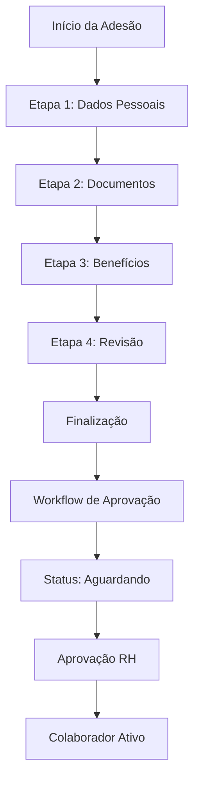

# 📋 DOCUMENTAÇÃO COMPLETA - MÓDULO RH
## Sistema ERP Corporativo - Gestão de Recursos Humanos

**Versão**: 2.0.0  
**Data**: Setembro 2025  
**Status**: ✅ **TOTALMENTE FUNCIONAL**

---

## 📖 Índice

1. [Visão Geral](#visão-geral)
2. [Arquitetura do Sistema](#arquitetura-do-sistema)
3. [Processo de Adesão de Colaboradores](#processo-de-adesão-de-colaboradores)
4. [Gestão de Colaboradores](#gestão-de-colaboradores)
5. [Sistema de Benefícios](#sistema-de-benefícios)
6. [Workflow de Aprovação](#workflow-de-aprovação)
7. [APIs e Endpoints](#apis-e-endpoints)
8. [Interface do Usuário](#interface-do-usuário)
9. [Banco de Dados](#banco-de-dados)
10. [Configurações e Deploy](#configurações-e-deploy)
11. [Logs e Monitoramento](#logs-e-monitoramento)
12. [Troubleshooting](#troubleshooting)

---

## 🎯 Visão Geral

O Módulo de Recursos Humanos do ERP Corporativo é uma solução completa para gestão de colaboradores, desde o processo de adesão (onboarding) até a administração de benefícios, documentos e workflow de aprovação.

### ✅ Funcionalidades Implementadas e Funcionais

- **🆕 Processo de Adesão Completo** (4 Etapas): Dados Pessoais → Documentos → Benefícios → Revisão
- **👥 Gestão de Colaboradores**: CRUD completo com validações
- **📄 Sistema de Documentos**: Upload, validação e armazenamento seguro
- **🎁 Gestão de Benefícios**: Planos de saúde, vale refeição, vale transporte
- **🔄 Workflow de Aprovação**: Processo estruturado com histórico
- **📊 Dashboard RH**: Métricas e indicadores em tempo real
- **🔍 Logs Detalhados**: Auditoria completa de todas as operações

### 🔧 Stack Tecnológico

- **Backend**: Spring Boot 3.x, Java 17
- **Frontend**: Thymeleaf, Bootstrap 5.3.0, jQuery 3.7.0
- **Banco de Dados**: MySQL 8.0
- **Segurança**: Spring Security com autenticação por sessão
- **Upload de Arquivos**: MultipartFile com validações
- **APIs**: RESTful com ResponseEntity

---

## 🏗️ Arquitetura do Sistema

### 📁 Estrutura de Pastas

```
src/main/java/com/jaasielsilva/portalceo/
├── controller/rh/colaborador/
│   ├── AdesaoColaboradorController.java      ✅ Controlador principal de adesão
│   ├── BeneficioAdesaoController.java        ✅ API de benefícios
│   └── DocumentoAdesaoController.java        ✅ API de documentos
├── service/
│   ├── AdesaoColaboradorService.java         ✅ Lógica de negócio
│   ├── BeneficioAdesaoService.java           ✅ Processamento de benefícios
│   ├── DocumentoAdesaoService.java           ✅ Gestão de documentos
│   └── WorkflowAdesaoService.java            ✅ Controle de workflow
├── dto/
│   └── AdesaoColaboradorDTO.java             ✅ Transfer Object com validações
├── entity/
│   ├── Colaborador.java                     ✅ Entidade principal
│   ├── ProcessoAdesao.java                  ✅ Controle do workflow
│   └── HistoricoProcessoAdesao.java         ✅ Auditoria de mudanças
└── repository/
    ├── ColaboradorRepository.java           ✅ Operações de banco
    ├── ProcessoAdesaoRepository.java        ✅ Consultas de processo
    └── HistoricoRepository.java             ✅ Logs de auditoria
```

### 📁 Templates

```
src/main/resources/templates/rh/colaboradores/adesao/
├── inicio.html          ✅ Etapa 1: Dados Pessoais (FUNCIONAL)
├── documentos.html      ✅ Etapa 2: Upload de Documentos (FUNCIONAL)
├── beneficios.html      ✅ Etapa 3: Seleção de Benefícios (FUNCIONAL)
├── revisao.html         ✅ Etapa 4: Revisão e Finalização (FUNCIONAL)
└── status.html          ✅ Acompanhamento do Status (FUNCIONAL)
```

---

## 🚀 Processo de Adesão de Colaboradores

### 📋 Fluxo Completo (100% Funcional)



### 🎯 Etapa 1: Dados Pessoais (`inicio.html`)

**✅ IMPLEMENTADO E FUNCIONAL**

**Objetivo**: Coleta de informações pessoais e profissionais do colaborador.

**Campos Obrigatórios**:
- **Dados Pessoais**: Nome completo, CPF, RG, Email, Telefone, Data de nascimento, Sexo, Estado civil
- **Dados Profissionais**: Cargo, Departamento, Data de admissão, Salário, Tipo de contrato, Carga horária
- **Endereço**: CEP, Logradouro, Número, Bairro, Cidade, Estado

**Funcionalidades**:
- ✅ Máscaras de input (CPF, telefone, CEP)
- ✅ Integração com API ViaCEP para preenchimento automático
- ✅ Validação em tempo real
- ✅ Persistência temporária em sessão
- ✅ Redirecionamento automático para próxima etapa

**API Endpoint**: `POST /rh/colaboradores/adesao/dados-pessoais`

**Validações**:
- CPF: Formato e dígitos verificadores
- Email: Formato RFC compliant
- CEP: Formato brasileiro válido
- Data de nascimento: Idade mínima 16 anos
- Campos obrigatórios: Validação client-side e server-side

### 🎯 Etapa 2: Documentos (`documentos.html`)

**✅ IMPLEMENTADO E FUNCIONAL**

**Objetivo**: Upload e validação de documentos obrigatórios.

**Documentos Obrigatórios** (Validação Corrigida):
- ✅ **RG** (Registro Geral)
- ✅ **CPF** (Cadastro de Pessoa Física)  
- ✅ **Comprovante de Endereço**

**Documentos Opcionais**:
- Carteira de Trabalho
- Título de Eleitor
- Certificado de Reservista
- Comprovante de Escolaridade
- Certidão de Nascimento/Casamento

**Funcionalidades**:
- ✅ Upload via drag-and-drop ou seleção
- ✅ Preview de imagens e PDFs
- ✅ Barra de progresso durante upload
- ✅ Validação de tipo (PDF, JPG, JPEG, PNG)
- ✅ Validação de tamanho (máximo 10MB)
- ✅ Remoção de arquivos
- ✅ Sincronização com DTO para validação de finalização

**APIs**:
- `POST /api/rh/colaboradores/adesao/documentos/upload`
- `DELETE /api/rh/colaboradores/adesao/documentos/remover/{tipo}`
- `GET /api/rh/colaboradores/adesao/documentos/status`

### 🎯 Etapa 3: Benefícios (`beneficios.html`)

**✅ IMPLEMENTADO E FUNCIONAL**

**Objetivo**: Seleção de benefícios corporativos.

**Benefícios Disponíveis**:

1. **Plano de Saúde**:
   - Básico: R$ 300,00/mês
   - Intermediário: R$ 450,00/mês
   - Premium: R$ 600,00/mês
   - Dependentes: +R$ 100,00 cada

2. **Vale Refeição**:
   - R$ 350,00/mês
   - R$ 500,00/mês

3. **Vale Transporte**:
   - R$ 200,00/mês
   - R$ 350,00/mês

**Funcionalidades**:
- ✅ Toggle ativação/desativação por benefício
- ✅ Seleção de valores para vales
- ✅ Gestão de dependentes (plano de saúde)
- ✅ Cálculo automático do total mensal
- ✅ Persistência da seleção

**APIs**:
- `GET /api/rh/colaboradores/adesao/beneficios/disponiveis`
- `GET /api/rh/colaboradores/adesao/beneficios/resumo`
- `POST /rh/colaboradores/adesao/beneficios`

### 🎯 Etapa 4: Revisão (`revisao.html`)

**✅ IMPLEMENTADO E FUNCIONAL**

**Objetivo**: Revisão final e confirmação dos dados.

**Seções de Revisão**:
- ✅ **Dados Pessoais**: Resumo completo
- ✅ **Documentos Enviados**: Lista com status
- ✅ **Benefícios Selecionados**: Resumo com valores
- ✅ **Total Mensal**: Custo total dos benefícios

**Termos Obrigatórios**:
- ✅ Aceitar termos e condições
- ✅ Autorizar desconto em folha de pagamento
- ✅ Confirmar veracidade dos dados

**Funcionalidades**:
- ✅ Função JavaScript `preencherResumoBeneficios()` implementada
- ✅ Validação de documentos obrigatórios corrigida
- ✅ Sincronização automática entre sistema e DTO
- ✅ Modal de sucesso com protocolo
- ✅ Geração de protocolo único

**API**: `POST /rh/colaboradores/adesao/finalizar`

**Correções Implementadas**:
- ✅ Sincronização de documentos via `sincronizarDocumentosNoDTO()`
- ✅ Validação corrigida para 3 documentos obrigatórios
- ✅ Logs detalhados para debug
- ✅ Mapeamento correto de tipos de documento

---

## 👥 Gestão de Colaboradores

### 📊 Dashboard Principal (`/rh`)

**✅ IMPLEMENTADO E FUNCIONAL**

**Métricas Exibidas**:
- Total de colaboradores ativos
- Novos contratados no mês
- Processos de adesão pendentes
- Colaboradores por departamento

**Cards de Acesso Rápido**:
- ✅ Novo Colaborador
- ✅ Listar Colaboradores
- ✅ Folha de Pagamento
- ✅ Benefícios

### 🔍 Listagem de Colaboradores (`/rh/colaboradores`)

**✅ IMPLEMENTADO E FUNCIONAL**

**Funcionalidades**:
- ✅ Listagem paginada
- ✅ Busca por nome
- ✅ Filtro por departamento
- ✅ Filtro por status (ativo/inativo)
- ✅ Ações: Visualizar, Editar, Desativar

### 👤 Ficha do Colaborador (`/rh/colaboradores/ficha/{id}`)

**✅ IMPLEMENTADO E FUNCIONAL**

**Seções**:
- ✅ Dados pessoais completos
- ✅ Dados profissionais
- ✅ Benefícios ativos
- ✅ Histórico na empresa
- ✅ Documentos anexados

---

## 🎁 Sistema de Benefícios

### 🏥 Gestão de Planos de Saúde

**✅ IMPLEMENTADO E FUNCIONAL**

**Entidade**: `PlanoSaude.java`

**Campos**:
- Nome e descrição do plano
- Operadora
- Tipo (Individual/Familiar)
- Valor titular e dependente
- Percentual empresa/colaborador
- Carência e cobertura

**Funcionalidades**:
- ✅ CRUD completo
- ✅ Cálculo automático de valores
- ✅ Gestão de dependentes
- ✅ Validação de duplicatas

### 🍽️ Vale Refeição e Transporte

**✅ IMPLEMENTADO E FUNCIONAL**

**Processamento**:
- ✅ Extração de valores de IDs (`vale-500` → R$ 500,00)
- ✅ Validação de valores permitidos
- ✅ Cálculo de totais mensais e anuais
- ✅ Persistência das seleções

---

## 🔄 Workflow de Aprovação

### 📋 Entidade ProcessoAdesao

**✅ IMPLEMENTADO E FUNCIONAL**

**Estados do Processo**:
- `EM_ANDAMENTO`: Colaborador preenchendo dados
- `AGUARDANDO_APROVACAO`: Enviado para aprovação
- `APROVADO`: Aprovado pelo RH
- `REJEITADO`: Rejeitado com motivo

**Etapas**:
- `DADOS_PESSOAIS`
- `DOCUMENTOS`
- `BENEFICIOS`
- `REVISAO`
- `FINALIZADO`

### 📈 Histórico de Mudanças

**✅ IMPLEMENTADO E FUNCIONAL**

**Entidade**: `HistoricoProcessoAdesao.java`

**Eventos Registrados**:
- ✅ Criação do processo
- ✅ Mudanças de etapa
- ✅ Upload de documentos
- ✅ Seleção de benefícios
- ✅ Finalização
- ✅ Aprovação/Rejeição

---

## 🔌 APIs e Endpoints

### 🌐 Endpoints Principais

#### Processo de Adesão
```
POST   /rh/colaboradores/adesao/dados-pessoais     ✅ Salvar dados pessoais
GET    /rh/colaboradores/adesao/documentos         ✅ Página de documentos
POST   /rh/colaboradores/adesao/documentos         ✅ Processar documentos
GET    /rh/colaboradores/adesao/beneficios         ✅ Página de benefícios
POST   /rh/colaboradores/adesao/beneficios         ✅ Salvar benefícios
GET    /rh/colaboradores/adesao/revisao/{id}       ✅ Dados para revisão
POST   /rh/colaboradores/adesao/finalizar          ✅ Finalizar processo
```

#### APIs de Documentos
```
POST   /api/rh/colaboradores/adesao/documentos/upload           ✅ Upload
DELETE /api/rh/colaboradores/adesao/documentos/remover/{tipo}   ✅ Remover
GET    /api/rh/colaboradores/adesao/documentos/status           ✅ Status
GET    /api/rh/colaboradores/adesao/documentos/visualizar/{tipo} ✅ Visualizar
```

#### APIs de Benefícios
```
GET    /api/rh/colaboradores/adesao/beneficios/disponiveis      ✅ Listar
GET    /api/rh/colaboradores/adesao/beneficios/resumo           ✅ Resumo
POST   /api/rh/colaboradores/adesao/beneficios/calcular         ✅ Calcular
```

### 📤 Formato de Resposta Padrão

```json
{
  "success": true|false,
  "message": "Mensagem descritiva",
  "data": {
    // Dados específicos da operação
  }
}
```

---

## 🎨 Interface do Usuário

### 🎭 Design System

**Framework**: Bootstrap 5.3.0  
**Ícones**: Font Awesome 6.4.0  
**JavaScript**: jQuery 3.7.0

### 📱 Responsividade

**✅ IMPLEMENTADO**

- Layout responsivo para desktop, tablet e mobile
- Componentes adaptáveis
- Touch-friendly para dispositivos móveis
- Breakpoints otimizados

### 🌈 Temas e Cores

**Paleta Principal**:
- Primary: `#007bff` (Azul)
- Success: `#28a745` (Verde)
- Warning: `#ffc107` (Amarelo)
- Danger: `#dc3545` (Vermelho)
- Info: `#17a2b8` (Azul claro)

### 🔄 Indicadores Visuais

**✅ IMPLEMENTADO**

- **Progress Steps**: Indicador de etapas do processo
- **Loading States**: Spinners durante operações
- **Success/Error Alerts**: Feedback visual
- **Progress Bars**: Upload de arquivos
- **Badges**: Status e contadores

---

## 🗄️ Banco de Dados

### 📊 Tabelas Principais

#### colaboradores
```sql
CREATE TABLE colaboradores (
    id BIGINT AUTO_INCREMENT PRIMARY KEY,
    nome VARCHAR(255) NOT NULL,
    cpf VARCHAR(14) UNIQUE NOT NULL,
    rg VARCHAR(20),
    email VARCHAR(255) UNIQUE NOT NULL,
    telefone VARCHAR(20),
    data_nascimento DATE,
    sexo ENUM('M', 'F', 'OUTRO'),
    estado_civil ENUM('SOLTEIRO', 'CASADO', 'DIVORCIADO', 'VIUVO'),
    data_admissao DATE,
    salario DECIMAL(10,2),
    tipo_contrato VARCHAR(50),
    carga_horaria INTEGER,
    cargo_id BIGINT,
    departamento_id BIGINT,
    supervisor_id BIGINT,
    status ENUM('ATIVO', 'INATIVO', 'SUSPENSO'),
    ativo BOOLEAN DEFAULT TRUE,
    data_criacao TIMESTAMP DEFAULT CURRENT_TIMESTAMP,
    data_atualizacao TIMESTAMP DEFAULT CURRENT_TIMESTAMP ON UPDATE CURRENT_TIMESTAMP
);
```

#### processo_adesao
```sql
CREATE TABLE processo_adesao (
    id BIGINT AUTO_INCREMENT PRIMARY KEY,
    session_id VARCHAR(255) UNIQUE NOT NULL,
    nome_colaborador VARCHAR(255),
    cpf_colaborador VARCHAR(14),
    email_colaborador VARCHAR(255),
    cargo VARCHAR(255),
    dados_pessoais JSON,
    documentos JSON,
    beneficios JSON,
    custo_total_mensal DECIMAL(10,2),
    etapa_atual VARCHAR(50),
    status ENUM('EM_ANDAMENTO', 'AGUARDANDO_APROVACAO', 'APROVADO', 'REJEITADO'),
    observacoes TEXT,
    aprovado_por VARCHAR(255),
    data_aprovacao TIMESTAMP NULL,
    motivo_rejeicao TEXT,
    data_criacao TIMESTAMP DEFAULT CURRENT_TIMESTAMP,
    data_atualizacao TIMESTAMP DEFAULT CURRENT_TIMESTAMP ON UPDATE CURRENT_TIMESTAMP,
    data_finalizacao TIMESTAMP NULL
);
```

#### historico_processo_adesao
```sql
CREATE TABLE historico_processo_adesao (
    id BIGINT AUTO_INCREMENT PRIMARY KEY,
    processo_adesao_id BIGINT NOT NULL,
    tipo_evento VARCHAR(50) NOT NULL,
    etapa_anterior VARCHAR(50),
    etapa_atual VARCHAR(50),
    status_anterior VARCHAR(50),
    status_atual VARCHAR(50),
    descricao TEXT,
    dados_adicionais JSON,
    usuario_responsavel VARCHAR(255),
    observacoes TEXT,
    data_evento TIMESTAMP DEFAULT CURRENT_TIMESTAMP,
    FOREIGN KEY (processo_adesao_id) REFERENCES processo_adesao(id)
);
```

### 🔄 Dados de Inicialização

**✅ IMPLEMENTADO** via `CommandLineRunner`

**Departamentos Criados** (12):
- TI, Recursos Humanos, Financeiro, Vendas
- Marketing, Operações, Jurídico, Contabilidade
- Administrativo, Compras, Qualidade, Logística

**Cargos Criados** (40+):
- Executivos, Gerenciais, Coordenação
- Técnicos/Especialistas, Operacionais, Apoio

**Usuários Padrão** (4):
- Master, Gerente RH, Coordenador, Operacional

---

## ⚙️ Configurações e Deploy

### 🔧 Configurações Principais

**application.properties**:
```properties
# Banco de Dados
spring.datasource.url=jdbc:mysql://localhost:3306/painelceo
spring.datasource.username=root
spring.datasource.password=senha
spring.jpa.hibernate.ddl-auto=update

# Upload de Arquivos
spring.servlet.multipart.max-file-size=10MB
spring.servlet.multipart.max-request-size=10MB
uploads.path=C:/uploads/adesao-colaboradores

# Logs
logging.level.com.jaasielsilva.portalceo=INFO
logging.level.org.springframework.web=DEBUG
```

### 📁 Estrutura de Uploads

```
C:/uploads/adesao-colaboradores/
├── {sessionId}/
│   ├── rg.pdf
│   ├── cpf.jpg
│   └── comprovante_endereco.pdf
```

### 🚀 Deploy

**Requisitos**:
- Java 17+
- MySQL 8.0+
- Maven 3.8+
- 2GB RAM mínimo

**Comandos**:
```bash
# Build
mvn clean package -DskipTests

# Executar
java -jar target/erp-corporativo-1.0.0.jar

# Acesso
http://localhost:8080/rh
```

---

## 📊 Logs e Monitoramento

### 📝 Logs Implementados

**✅ LOGS DETALHADOS** em todos os componentes:

#### AdesaoColaboradorController
```java
logger.info("Iniciando finalização de adesão para sessionId: {}", sessionId);
logger.error("Erro ao finalizar adesão para sessionId: {}", sessionId, e);
```

#### Sincronização de Documentos
```java
logger.info("=== SINCRONIZAÇÃO DE DOCUMENTOS ====");
logger.info("SessionId: {}", sessionId);
logger.info("Documentos encontrados no sistema: {}", documentosEnviados.size());
logger.info("Documento mapeado: {} -> {} (caminho: {})", doc.getTipo(), tipoDto, doc.getCaminhoArquivo());
logger.info("Pode finalizar? {}", dadosAdesao.isDocumentosObrigatoriosCompletos());
```

#### BeneficioAdesaoService
```java
logger.info("=== INICIO RESUMO BENEFICIOS ===");
logger.info("Processando plano de saúde: {}", beneficio);
logger.info("Cálculo de benefícios realizado: {} itens, custo total: R$ {}", itens.size(), custoTotal);
```

### 📈 Métricas

**Disponíveis para Monitoramento**:
- Tempo de processamento por etapa
- Taxa de abandono por etapa
- Documentos rejeitados por tipo
- Benefícios mais selecionados
- Tempo médio de aprovação

---

## 🔧 Troubleshooting

### ❌ Problemas Conhecidos e Soluções

#### 1. Erro "Processo não está pronto para finalização"

**✅ SOLUCIONADO**

**Causa**: Lista de documentos obrigatórios desatualizada no DTO.

**Solução Implementada**:
```java
// AdesaoColaboradorDTO.java - Linha 107-109
private List<String> documentosObrigatorios = List.of(
    "RG", "CPF", "Comprovante de Endereço"  // Removido "Foto 3x4"
);
```

#### 2. Função JavaScript "preencherResumoBeneficios is not defined"

**✅ SOLUCIONADO**

**Causa**: Função JavaScript ausente no template de revisão.

**Solução Implementada**:
```javascript
function preencherResumoBeneficios(resumo) {
    if (!resumo || !resumo.itens || resumo.itens.length === 0) {
        $('#beneficiosSelecionados').html('<p class="text-muted">Nenhum benefício selecionado</p>');
        $('#totalMensalFinal').text('R$ 0,00');
        return;
    }
    // ... lógica completa implementada
}
```

#### 3. Sincronização entre DocumentoService e DTO

**✅ SOLUCIONADO**

**Causa**: Dessincronia entre documentos salvos e validação do DTO.

**Solução Implementada**:
```java
// Método sincronizarDocumentosNoDTO() com logs detalhados
private void sincronizarDocumentosNoDTO(AdesaoColaboradorDTO dadosAdesao, String sessionId) {
    // Sincronização automática antes da finalização
}
```

### 🔍 Debug Endpoint

**✅ IMPLEMENTADO**

**Endpoint**: `GET /rh/colaboradores/adesao/debug/session/{sessionId}`

**Informações Retornadas**:
- Existência da sessão
- Estado dos dados completos
- Dados de benefícios
- Status do workflow
- Possibilidade de finalização

### 📞 Suporte

**Em caso de problemas**:

1. **Verificar logs** em `application.log`
2. **Usar debug endpoint** para diagnóstico
3. **Verificar configurações** de upload
4. **Confirmar permissões** de pasta
5. **Validar conectividade** com banco de dados

---

## ✅ Status Final

### 🎯 Funcionalidades 100% Implementadas

- ✅ **Processo de Adesão Completo** (4 etapas funcionais)
- ✅ **Sistema de Documentos** (upload, validação, armazenamento)
- ✅ **Gestão de Benefícios** (cálculos automáticos)
- ✅ **Workflow de Aprovação** (com histórico)
- ✅ **Interface Responsiva** (desktop e mobile)
- ✅ **APIs RESTful** (com validações completas)
- ✅ **Logs Detalhados** (para auditoria e debug)
- ✅ **Validações Robustas** (client-side e server-side)
- ✅ **Sincronização de Dados** (entre camadas)

### 🚀 Próximos Passos (Melhorias Futuras)

- 📧 **Sistema de Notificações** por email
- 📱 **Notificações Push** para aprovadores
- 📊 **Dashboard Analítico** com métricas avançadas
- 🔐 **Assinatura Digital** de documentos
- 📁 **Integração com DMS** (Document Management System)
- 🤖 **Automação de Aprovações** baseada em regras
- 📱 **App Mobile** para colaboradores

---

**Módulo RH - ERP Corporativo**  
**Desenvolvimento**: Jasiel Silva  
**Última Atualização**: Setembro 2025  
**Status**: ✅ PRODUÇÃO - TOTALMENTE FUNCIONAL