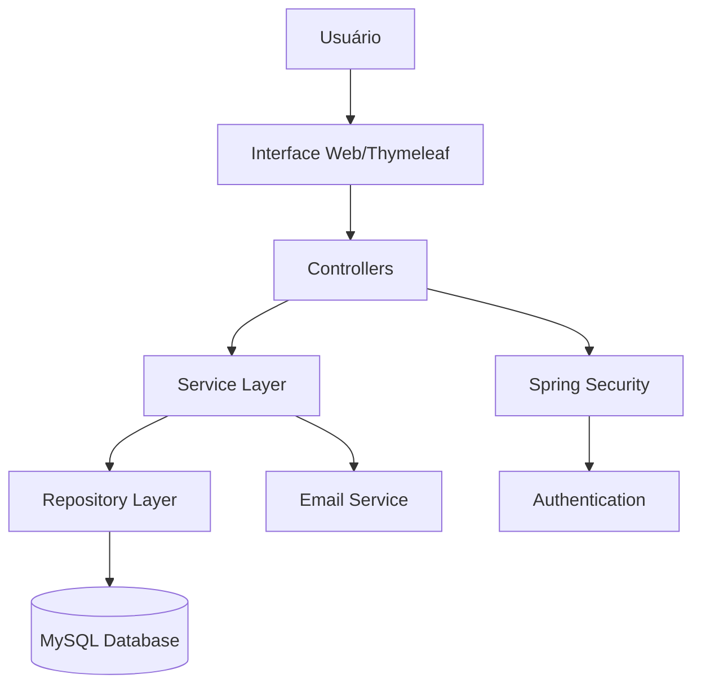
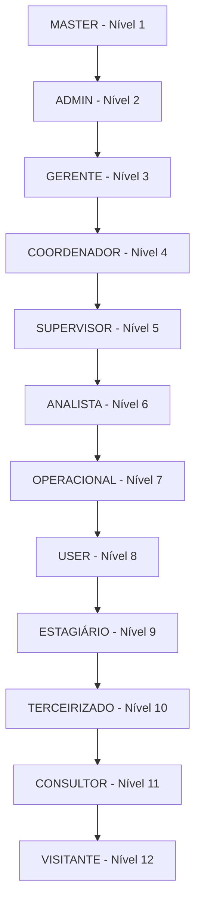
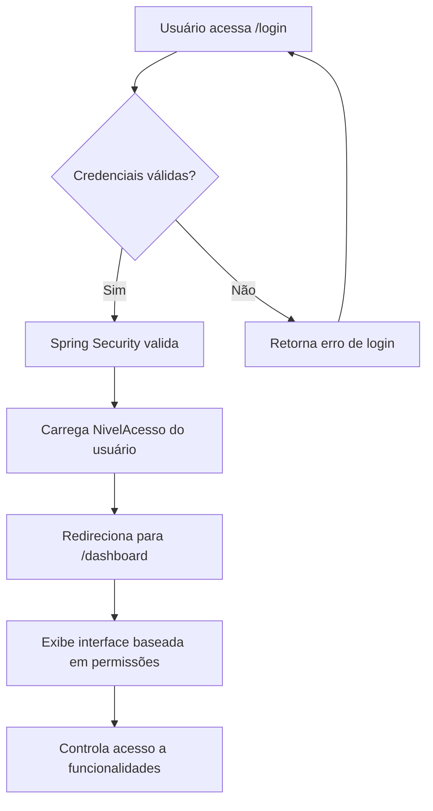
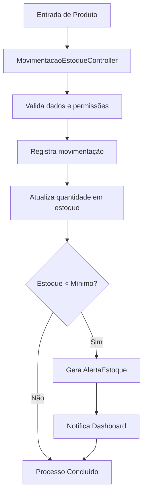
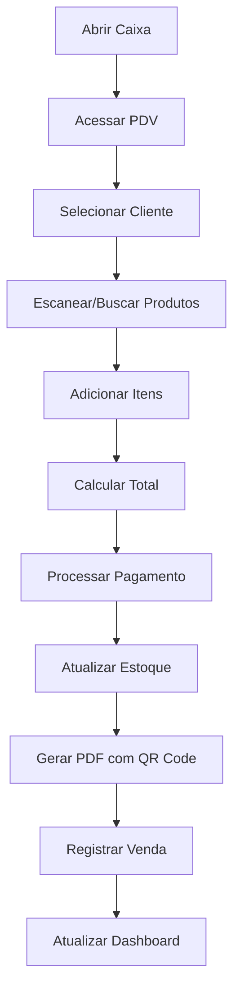

# 📊 Sistema ERP Corporativo - Documentação Completa

## 📋 Visão Geral do Sistema

### Descrição do Sistema
O ERP Corporativo é um sistema de gestão empresarial abrangente desenvolvido com **Spring Boot 3.5.3**, **Thymeleaf**, **MySQL** e tecnologias web modernas. O sistema é projetado para pequenas e médias empresas, oferecendo controle centralizado de processos administrativos, financeiros, de recursos humanos, vendas, estoque e muito mais.

### Tecnologias Utilizadas
- **Backend**: Java 17, Spring Boot 3.5.3, Spring Security, Spring Data JPA, Spring WebSocket
- **Frontend**: Thymeleaf, HTML5, CSS3, JavaScript (vanilla)
- **Banco de Dados**: MySQL
- **Build**: Maven
- **Arquitetura**: Monolítica em camadas (MVC)
- **Segurança**: Spring Security com autenticação baseada em níveis
- **PDF**: iTextPDF, OpenPDF
- **QR Code**: ZXing
- **Email**: Spring Mail

## 🏗️ Arquitetura do Sistema

### Padrão Arquitetural


### Estrutura de Camadas
- **Presentation Layer**: Templates Thymeleaf + Controllers (44 controllers)
- **Business Layer**: Services (37 serviços) + lógica de negócio
- **Data Access Layer**: Repositories (42 repositórios) + JPA Entities (55 entidades)
- **Security Layer**: Spring Security + Custom Authentication + NivelAcesso

### Estrutura de Diretórios
```
src/main/java/com/jaasielsilva/portalceo/
├── config/          # Configurações (7 arquivos)
├── controller/      # Controllers MVC (44 arquivos)
│   ├── agenda/      # Módulo de agenda
│   └── rh/          # Módulo RH especializado
├── dto/             # Data Transfer Objects (14 DTOs)
├── exception/       # Tratamento de exceções (5 classes)
├── formatter/       # Formatadores customizados
├── model/           # Entidades JPA (55 entidades)
├── repository/      # Repositórios Spring Data (42 interfaces)
├── security/        # Componentes de segurança
└── service/         # Serviços de negócio (37 classes)
```

## 👥 Sistema de Usuários e Permissões

### Níveis de Acesso Hierárquicos


### Matriz de Permissões por Nível

| Funcionalidade | MASTER | ADMIN | GERENTE | COORDENADOR | SUPERVISOR | ANALISTA | OPERACIONAL | USER | ESTAGIÁRIO |
|----------------|---------|-------|---------|-------------|------------|----------|-------------|------|------------|
| **Gestão de Usuários** | ✅ | ✅ | ✅ | ❌ | ❌ | ❌ | ❌ | ❌ | ❌ |
| **Configurações do Sistema** | ✅ | ✅ | ❌ | ❌ | ❌ | ❌ | ❌ | ❌ | ❌ |
| **Relatórios Financeiros** | ✅ | ✅ | ✅ | ✅ | ❌ | ❌ | ❌ | ❌ | ❌ |
| **Gestão de RH** | ✅ | ✅ | ✅ | ❌ | ❌ | ❌ | ❌ | ❌ | ❌ |
| **Vendas Completas** | ✅ | ✅ | ✅ | ✅ | ✅ | ✅ | ✅ | ❌ | ❌ |
| **Estoque** | ✅ | ✅ | ✅ | ✅ | ✅ | ✅ | ✅ | ❌ | ❌ |
| **Dashboard Executivo** | ✅ | ✅ | ✅ | ✅ | ❌ | ❌ | ❌ | ❌ | ❌ |
| **Cadastro de Clientes** | ✅ | ✅ | ✅ | ✅ | ✅ | ✅ | ✅ | ❌ | ❌ |
| **Consulta Básica** | ✅ | ✅ | ✅ | ✅ | ✅ | ✅ | ✅ | ✅ | ✅ |

### Usuários Padrão do Sistema
| Usuário | Email | Senha | Nível | Função |
|---------|-------|--------|-------|--------|
| Master | master@sistema.com | master123 | MASTER | Administração total |
| Admin | admin@empresa.com | admin123 | ADMIN | Administrador geral |
| Gerente RH | rh@empresa.com | rh123 | GERENTE | Gestão de RH |
| Coordenador | coordenador@empresa.com | coord123 | COORDENADOR | Coordenação de vendas |
| Operacional | operacional@empresa.com | op123 | OPERACIONAL | Operações básicas |

## 📊 Manual do Usuário

### Acesso ao Sistema
1. **URL**: `http://localhost:8080`
2. **Login**: Use email e senha fornecidos
3. **Dashboard**: Interface principal adaptada ao nível de acesso

### Navegação Principal

#### Dashboard Principal
- **Visão Executiva**: Métricas consolidadas por área
- **Gráficos Interativos**: 
  - Vendas últimos 12 meses
  - Faturamento mensal vs meta
  - Performance por área (Vendas, Atendimento, Logística, Qualidade, Financeiro)
- **KPIs em Tempo Real**:
  - Faturamento mensal
  - Total de vendas
  - Número de clientes
  - Produtos em estoque
  - Funcionários ativos
  - Solicitações pendentes

#### Módulos Funcionais

##### 👤 Gestão de Usuários (90% Completo)
**Funcionalidades Implementadas:**
- ✅ CRUD completo com validações
- ✅ Sistema de perfis hierárquico
- ✅ Upload de foto de perfil
- ✅ Controle de status (Ativo, Inativo, Bloqueado, Demitido)
- ✅ Relatórios em PDF
- ✅ Exportação Excel
- ✅ Validação de matricula para exclusão

**Como usar:**
1. Acesse `/usuarios` para listar
2. Use `/usuarios/cadastro` para novo usuário
3. Defina nível de acesso apropriado
4. Gerencie status conforme necessário

##### 👥 Gestão de Clientes (80% Completo)
**Funcionalidades Implementadas:**
- ✅ Cadastro PF/PJ completo
- ✅ Histórico de interações
- ✅ Busca avançada
- ✅ Controle de status
- ✅ Integração com vendas

**Como usar:**
1. Acesse `/clientes` para gestão
2. Cadastre dados completos (CPF/CNPJ, endereço, contatos)
3. Acompanhe histórico de vendas
4. Gerencie contratos associados

##### 📦 Gestão de Estoque (85% Completo)
**Funcionalidades Implementadas:**
- ✅ Controle completo de inventário
- ✅ Sistema de alertas de estoque baixo
- ✅ Movimentações (entrada, saída, ajuste)
- ✅ Transferências entre localidades
- ✅ Auditoria de movimentações
- ✅ Relatórios de estoque

**Como usar:**
1. Acesse `/estoque` para visão geral
2. Use `/movimentacao-estoque` para registrar movimentações
3. Configure alertas de estoque mínimo
4. Monitore produtos críticos no dashboard

##### 🛒 Vendas (60% Completo)
**Funcionalidades Implementadas:**
- ✅ PDV básico funcional
- ✅ Cadastro de vendas
- ✅ Relatórios básicos
- ✅ Gestão de caixa
- ✅ Geração de PDF com QR Code
- ✅ API REST para PDV

**Como usar:**
1. Acesse `/vendas/caixa` para abrir caixa
2. Use `/vendas/pdv` para vendas
3. Processe pagamentos múltiplos
4. Gere relatórios em `/vendas/relatorios`

**⚠️ Pendências:**
- Sistema de devoluções
- Relatórios avançados
- Controle de comissões

##### 🏭 Fornecedores (70% Completo)
**Funcionalidades Implementadas:**
- ✅ CRUD completo
- ✅ Sistema de avaliação
- ✅ Contratos básicos
- ✅ Histórico de compras

**Como usar:**
1. Cadastre fornecedores em `/fornecedor`
2. Avalie desempenho regularmente
3. Gerencie contratos associados

## 🏢 Status de Implementação dos Módulos

### 🟢 Módulos Funcionais (80-95% Completos)

#### 1. Dashboard (95% Completo) ✅
- **Status**: Totalmente funcional
- **Localização**: `DashboardController.java`
- **Recursos**: Interface executiva, gráficos interativos, métricas em tempo real

#### 2. Usuários (90% Completo) ✅
- **Status**: Quase completo
- **Localização**: `UsuarioController.java` (471 linhas)
- **Recursos**: CRUD, hierarquia de perfis, upload de foto, relatórios PDF

#### 3. Estoque (85% Completo) ✅
- **Status**: Muito funcional
- **Localização**: `EstoqueController.java`, `MovimentacaoEstoqueController.java`
- **Recursos**: Inventário, alertas, auditoria, transferências

#### 4. Clientes (80% Completo) ✅
- **Status**: Bem funcional
- **Localização**: `ClienteController.java` (8.2KB)
- **Recursos**: Cadastro PF/PJ, histórico, busca avançada

#### 5. Produtos (75% Completo) ✅
- **Status**: Funcional básico
- **Localização**: `ProdutoController.java`, `ProdutoRestController.java`
- **Recursos**: Catálogo, categorização, preços, API REST

### 🟡 Módulos Parcialmente Implementados (50-70%)

#### 6. Vendas (60% Completo) 🔄
- **Status**: PDV funcional, necessita melhorias
- **Localização**: `VendaController.java` (20.2KB) - maior controller
- **Implementado**: PDV, caixa, relatórios básicos, PDF com QR Code
- **Pendente**: Devoluções, relatórios avançados, comissões

#### 7. Fornecedores (70% Completo) 🔄
- **Status**: CRUD completo, falta dashboard
- **Localização**: `FornecedorController.java` (7.1KB)
- **Implementado**: Gestão básica, avaliações, contratos
- **Pendente**: Dashboard específico, relatórios avançados

#### 8. RH - Recursos Humanos (50% Completo) 🔄
- **Status**: Estrutura bem definida, falta implementação
- **Localização**: `controller/rh/` (4 subdiretórios)
- **Implementado**: 
  - Colaboradores: Gestão básica, benefícios
  - Benefícios: Vale transporte, plano saúde (parcial)
  - Folha: Templates básicos
  - Ponto: Estrutura criada

**Pendente:**
- Cálculos de folha de pagamento
- Sistema de ponto eletrônico completo
- Relatórios de RH
- Gestão completa de benefícios

#### 9. Contratos (60% Completo) 🔄
- **Status**: CRUD funcional
- **Localização**: `ContratosController.java` (8.0KB)
- **Implementado**: Gestão básica, status, vencimentos
- **Pendente**: Workflows de aprovação, alertas automáticos

### 🔴 Módulos com Estrutura Básica (5-20%)

#### 10. Financeiro (20% Completo) ⚠️
- **Localização**: `FinanceiroController.java` (1.8KB)
- **Status**: Templates básicos criados
- **Pendente**: Contas a pagar/receber, fluxo de caixa, conciliação bancária

#### 11. Marketing (15% Completo) ⚠️
- **Localização**: `MarketingController.java` (1.8KB)
- **Status**: Estrutura inicial
- **Pendente**: CRM, campanhas, métricas de conversão

#### 12. TI (15% Completo) ⚠️
- **Localização**: `TiController.java` (1.7KB)
- **Status**: Templates básicos
- **Pendente**: Sistema de tickets, inventário de TI

#### 13. Jurídico (10% Completo) ⚠️
- **Localização**: `JuridicoController.java` (1.8KB)
- **Status**: Estrutura inicial
- **Pendente**: Gestão de processos, compliance

#### 14-19. Outros Módulos (5-10% Completos) ⚠️
- **Agenda**: Controller básico criado
- **Serviços**: Template básico
- **Relatórios**: Estrutura inicial
- **Configurações**: Básico implementado
- **Documentos**: Templates criados
- **Suporte**: Estrutura básica

## 🔄 Fluxos do Sistema

### Fluxo de Login e Autenticação


### Fluxo de Gestão de Estoque


### Fluxo de Vendas PDV


## 📈 Roadmap de Desenvolvimento

### FASE 1: Finalização dos Módulos Core (Prioridade ALTA)

#### 1.1 Módulo RH - Completar (50% → 90%) 🎯
**Épico: Sistema de RH Completo**

**Objetivos:**
- Implementar cálculos de folha de pagamento
- Finalizar sistema de benefícios
- Completar controle de ponto eletrônico
- Criar relatórios de RH

**Tarefas Principais:**

**a) Folha de Pagamento**
- Implementar `FolhaPagamentoService` com cálculos
- Criar templates para geração de holerites
- Desenvolver relatórios de folha por período
- Implementar workflow de aprovação de folha

**b) Sistema de Benefícios**
- Completar `PlanoSaudeController` e views
- Finalizar `ValeRefeicaoController` (atualmente vazio)
- Implementar gestão de adesões e cancelamentos
- Criar dashboard de benefícios

**c) Ponto Eletrônico**
- Implementar funcionalidades no `PontoEscalaController`
- Criar sistema de registro de ponto via web
- Desenvolver correções de ponto
- Integrar com cálculos de folha

**Entregáveis:**
- Controllers RH completamente funcionais
- Templates Thymeleaf para todos os recursos
- Relatórios em PDF
- Dashboard de RH integrado

**Estimativa:** 4-5 semanas

#### 1.2 Módulo Financeiro - Implementar (20% → 90%) 🎯
**Épico: Sistema Financeiro Completo**

**Objetivos:**
- Implementar contas a pagar e receber
- Criar dashboard financeiro em tempo real
- Desenvolver fluxo de caixa projetado
- Implementar conciliação bancária

**Tarefas Principais:**

**a) Contas a Pagar**
- Criar entidades `ContaPagar` e repository
- Implementar `ContasPagarController` completo
- Desenvolver templates para gestão
- Criar sistema de aprovações

**b) Contas a Receber**
- Criar entidades `ContaReceber` e repository
- Implementar controle de inadimplência
- Desenvolver cobrança automática
- Integrar com módulo de vendas

**c) Dashboard Financeiro**
- Expandir `FinanceiroController` atual (1.8KB → ~15KB)
- Implementar métricas em tempo real
- Criar gráficos de fluxo de caixa
- Desenvolver projeções financeiras

**d) Relatórios Financeiros**
- Implementar DRE (Demonstração do Resultado)
- Criar Balanço Patrimonial
- Desenvolver relatórios de aging de recebíveis
- Implementar exportação em Excel/PDF

**Entregáveis:**
- Sistema financeiro completo
- Dashboard financeiro em tempo real
- Suite de relatórios financeiros
- Integração com outros módulos

**Estimativa:** 5-6 semanas

#### 1.3 Módulo Vendas - Finalizar (60% → 95%) 🎯
**Épico: PDV e Vendas Avançado**

**Objetivos:**
- Aprimorar PDV existente
- Implementar sistema de devoluções
- Criar relatórios avançados de vendas
- Desenvolver sistema de comissões

**Tarefas Principais:**

**a) PDV Aprimorado**
- Melhorar interface do PDV atual
- Implementar múltiplas formas de pagamento simultâneas
- Criar sistema de desconto por produto/total
- Desenvolver impressão de cupom fiscal

**b) Sistema de Devoluções**
- Criar `DevolucaoController` e entidades
- Implementar templates para devoluções
- Desenvolver estorno automático para estoque
- Criar relatórios de devoluções

**c) Relatórios Avançados**
- Expandir relatórios em `/vendas/relatorios`
- Criar análises por vendedor
- Implementar métricas de conversion rate
- Desenvolver comparativos temporais

**d) Sistema de Comissões**
- Implementar cálculo automático de comissões
- Criar relatórios de comissões por vendedor
- Desenvolver sistema de metas
- Integrar com folha de pagamento

**Entregáveis:**
- PDV completamente funcional
- Sistema de devoluções operacional
- Suite completa de relatórios
- Sistema de comissões

**Estimativa:** 3-4 semanas

### FASE 2: Módulos Estratégicos (Prioridade MÉDIA)

#### 2.1 Módulo Marketing - Implementar (15% → 80%) 🎯
**Épico: CRM e Marketing Digital**

**Tarefas Principais:**

**a) CRM Básico**
- Expandir `MarketingController` (1.8KB → ~12KB)
- Implementar funil de vendas
- Criar gestão de leads
- Desenvolver scoring automático de leads

**b) Gestão de Campanhas**
- Criar entidades `Campanha` e controllers
- Implementar calendário de campanhas
- Desenvolver controle de orçamento
- Criar relatórios de ROI

**c) Análise de Marketing**
- Implementar dashboard específico
- Criar métricas de conversão
- Desenvolver relatórios de canais
- Integrar com Google Analytics (opcional)

**Estimativa:** 4-5 semanas

#### 2.2 Módulo Jurídico - Implementar (10% → 80%) 🎯
**Épico: Gestão Jurídica e Compliance**

**Tarefas Principais:**

**a) Gestão de Contratos Jurídicos**
- Expandir `JuridicoController` (1.8KB → ~10KB)
- Implementar versionamento de contratos
- Criar sistema de assinatura digital
- Desenvolver alertas de renovação

**b) Gestão de Processos**
- Criar controle de processos judiciais
- Implementar acompanhamento de prazos
- Desenvolver controle de custos jurídicos
- Integrar com sistema de documentos

**c) Compliance**
- Implementar checklists de conformidade
- Criar sistema de auditoria
- Desenvolver relatórios de compliance
- Implementar alertas regulatórios

**Estimativa:** 3-4 semanas

### FASE 3: Módulos Complementares (Prioridade BAIXA)

#### 3.1 Módulos Básicos - Completar 🎯
**Objetivos:** Implementar CRUD completo e templates

**a) TI (15% → 70%)**
- Sistema de tickets
- Inventário de equipamentos
- Base de conhecimento

**b) Agenda (10% → 70%)**
- Calendário interativo
- Gestão de eventos
- Lembretes automáticos

**c) Serviços (5% → 70%)**
- Catálogo de serviços
- Gestão de prestadores
- Controle de qualidade

**Estimativa:** 2-3 semanas cada

## 🧪 Estratégia de Testes

### Testes por Módulo

#### Módulos Prioritários (FASE 1)
1. **Testes RH**
   - Testes unitários para cálculos de folha
   - Testes de integração para benefícios
   - Testes de interface para ponto eletrônico

2. **Testes Financeiro**
   - Testes de precisão para cálculos financeiros
   - Testes de conciliação bancária
   - Testes de relatórios DRE e Balanço

3. **Testes Vendas**
   - Testes do PDV em diferentes cenários
   - Testes de integração com estoque
   - Testes de geração de PDF e QR Code

### Plano de Validação
1. **Testes Unitários**: JUnit 5 para lógica de negócio
2. **Testes de Integração**: TestContainers para MySQL
3. **Testes de Interface**: Selenium WebDriver
4. **Testes de Performance**: JMeter para endpoints críticos

## 📊 Métricas de Projeto

### Estatísticas Atuais
- **Controllers**: 44 implementados
- **Services**: 37 serviços de negócio
- **Repositories**: 42 interfaces
- **Entidades**: 55 modelos de dados
- **Templates**: 35+ diretórios de templates
- **Funcionalidade Geral**: ~60% implementada

### Distribuição de Implementação
- **Módulos Funcionais (80%+)**: 5 módulos
- **Módulos Parciais (50-70%)**: 4 módulos
- **Módulos Básicos (5-20%)**: 10+ módulos

### Estimativas de Conclusão
- **Módulos Core (FASE 1)**: 12-15 semanas
- **Módulos Estratégicos (FASE 2)**: 7-9 semanas
- **Módulos Complementares (FASE 3)**: 6-9 semanas
- **Total para 100% funcional**: ~25-33 semanas

## 🚀 Próximos Passos Imediatos

### Semana 1-2: Preparação
1. ✅ Documentação completa criada
2. Setup do ambiente de desenvolvimento
3. Configuração de ferramentas de teste
4. Planejamento detalhado da FASE 1

### Semana 3-6: Módulo RH
1. Implementar cálculos de folha de pagamento
2. Finalizar sistema de benefícios
3. Completar controle de ponto
4. Criar relatórios de RH

### Semana 7-12: Módulo Financeiro
1. Implementar contas a pagar/receber
2. Criar dashboard financeiro
3. Desenvolver relatórios DRE e Balanço
4. Implementar conciliação bancária

### Semana 13-16: Finalizar Vendas
1. Aprimorar PDV
2. Implementar devoluções
3. Criar relatórios avançados
4. Desenvolver sistema de comissões

## 🔧 Comandos de Desenvolvimento

### Build e Execução
```bash
# Compilar projeto
./mvnw clean compile

# Executar testes
./mvnw test

# Executar aplicação
./mvnw spring-boot:run

# Gerar JAR
./mvnw clean package

# Docker build
docker build -t erp-corporativo .

# Docker run
docker run -p 8080:8080 erp-corporativo
```

### Acesso
- **URL**: http://localhost:8080
- **Usuário Master**: master@sistema.com / master123
- **Banco**: MySQL na porta 3306

---

## 📞 Conclusão

O Sistema ERP Corporativo apresenta uma base sólida com 60% de funcionalidade implementada. Os módulos core (Dashboard, Usuários, Estoque, Clientes) estão bem maduros, enquanto módulos estratégicos como RH, Financeiro e Vendas precisam de finalização.

O roadmap apresentado é realista e executável, com foco em completar os módulos essenciais para operação básica de uma empresa antes de expandir para funcionalidades avançadas.

**Prioridade Imediata**: Completar RH, Financeiro e Vendas (FASE 1) para ter um ERP verdadeiramente funcional para PMEs.