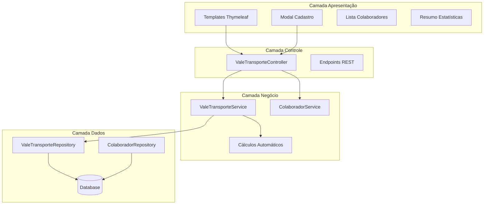
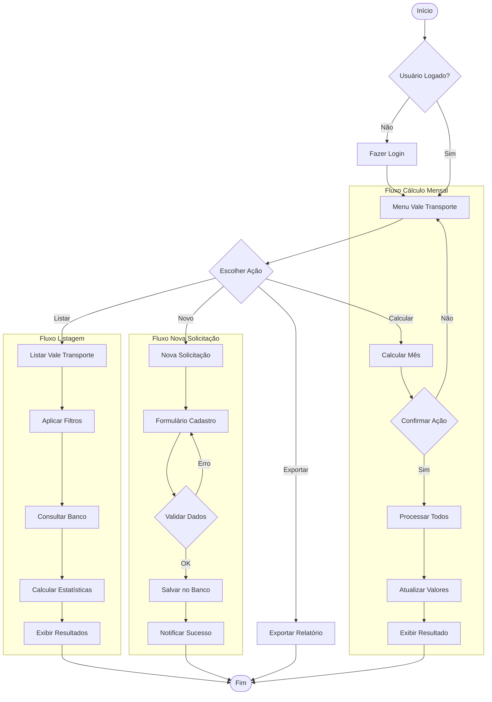
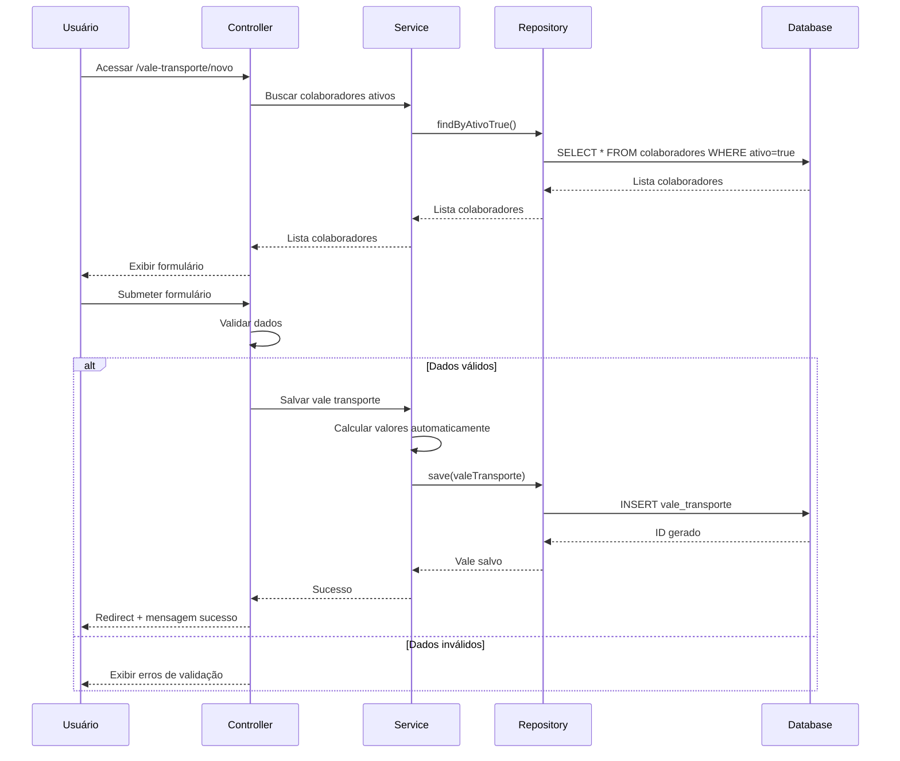
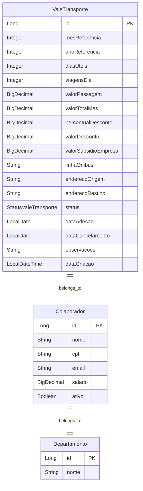
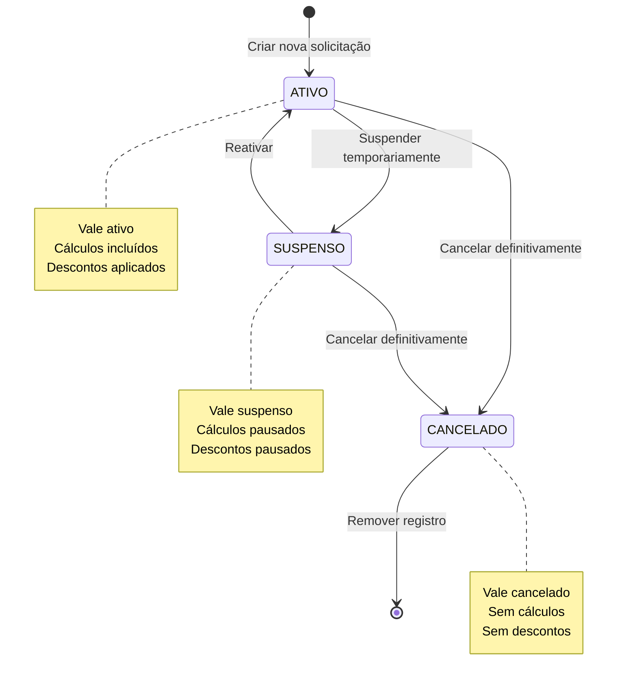

# Fluxograma - Implementação Vale Transporte

## Visão Geral da Arquitetura



## Fluxo Principal - Gestão Vale Transporte



## Fluxo Detalhado - Nova Solicitação Vale Transporte



## Fluxo de Cálculo Automático de Valores

```mermaid
flowchart TD
    TRIGGER[Trigger: Salvar/Atualizar] --> CHECK{Dados Completos?}
    CHECK -->|Não| SKIP[Pular Cálculo]
    CHECK -->|Sim| CALC_TOTAL[Calcular Valor Total Mês]
    
    CALC_TOTAL --> FORMULA1[Total = Dias Úteis × Viagens/Dia × Valor Passagem]
    FORMULA1 --> GET_SALARY[Obter Salário Colaborador]
    GET_SALARY --> CALC_DISCOUNT[Calcular Desconto]
    
    CALC_DISCOUNT --> FORMULA2[Desconto = min(Total, Salário × 6%)]
    FORMULA2 --> CALC_SUBSIDY[Calcular Subsídio Empresa]
    CALC_SUBSIDY --> FORMULA3[Subsídio = Total - Desconto]
    
    FORMULA3 --> SAVE_VALUES[Salvar Valores Calculados]
    SAVE_VALUES --> END_CALC[Fim Cálculo]
    
    SKIP --> END_CALC
```

## Estrutura de Dados - Vale Transporte



## Endpoints da API

```mermaid
graph LR
    subgraph "Endpoints Vale Transporte"
        GET1[GET /listar] --> LIST_ALL[Listar todos]
        GET2[GET /novo] --> NEW_FORM[Formulário novo]
        POST1[POST /salvar] --> SAVE[Salvar vale]
        GET3[GET /editar/{id}] --> EDIT_FORM[Formulário edição]
        POST2[POST /atualizar/{id}] --> UPDATE[Atualizar vale]
        GET4[GET /deletar/{id}] --> DELETE[Deletar vale]
        
        GET5[GET /api/estatisticas] --> STATS[Estatísticas]
        POST3[POST /api/calcular-mes] --> CALC_MONTH[Calcular mês]
        GET6[GET /api/relatorio] --> REPORT[Gerar relatório]
    end
```

## Estados do Vale Transporte



## Próximos Passos da Implementação

1. **Expandir ValeTransporteService** - Adicionar métodos para estatísticas
2. **Melhorar ValeTransporteController** - Endpoints para dados reais
3. **Criar DTOs** - Para transferência de dados de estatísticas
4. **Integrar Templates** - Conectar com dados reais do banco
5. **Implementar Cálculo em Lote** - Para processamento mensal
6. **Adicionar Exportação** - Relatórios em PDF/Excel
7. **Testes** - Validar todas as funcionalidades

## Benefícios da Implementação

- ✅ **Automatização** - Cálculos automáticos de valores
- ✅ **Compliance** - Respeita limite legal de 6% do salário
- ✅ **Auditoria** - Histórico completo de alterações
- ✅ **Flexibilidade** - Diferentes tipos de transporte e trajetos
- ✅ **Relatórios** - Estatísticas em tempo real
- ✅ **UX** - Interface intuitiva e responsiva