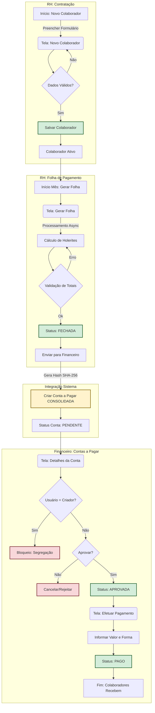

# Fluxo de Aprovação e Pagamento (End-to-End)

Este documento descreve o fluxo completo desde a contratação de um colaborador até o pagamento do seu salário, incluindo os cenários de sucesso e exceção, conforme as regras de negócio e segregação de funções implementadas.

## 1. Fluxograma Visual (Mermaid)

---

## 2. Cenários de Teste

### Cenário 1: Fluxo Feliz (Caminho Correto)

**Objetivo:** Verificar se o ciclo completo ocorre sem erros quando usuários distintos realizam as ações.

1. **Contratação (Usuário RH):**
   * Acessar `RH > Colaboradores > Novo`.
   * Cadastrar colaborador com todos os campos obrigatórios.
   * Verificar se status é "ATIVO".
2. **Gerar Folha (Usuário RH):**
   * Acessar `RH > Folha de Pagamento > Gerar`.
   * Selecionar Mês/Ano.
   * Aguardar processamento e status "FECHADA".
   * Clicar em "Enviar para Financeiro".
3. **Aprovação (Usuário Financeiro - *Diferente do RH*):**
   * Acessar `Financeiro > Contas a Pagar`.
   * Localizar conta "Folha de Pagamento - [Mês]/[Ano]".
   * Clicar em "Aprovar".
   * Verificar mudança de status para "APROVADA".
4. **Pagamento (Usuário Tesouraria/Financeiro):**
   * Na mesma conta, clicar em "Efetuar Pagamento".
   * Informar valor total e forma "TED" ou "PIX".
   * Confirmar. Status muda para "PAGO".

### Cenário 2: Erro de Segregação (Mesmo Usuário)

**Objetivo:** Garantir que quem cria (ou solicita) não pode aprovar.

1. **Envio (Usuário A):**
   * Realiza o envio da folha para o financeiro.
   * (Sistema registra `Usuario A` como criador da solicitação/conta).
2. **Tentativa de Aprovação (Usuário A):**
   * Acessa `Financeiro > Contas a Pagar`.
   * Tenta clicar em "Aprovar".
   * **Resultado Esperado:** Mensagem de erro "Operação não permitida: Usuário criador não pode aprovar".

### Cenário 3: Rejeição/Cancelamento

**Objetivo:** Verificar o fluxo de cancelamento de uma conta a pagar incorreta.

1. **Envio:** Folha enviada para o financeiro.
2. **Análise:** Financeiro identifica valor incorreto.
3. **Ação:** Clicar em "Cancelar".
4. **Resultado:** Status muda para "CANCELADA". Processo deve ser reiniciado no RH (reabrir folha, corrigir, reenviar).

---

## 3. Mapeamento de Campos por Tela

Abaixo estão listados todos os campos presentes nas telas envolvidas no processo, para validação de completude durante os testes.

### A. Tela: Cadastro de Colaborador (`/rh/colaboradores/novo`)

*Campos obrigatórios marcados com asterisco (*).*

**Seção: Dados Pessoais**

- [ ] Nome Completo *
- [ ] CPF * (Máscara: 000.000.000-00)
- [ ] RG
- [ ] Data de Nascimento
- [ ] Estado Civil (Solteiro, Casado, Divorciado, Viúvo)
- [ ] Sexo (Masculino, Feminino, Outro)
- [ ] Dependentes (IRRF) (Numérico)
- [ ] Status do Colaborador (Ativo, Inativo, Suspenso)

**Seção: Contato**

- [ ] E-mail *
- [ ] Telefone (Fixo ou Celular)
- [ ] CEP (Busca automática)
- [ ] Logradouro
- [ ] Número
- [ ] Complemento
- [ ] Bairro
- [ ] Cidade
- [ ] Estado
- [ ] País (Read-only: Brasil)

**Seção: Dados Profissionais**

- [ ] Cargo * (Select)
- [ ] Departamento * (Select)
- [ ] Data de Admissão *
- [ ] Salário (R$)
- [ ] Tipo de Contrato (CLT, PJ, Estágio, Terceirizado)
- [ ] Carga Horária Semanal
- [ ] Supervisor Direto (Select)

**Seção: Benefícios**

- [ ] Plano de Saúde (Select + Valor + Status)
- [ ] Vale Transporte (Select + Valor + Status)
- [ ] Vale Refeição (Select + Valor + Status)

**Seção: Observações**

- [ ] Observações Gerais (Texto)

> **Nota Técnica:** Atualmente, a tela de cadastro **não** possui campos para dados bancários (Banco, Agência, Conta) do colaborador. O pagamento é processado de forma consolidada.

### B. Tela: Gerar Folha de Pagamento (`/rh/folha-pagamento/gerar`)

- [ ] Mês de Referência * (1 a 12)
- [ ] Ano de Referência * (Ex: 2025)
- [ ] Botão: "Processar Folha"

### C. Tela: Detalhes da Conta a Pagar (`/financeiro/contas-pagar/detalhes/{id}`)

*Acessada após o envio da folha para o financeiro.*

**Informações (Leitura)**

- [ ] Fornecedor (Nome)
- [ ] Categoria (Ex: SALARIOS)
- [ ] Valor Original (R$)
- [ ] Valor Pago (R$)
- [ ] Data Pagamento
- [ ] Forma de Pagamento

**Ações Disponíveis**

- [ ] Botão: Aprovar (Requer permissão e segregação)
- [ ] Botão: Cancelar (Requer motivo)
- [ ] Formulário de Pagamento:
  - [ ] Valor a Pagar (R$)
  - [ ] Forma de Pagamento (Select: PIX, BOLETO, TED, DINHEIRO)
  - [ ] Botão: Efetuar Pagamento

### D. Tela: Efetuar Pagamento (`/financeiro/contas-pagar/pagar/{id}`)

*Tela dedicada para o ato do pagamento.*

- [ ] Descrição (Read-only)
- [ ] Vencimento (Read-only)
- [ ] Valor Original (Read-only)
- [ ] Valor a pagar (R$) *
- [ ] Forma de Pagamento (Select) *
- [ ] Anexar Comprovante (Upload de Arquivo)
- [ ] Botão: Confirmar Pagamento

---

## 4. Notas Técnicas e Limitações Atuais

1. **Pagamento Consolidado:** O sistema gera uma única conta a pagar para toda a folha ("Folha de Pagamento - 12/2025"). Não há geração de contas individuais por colaborador no módulo financeiro.
2. **Dados Bancários:** A ausência de dados bancários no cadastro do colaborador impede a geração automática de arquivos de remessa bancária (CNAB) para pagamento individualizado.
3. **Segregação:** A validação "Quem cria não aprova" baseia-se no usuário logado que clicou em "Enviar para Financeiro" (criador) vs. usuário logado que clica em "Aprovar".
