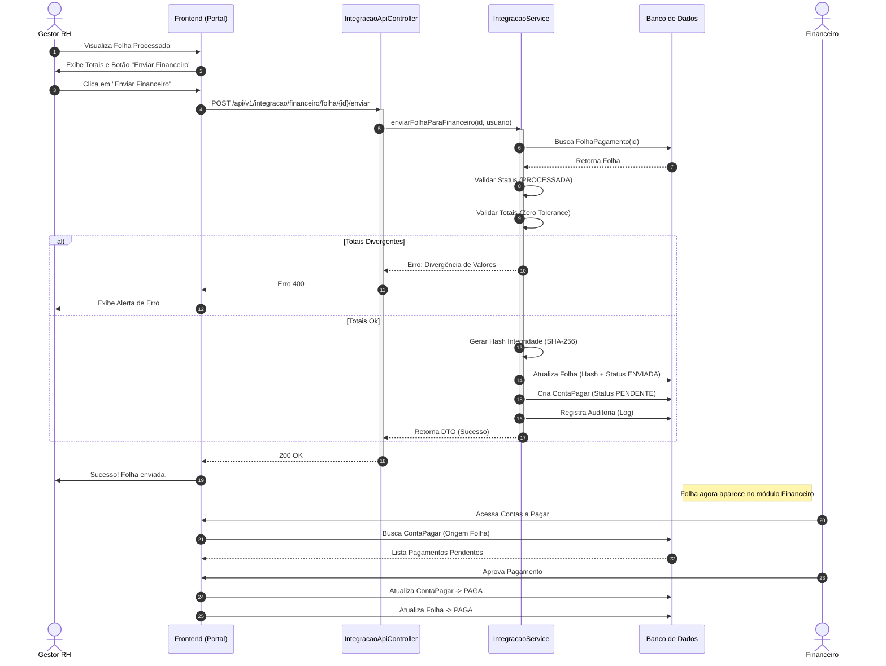

# Diagrama de Sequência - Integração RH x Financeiro

```mermaid
sequenceDiagram
    autonumber
    actor RH as Gestor RH
    participant UI as Frontend (Portal)
    participant API as IntegracaoApiController
    participant Service as IntegracaoService
    participant DB as Banco de Dados
    actor FIN as Financeiro

    RH->>UI: Visualiza Folha Processada
    UI->>RH: Exibe Totais e Botão "Enviar Financeiro"
    RH->>UI: Clica em "Enviar Financeiro"
    UI->>API: POST /api/v1/integracao/financeiro/folha/{id}/enviar
    
    activate API
    API->>Service: enviarFolhaParaFinanceiro(id, usuario)
    
    activate Service
    Service->>DB: Busca FolhaPagamento(id)
    DB-->>Service: Retorna Folha
    
    Service->>Service: Validar Status (PROCESSADA)
    Service->>Service: Validar Totais (Zero Tolerance)
    
    alt Totais Divergentes
        Service-->>API: Erro: Divergência de Valores
        API-->>UI: Erro 400
        UI-->>RH: Exibe Alerta de Erro
    else Totais Ok
        Service->>Service: Gerar Hash Integridade (SHA-256)
        
        Service->>DB: Atualiza Folha (Hash + Status ENVIADA)
        Service->>DB: Cria ContaPagar (Status PENDENTE)
        Service->>DB: Registra Auditoria (Log)
        
        Service-->>API: Retorna DTO (Sucesso)
    end
    
    deactivate Service
    
    API-->>UI: 200 OK
    deactivate API
    
    UI->>RH: Sucesso! Folha enviada.
    
    note right of DB: Folha agora aparece no módulo Financeiro
    
    FIN->>UI: Acessa Contas a Pagar
    UI->>DB: Busca ContaPagar (Origem Folha)
    DB-->>UI: Lista Pagamentos Pendentes
    FIN->>UI: Aprova Pagamento
    UI->>DB: Atualiza ContaPagar -> PAGA
    UI->>DB: Atualiza Folha -> PAGA
```
