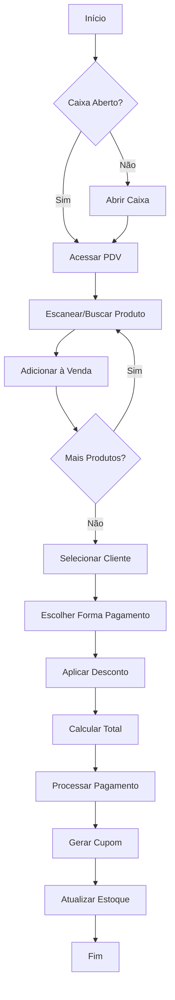
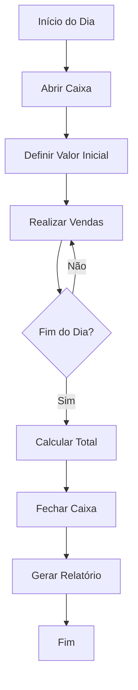

# 📊 Documentação Completa do Módulo de Vendas

## 📋 Índice
1. [Visão Geral](#visão-geral)
2. [Estrutura do Sistema](#estrutura-do-sistema)
3. [Funcionalidades](#funcionalidades)
4. [Fluxograma de Processos](#fluxograma-de-processos)
5. [Páginas e Componentes](#páginas-e-componentes)
6. [APIs e Endpoints](#apis-e-endpoints)
7. [Modelos de Dados](#modelos-de-dados)
8. [Integração com Outros Módulos](#integração-com-outros-módulos)

---

## 🎯 Visão Geral

O **Módulo de Vendas** é um sistema completo de gestão comercial que oferece funcionalidades desde o ponto de venda (PDV) até relatórios avançados de performance. O sistema é projetado para atender estabelecimentos comerciais com necessidades de controle de vendas, estoque e gestão financeira.

### Principais Características:
- ✅ **PDV Completo** - Interface moderna para vendas rápidas
- 📊 **Relatórios Avançados** - Análises detalhadas de performance
- 💰 **Gestão de Caixa** - Controle de abertura/fechamento
- 🧾 **Cupons Fiscais** - Geração de documentos fiscais
- 🔄 **Devoluções** - Sistema completo de devoluções
- 👥 **Histórico de Clientes** - Acompanhamento de vendas por cliente

---

## 🏗️ Estrutura do Sistema

### Arquitetura MVC
```
📁 Módulo de Vendas/
├── 🎮 Controller/
│   └── VendaController.java
├── 🏢 Service/
│   ├── VendaService.java
│   ├── VendaRelatorioService.java
│   └── CaixaService.java
├── 🗃️ Repository/
│   ├── VendaRepository.java
│   └── VendaItemRepository.java
├── 📊 Model/
│   ├── Venda.java
│   ├── VendaItem.java
│   └── StatusVenda.java
└── 🎨 Templates/
    └── vendas/
        ├── lista.html
        ├── cadastro.html
        ├── pdv.html
        ├── caixa.html
        ├── relatorios.html
        └── ...
```

---

## ⚙️ Funcionalidades

### 1. 🏪 Ponto de Venda (PDV)
- **Scanner de Código de Barras**: Leitura automática de produtos
- **Busca Rápida**: Localização de produtos por EAN/código
- **Cálculo Automático**: Total, desconto, troco
- **Múltiplas Formas de Pagamento**: Dinheiro, PIX, cartão
- **Parcelamento**: Suporte a vendas parceladas
- **Interface Responsiva**: Otimizada para tablets e desktops

### 2. 💰 Gestão de Caixa
- **Abertura de Caixa**: Definição de valor inicial
- **Controle de Vendas**: Acompanhamento em tempo real
- **Fechamento**: Cálculo automático do saldo final
- **Relatórios**: Resumo das operações do dia

### 3. 📊 Relatórios e Análises
- **Relatórios Básicos**: Vendas por período, cliente, produto
- **Análise de Performance**: Métricas de crescimento e tendências
- **Análise Comparativa**: Comparação entre períodos
- **Sazonalidade**: Identificação de padrões sazonais
- **Top Produtos**: Produtos mais vendidos

### 4. 🧾 Documentos Fiscais
- **Cupom Fiscal**: Geração automática com QR Code
- **PDF Personalizado**: Layout profissional
- **Informações Fiscais**: Impostos e tributos
- **Histórico**: Arquivo de todos os documentos

### 5. 🔄 Devoluções
- **Processo Simplificado**: Interface intuitiva
- **Controle de Estoque**: Reintegração automática
- **Motivos**: Categorização das devoluções
- **Relatórios**: Análise de devoluções

---

## 🔄 Fluxograma de Processos

### Processo Principal de Venda


### Processo de Gestão de Caixa


---

## 🎨 Páginas e Componentes

### Estrutura Padrão das Páginas
Todas as páginas do módulo seguem o padrão arquitetural:
```html
<div class="app-container">
    <aside th:replace="~{components/sidebar :: sidebar}"></aside>
    <main class="main-content">
        <header th:replace="~{components/topbar :: topbar}"></header>
        <section class="content-area">
            <!-- Conteúdo específico da página -->
        </section>
        <footer th:replace="~{components/footer :: footer}"></footer>
    </main>
</div>
```

### 📄 Lista de Páginas

| Página | Arquivo | Descrição | Status |
|--------|---------|-----------|--------|
| **Lista de Vendas** | `lista.html` | Listagem e filtros de vendas | ✅ Padronizada |
| **Cadastro de Venda** | `cadastro.html` | Formulário para nova venda | ✅ Padronizada |
| **PDV** | `pdv.html` | Ponto de venda completo | ✅ Padronizada |
| **Gestão de Caixa** | `caixa.html` | Controle de caixa | ✅ Padronizada |
| **Caixa Fechado** | `caixa-fechado.html` | Aviso de caixa fechado | ✅ Padronizada |
| **Relatórios** | `relatorios.html` | Relatórios básicos | ✅ Padronizada |
| **Relatórios Avançados** | `relatorios-avancados.html` | Análises detalhadas | ✅ Padronizada |
| **Detalhes da Venda** | `detalhes.html` | Visualização detalhada | ✅ Padronizada |
| **Editar Venda** | `editar.html` | Edição de vendas | ✅ Padronizada |
| **Devoluções** | `devolucao.html` | Gestão de devoluções | ✅ Padronizada |
| **Cupom Fiscal** | `cupom-fiscal.html` | Visualização de cupons | ✅ Padronizada |
| **Histórico Cliente** | `historico-cliente.html` | Vendas por cliente | ✅ Padronizada |

---

## 🔌 APIs e Endpoints

### Endpoints Principais

#### 📋 Gestão de Vendas
```http
GET    /vendas                    # Listar vendas
GET    /vendas/nova               # Formulário nova venda
POST   /vendas/salvar             # Salvar venda
GET    /vendas/{id}               # Detalhes da venda
GET    /vendas/{id}/pdf           # Gerar PDF da venda
```

#### 🏪 PDV (Ponto de Venda)
```http
GET    /vendas/pdv                # Interface do PDV
GET    /vendas/api/produto/{ean}  # Buscar produto por EAN
POST   /vendas/api/processar      # Processar venda PDV
```

#### 💰 Gestão de Caixa
```http
GET    /vendas/caixa              # Interface de caixa
POST   /vendas/api/caixa/abrir    # Abrir caixa
POST   /vendas/api/caixa/fechar   # Fechar caixa
GET    /vendas/api/caixa/status   # Status do caixa
```

#### 📊 Relatórios
```http
GET    /vendas/relatorios                    # Relatórios básicos
GET    /vendas/relatorios/avancados          # Relatórios avançados
GET    /vendas/api/relatorio-performance     # Relatório de performance
GET    /vendas/api/analise-comparativa       # Análise comparativa
GET    /vendas/api/analise-sazonalidade      # Análise de sazonalidade
GET    /vendas/api/analise-produtos          # Análise de produtos
```

### 📝 Estrutura de Dados das APIs

#### VendaPdvRequest
```json
{
  "clienteId": 1,
  "formaPagamento": "PIX",
  "valorPago": 100.00,
  "desconto": 5.00,
  "parcelas": 1,
  "observacoes": "Venda PDV",
  "itens": [
    {
      "ean": "7891234567890",
      "quantidade": 2
    }
  ]
}
```

#### VendaPdvResponse
```json
{
  "id": 123,
  "numeroVenda": "VND-2024-001",
  "total": 95.00,
  "troco": 5.00,
  "dataVenda": "2024-01-15T10:30:00",
  "sucesso": true,
  "mensagem": "Venda processada com sucesso!"
}
```

---

## 🗃️ Modelos de Dados

### Entidade Venda
```java
@Entity
public class Venda {
    @Id
    private Long id;
    private String numeroVenda;        // Número único da venda
    private BigDecimal total;          // Valor total
    private BigDecimal subtotal;       // Subtotal antes desconto
    private BigDecimal desconto;       // Valor do desconto
    private String formaPagamento;     // Forma de pagamento
    private Integer parcelas;          // Número de parcelas
    private BigDecimal valorPago;      // Valor pago pelo cliente
    private BigDecimal troco;          // Troco
    private LocalDateTime dataVenda;   // Data/hora da venda
    private String observacoes;        // Observações
    
    @ManyToOne
    private Cliente cliente;           // Cliente da venda
    
    @ManyToOne
    private Usuario usuario;           // Vendedor
    
    @OneToMany(mappedBy = "venda")
    private List<VendaItem> itens;     // Itens da venda
    
    @Enumerated(EnumType.STRING)
    private StatusVenda status;        // Status da venda
}
```

### Entidade VendaItem
```java
@Entity
public class VendaItem {
    @Id
    private Long id;
    private Integer quantidade;        // Quantidade vendida
    private BigDecimal precoUnitario; // Preço unitário
    private BigDecimal subtotal;      // Subtotal do item
    
    @ManyToOne
    private Venda venda;              // Venda pai
    
    @ManyToOne
    private Produto produto;          // Produto vendido
}
```

### Enum StatusVenda
```java
public enum StatusVenda {
    PENDENTE,      // Venda criada, aguardando pagamento
    CONFIRMADA,    // Venda confirmada e paga
    CANCELADA,     // Venda cancelada
    DEVOLVIDA      // Venda devolvida
}
```

---

## 🔗 Integração com Outros Módulos

### 📦 Módulo de Estoque
- **Consulta de Produtos**: Busca por EAN/código
- **Atualização Automática**: Redução do estoque após venda
- **Alertas**: Notificação de estoque baixo
- **Devoluções**: Reintegração ao estoque

### 👥 Módulo de Clientes
- **Cadastro Rápido**: Criação durante a venda
- **Histórico**: Consulta de vendas por cliente
- **Fidelidade**: Programas de pontuação
- **Análises**: Perfil de compra dos clientes

### 💰 Módulo Financeiro
- **Contas a Receber**: Vendas a prazo
- **Fluxo de Caixa**: Integração com movimentações
- **Relatórios**: Consolidação financeira
- **Conciliação**: Fechamento de caixa

### 🧾 Módulo Fiscal
- **Emissão de NFCe**: Cupons fiscais eletrônicos
- **Cálculo de Impostos**: ICMS, PIS, COFINS
- **SPED**: Integração com obrigações fiscais
- **Relatórios Fiscais**: Apuração de impostos

---

## 🎯 Conclusão

O **Módulo de Vendas** representa uma solução completa e moderna para gestão comercial, oferecendo:

✅ **Interface Intuitiva**: Design responsivo e user-friendly  
✅ **Performance Otimizada**: Processamento rápido de vendas  
✅ **Relatórios Avançados**: Análises detalhadas para tomada de decisão  
✅ **Integração Completa**: Conectividade com todos os módulos do sistema  
✅ **Escalabilidade**: Preparado para crescimento do negócio  

O sistema está totalmente **padronizado** com os componentes arquiteturais (sidebar, topbar, footer) e pronto para uso em ambiente de produção.

---

*Documentação gerada em: Janeiro 2024*  
*Versão: 1.0*  
*Status: ✅ Completo e Atualizado*