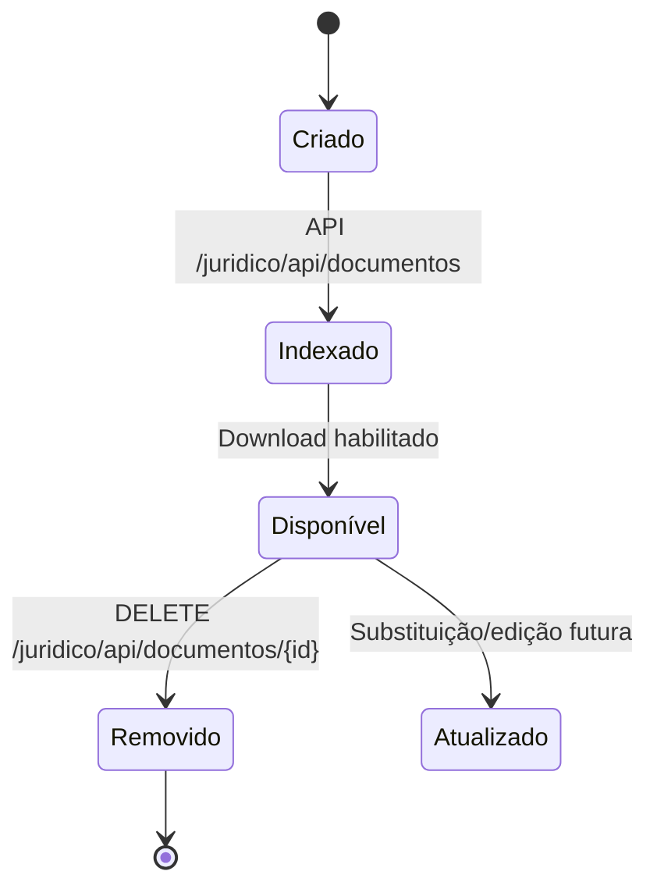
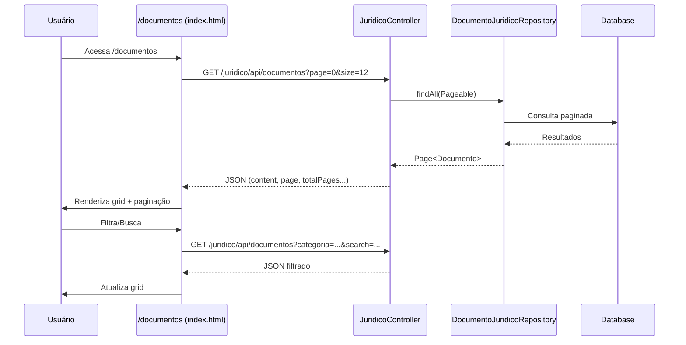
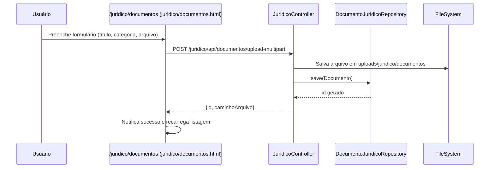
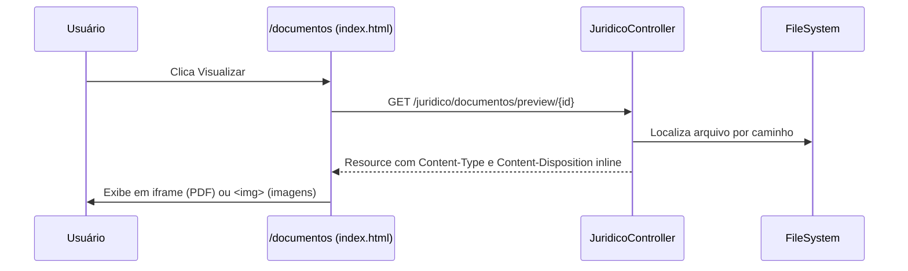
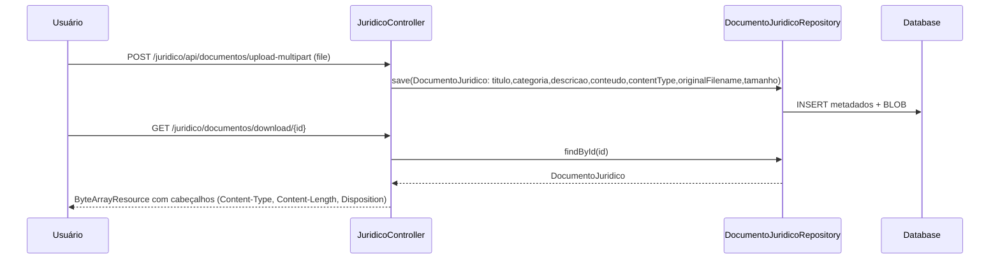

# Documentação Técnica — Ciclo de Vida do Sistema

## 1. Fluxograma Completo do Ciclo de Vida

```mermaid
flowchart LR
  subgraph Auth[Autenticação]
    A1[LoginController
    src/main/java/.../LoginController.java]
    A2[SecurityConfig
    src/main/java/.../config/SecurityConfig.java]
  end

  subgraph UI[Camada de UI (Thymeleaf)]
    D1[DashboardController
    src/main/java/.../DashboardController.java]
    RH1[RhController
    src/main/java/.../controller/rh/RhController.java]
    JU1[JuridicoController
    src/main/java/.../controller/JuridicoController.java]
    DOC1[DocumentosController
    src/main/java/.../controller/DocumentosController.java]
  end

  subgraph Templates[Templates]
    T_DOC_INDEX[documentos/index.html
    src/main/resources/templates/documentos/index.html]
    T_JUR_DOC[juridico/documentos.html
    src/main/resources/templates/juridico/documentos.html]
  end

  subgraph APIs[APIs REST]
    API_DOC_LIST[/juridico/api/documentos]
    API_DOC_METRICS[/juridico/api/documentos/metrics]
    API_DOC_UPLOAD[/juridico/api/documentos/upload-multipart]
    API_DOC_GERAR[/juridico/api/documentos/gerar]
    API_DOC_BY_ID[/juridico/api/documentos/{id}]
    API_DOC_DOWNLOAD[/juridico/documentos/download/{id}]
  end

  subgraph Data[Acesso a Dados]
    RepoDoc[DocumentoJuridicoRepository
    src/main/java/.../repository/juridico/DocumentoJuridicoRepository.java]
    DB[(PostgreSQL/MySQL)]
  end

  A1 -->|Login| A2 --> D1
  D1 --> DOC1 --> T_DOC_INDEX
  DOC1 --> JU1 --> T_JUR_DOC
  T_DOC_INDEX -. JS Fetch .-> API_DOC_LIST --> RepoDoc --> DB
  T_DOC_INDEX -. JS Fetch .-> API_DOC_METRICS --> RepoDoc --> DB
  T_JUR_DOC -. Upload .-> API_DOC_UPLOAD --> RepoDoc --> DB
  T_JUR_DOC -. Gerar .-> API_DOC_GERAR --> RepoDoc --> DB
  T_JUR_DOC -. Detalhes .-> API_DOC_BY_ID --> RepoDoc --> DB
  T_JUR_DOC -. Download .-> API_DOC_DOWNLOAD --> RepoDoc --> DB
```

Estados principais e transições (Documentos):



## 2. Explicação Passo a Passo

- Pontos de entrada
  - `LoginController` protege rotas e inicia sessão.
  - `DashboardController` direciona para módulos via sidebar/topbar.
- Fluxo principal (Documentos)
  - Usuário acessa `/documentos` → `DocumentosController` retorna `documentos/index.html` (UI padronizada).
  - JS da página chama `GET /juridico/api/documentos` e `GET /juridico/api/documentos/metrics` para listar e metrificar.
  - Renderiza grid, filtros, categorias e paginação.
- Fluxos alternativos/excepcionais
  - Upload via `juridico/documentos.html` (form multipart) → `POST /juridico/api/documentos/upload-multipart`.
  - Geração a partir de modelo → `POST /juridico/api/documentos/gerar` (duplica arquivo do modelo e cadastra documento).
  - Erros de upload/listagem são tratados na UI com toasts e mensagens de fallback.
- Integração entre módulos
  - UI `documentos/index.html` consome APIs do `JuridicoController` para dados reais.
  - `DocumentoJuridicoRepository` encapsula consultas e métricas.

## 3. Interconexões e Dependências

- Componentes e dependências
  - `DocumentosController` → `documentos/index.html` (view em `src/main/resources/templates/documentos/index.html`).
  - `JuridicoController` expõe endpoints REST e usa `DocumentoJuridicoRepository`.
  - Repositório → JPA/Hibernate → Base de dados.
- Comunicação entre módulos
  - Navegação: Dashboard/Sidebar → `/documentos` e `/juridico/documentos`.
  - APIs:
    - Listar: `GET /juridico/api/documentos` → paginação e filtros.
    - Métricas: `GET /juridico/api/documentos/metrics`.
    - Upload: `POST /juridico/api/documentos/upload-multipart`.
    - Gerar de modelo: `POST /juridico/api/documentos/gerar`.
    - Detalhes: `GET /juridico/api/documentos/{id}`.
    - Download: `GET /juridico/documentos/download/{id}`.
- Troca de dados e eventos
  - JSON payload com `content`, `page`, `size`, `totalPages`, `totalElements` para listagem, incluindo `contentType` e `originalFilename`.
  - Multipart para upload com `file`, `titulo`, `categoria`, `descricao`.

## 4. Padrões de Projeto

- Arquitetura
  - MVC com Spring Boot + Thymeleaf na UI.
  - Camadas: Controller → Service (quando aplicável) → Repository → DB.
  - Armazenamento de documentos: metadados + BLOB no banco (`DocumentoJuridico.conteudo`), com `contentType`, `originalFilename`, `tamanho`.
- Princípios SOLID
  - Responsabilidade única: Controllers por domínio (ex.: `JuridicoController`).
  - Inversão de dependência: Repositórios injetados via Spring.
- Padrões de comunicação
  - REST JSON para listagem/consulta.
  - Multipart para upload.
  - Download com `ResponseEntity<Resource>` e `Content-Disposition` (anexo).

## 5. Documentação Complementar

- Legenda (diagramas)
  - Caixas: componentes (Controllers, Templates, Repositórios).
  - Setas sólidas: navegação/renderização.
  - Setas tracejadas: chamadas JS/HTTP.
- Performance
  - Paginação no backend (`Pageable`) evita sobrecarga.
  - Métricas agregadas via query dedicada (`contagemPorCategoria`).
  - Upload sanitiza nomes e limita tamanhos.
- Manutenção
  - Centralizar endpoints no `JuridicoController` facilita evolução.
  - Reutilizar UI padrão (sidebar/topbar/footer) garante consistência.
  - Isolar lógica de transformação no cliente (inferência de tipo por extensão).
  - Controles de autorização por perfil (preview/download) aplicados via `@PreAuthorize` e refletidos na UI.

## 6. Diagramas de Sequência

Criação e exibição de documentos:



Upload multipart:



Preview integrado (inline):



Persistência e download/preview do BLOB:



Endpoints adicionados para preview:

- `GET /juridico/documentos/preview/{id}`: retorna o arquivo com `Content-Disposition: inline` e `Content-Type` detectado. Referência: src/main/java/com/jaasielsilva/portalceo/controller/JuridicoController.java:1390
- Integração na UI:
  - `documentos/index.html` usa `<iframe src="/juridico/documentos/preview/{id}#toolbar=0">` para PDFs e `` para imagens. Referência: src/main/resources/templates/documentos/index.html:1089
  - `juridico/documentos.html` adiciona botão “Visualizar” → abre nova aba com preview. Referência: src/main/resources/templates/juridico/documentos.html:386

Considerações:

- Tipos suportados para preview direto: PDF e imagens (PNG, JPG, JPEG).
- Demais tipos (DOC/DOCX/XLS/XLSX/PPT/PPTX): exibem mensagem e orientam download.
- Cabeçalhos de cache desabilitados para evitar exibição obsoleta.
 - Autorização:
   - Backend: `@PreAuthorize("hasAnyRole('ROLE_ADMIN','ROLE_MASTER')")` em preview e download.
     - Referências: `src/main/java/com/jaasielsilva/portalceo/controller/JuridicoController.java:1387`, `src/main/java/com/jaasielsilva/portalceo/controller/JuridicoController.java:1365`.
   - Frontend:
     - `documentos/index.html` define `window.PODE_PREVIEW` via Thymeleaf e oculta botões quando não permitido.
       - Referência: `src/main/resources/templates/documentos/index.html:898`.
     - `juridico/documentos.html` define `CAN_PREVIEW/CAN_DOWNLOAD` e condiciona botões.
       - Referência: `src/main/resources/templates/juridico/documentos.html:261`, `src/main/resources/templates/juridico/documentos.html:386`.

## 7. Referências no Código

- Páginas e controladores
  - `documentos/index.html`: src/main/resources/templates/documentos/index.html
  - `DocumentosController`: src/main/java/com/jaasielsilva/portalceo/controller/DocumentosController.java:11
  - `juridico/documentos.html`: src/main/resources/templates/juridico/documentos.html:87
  - `JuridicoController` (APIs de documentos):
    - Listar: src/main/java/com/jaasielsilva/portalceo/controller/JuridicoController.java:1026
    - Métricas: src/main/java/com/jaasielsilva/portalceo/controller/JuridicoController.java:1065
    - Upload multipart: src/main/java/com/jaasielsilva/portalceo/controller/JuridicoController.java:1305
    - Gerar de modelo: src/main/java/com/jaasielsilva/portalceo/controller/JuridicoController.java:1257
    - Detalhes: src/main/java/com/jaasielsilva/portalceo/controller/JuridicoController.java:1338
    - Download: src/main/java/com/jaasielsilva/portalceo/controller/JuridicoController.java:1365
  - `DocumentoJuridicoRepository`: src/main/java/com/jaasielsilva/portalceo/repository/juridico/DocumentoJuridicoRepository.java:1


