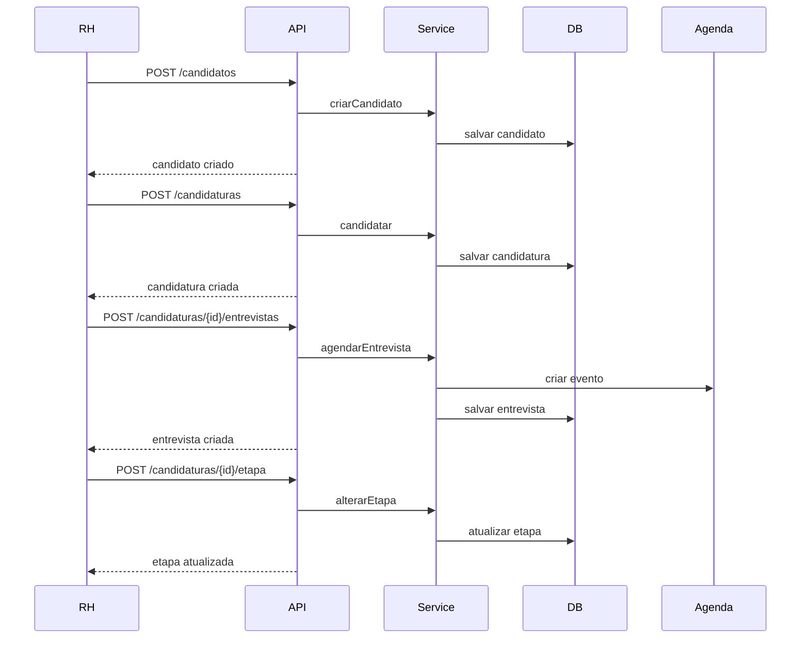

# Arquitetura do Módulo RH/Recrutamento

## Estrutura

- Modelos: Candidato, Experiência, Formação, Habilidade, Vaga, Candidatura, Entrevista, Avaliação, Divulgação
- Repositórios: por entidade
- Serviço: `RecrutamentoService` com regras de negócio
- Controladores: API (`/api/rh/recrutamento/*`) e MVC (`/rh/recrutamento/*`)
- Integração: Agenda corporativa (entrevistas) e EmailService (notificações)

## Endpoints

- `POST /api/rh/recrutamento/candidatos`
- `POST /api/rh/recrutamento/candidatos/{id}/experiencias`
- `POST /api/rh/recrutamento/candidatos/{id}/formacoes`
- `POST /api/rh/recrutamento/candidatos/{id}/habilidades`
- `POST /api/rh/recrutamento/vagas`
- `GET  /api/rh/recrutamento/vagas`
- `POST /api/rh/recrutamento/candidaturas`
- `GET  /api/rh/recrutamento/candidaturas`
- `POST /api/rh/recrutamento/candidaturas/{id}/entrevistas`
- `POST /api/rh/recrutamento/candidaturas/{id}/avaliacao`
- `POST /api/rh/recrutamento/candidaturas/{id}/etapa`
- `POST /api/rh/recrutamento/vagas/{id}/divulgacoes`
- `GET  /api/rh/recrutamento/relatorios/metrics`
- `GET  /api/rh/recrutamento/relatorios/export.csv`
- `GET  /api/rh/recrutamento/relatorios/export.pdf`
- `GET  /api/rh/recrutamento/relatorios/por-etapa`
- `POST /api/rh/recrutamento/vagas/{id}/divulgar-externo`

## Fluxo de Dados

- Candidatos com histórico (experiência, formação, habilidades)
- Vagas abertas recebem candidaturas e entrevistas
- Avaliações e etapas atualizam status de candidaturas
- Relatórios agregam métricas e diversidade

## Diagramas de Sequência

## Segurança

- `@PreAuthorize` com perfis `ROLE_RH`, `ROLE_ADMIN`, `ROLE_MASTER`, `ROLE_GERENCIAL`

## Métricas

- Total processos, contratados, reprovados, taxa de conversão, tempo médio, diversidade por gênero
 
## UI Atualizada

- Pipeline com filtros por etapa e vaga, edição de etapa, agendamento e avaliação direto da tabela (`templates/rh/recrutamento/pipeline.html`)
- Listagem de candidatos com busca (`templates/rh/recrutamento/candidatos.html`)
- Dashboard Chart.js de conversão por etapa (`templates/rh/recrutamento/relatorios.html`)
