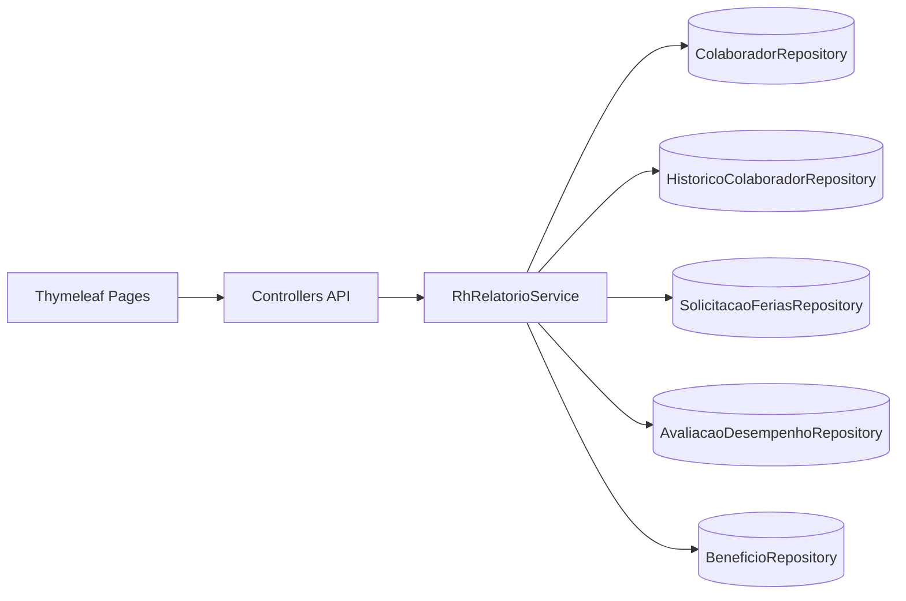
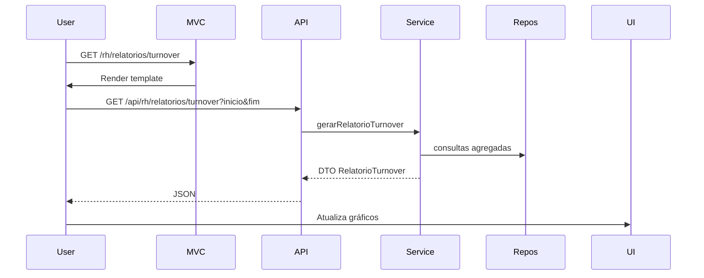

# Módulo RH/Relatórios — Documentação Técnica

## Arquitetura

- Controllers MVC: `RhRelatoriosController` (`/rh/relatorios/*`)
- Controllers API: `RhRelatoriosApiController` (`/api/rh/relatorios/*`)
- Service: `RhRelatorioService` (cálculos e agregações)
- Repositórios: `ColaboradorRepository`, `HistoricoColaboradorRepository`, `SolicitacaoFeriasRepository`, `AvaliacaoDesempenhoRepository`, `BeneficioRepository`
- Templates: `templates/rh/relatorios/*` com padronização do sistema
- Segurança: `@PreAuthorize` com perfis `'ROLE_RH','ROLE_ADMIN','ROLE_MASTER','ROLE_GERENCIAL'`

## Endpoints API

- `GET /api/rh/relatorios/turnover?inicio=YYYY-MM-DD&fim=YYYY-MM-DD`
  - Retorna contratações, desligamentos e taxa de turnover por mês
- `GET /api/rh/relatorios/admissoes-demissoes?inicio&fim`
  - Lista admitidos e desligados, totais e taxa de turnover do período
- `GET /api/rh/relatorios/ferias-beneficios?inicio&fim`
  - Totais de solicitações de férias (solicitadas, aprovadas, pendentes) e custos de benefícios
- `GET /api/rh/relatorios/indicadores?inicio&fim`
  - Indicadores de desempenho: total de avaliações, submetidas, aprovadas e média de notas

## Páginas MVC

- `GET /rh/relatorios/turnover`
  - Implementação dos gráficos seguindo o padrão do dashboard funcional (Chart.js)
  - Uma instância por gráfico; atualização via `chart.update()`
  - Validações: labels ordenadas, dados normalizados, tratamento de série vazia
  - Escala dinâmica com teto realista (cap) e `beginAtZero`
- `GET /rh/relatorios/admissoes-demissoes`
- `GET /rh/relatorios/ferias-beneficios`
- `GET /rh/relatorios/indicadores`

## Modelos de Dados (resumo)

- `Colaborador`: base para headcount, admissões e benefícios
- `HistoricoColaborador`: eventos com `evento` e `dataRegistro` para demissões
- `SolicitacaoFerias`: período e `status` para contagem
- `AvaliacaoDesempenho`: `status` e `nota` para indicadores
- `Beneficio`/`ColaboradorBeneficio`: agregação de custos por benefício

## Integração com Sidebar

- Itens adicionados em `templates/components/sidebar.html` no grupo “Relatórios RH”
  - `Turnover`, `Admissões/Demissões`, `Férias e Benefícios`, `Indicadores`

## Segurança

- Rotas sob autenticação conforme `SecurityConfig`
- `@EnableMethodSecurity` ativo; controllers usam `@PreAuthorize`

## Casos de Uso

- Analisar turnover mensal e comparar períodos
- Auditar admissões/demissões por período
- Planejar férias com visão consolidada e status
- Avaliar performance com KPIs agregados

## Campos e Ações (UI)

- Filtros: `inicio`, `fim`
- Ações: `Aplicar` (recarrega gráficos/tabelas via fetch JSON)
- Visualizações: gráficos `Chart.js`, tabelas responsivas

## Fluxo de Vida dos Relatórios

1. Usuário acessa página MVC
2. Define período e aplica filtro
3. Página consome API JSON
4. Renderização de gráficos e tabelas (Chart.js; atualização estável)
5. Ações adicionais conforme segurança/perfil

## Exemplos de Utilização

- Turnover: `GET /api/rh/relatorios/turnover?inicio=2025-01-01&fim=2025-06-30`
- Férias: `GET /api/rh/relatorios/ferias-beneficios?inicio=2025-01-01&fim=2025-12-31`

## Diagramas

