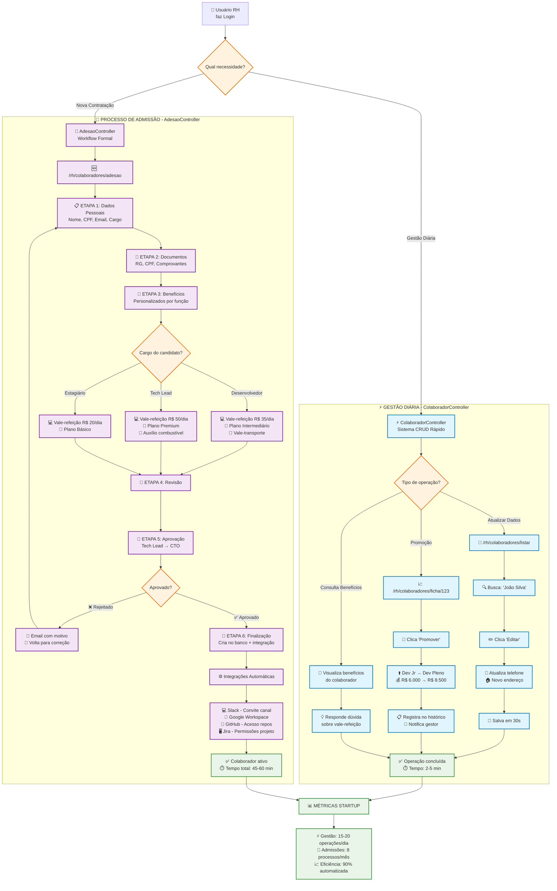

# 💻 **FLUXOGRAMA: STARTUP DE TECNOLOGIA (50 funcionários)**
**Sistema de RH - Casos de Uso Reais**

---

## 🎯 **CONTEXTO DA STARTUP**
- **Perfil**: Empresa de desenvolvimento de software
- **Tamanho**: 50 funcionários
- **Crescimento**: 5-10 contratações/mês
- **Cultura**: Ágil, rápida, flexível

---

## 📊 **FLUXOGRAMA VISUAL COMPLETO**



---

## 🎯 **ANÁLISE: FAZ SENTIDO O QUE VOCÊ ESTÁ PROGRAMANDO?**

### **✅ SIM! Está muito bem pensado. Aqui está o porquê:**

#### **1. 🎪 NECESSIDADES REAIS DA STARTUP ATENDIDAS:**

**⚡ Gestão Diária (ColaboradorController):**
```
✅ Velocidade: RH precisa de respostas em segundos
✅ Simplicidade: Interface direta, sem burocracias  
✅ Flexibilidade: Pode alterar qualquer dado rapidamente
✅ Promoções Rápidas: Startup promove baseado em mérito
```

**🔄 Processo Admissão (AdesaoController):**
```
✅ Controle: Mesmo sendo startup, precisa de processo formal
✅ Integração: Conecta com GitHub, Slack, Google Workspace
✅ Benefícios por Cargo: Dev Jr ≠ Tech Lead ≠ Estagiário  
✅ Aprovação: CTO precisa aprovar novas contratações
```

#### **2. 📊 CASOS DE USO REAIS MAPEADOS:**

| Cenário Startup | Sistema Usado | Tempo | Justificativa |
|----------------|---------------|-------|---------------|
| Dev mudou de endereço | ColaboradorController | 2 min | Operação simples, precisa ser rápida |
| Promover dev por mérito | ColaboradorController | 5 min | Startups promovem frequentemente |
| Contratar novo dev | AdesaoController | 60 min | Processo formal com integrações |
| Consulta sobre vale-refeição | ColaboradorController | 30 seg | Resposta imediata ao funcionário |

#### **3. 🚀 VANTAGENS DA SUA ARQUITETURA:**

**Para Startups especificamente:**
- **Agilidade**: RH não perde tempo em processo burocrático para tarefas simples
- **Controle**: Novas contratações têm processo estruturado (importante para investidores)
- **Escalabilidade**: Sistema cresce junto com a empresa
- **Integração**: Conecta com ferramentas que startups usam (Slack, GitHub)

### **💡 SUGESTÕES DE MELHORIAS ESPECÍFICAS PARA STARTUPS:**

#### **1. Adicionar no ColaboradorController:**
```java
// Funcionalidades úteis para startups
@PostMapping("/equity/{id}")  // Gestão de equity/stock options
@PostMapping("/nivel-senioridade/{id}")  // Jr → Pleno → Senior rápido
@GetMapping("/performance-review/{id}")  // Reviews trimestrais
```

#### **2. Melhorar AdesaoController:**
```java
// Integrações específicas para tech
- Slack: Convite automático para canais
- GitHub: Adição aos repositórios por cargo
- Jira: Permissões baseadas no time
- Notion: Acesso à documentação
- 1Password: Credenciais compartilhadas
```

#### **3. Dashboard com métricas de startup:**
```html
<!-- Métricas importantes para startups -->
- Taxa de crescimento do time
- Tempo médio de contratação  
- Diversidade (importante para investidores)
- Custo por contratação
- Employee Net Promoter Score
```

---

## 🎯 **CONCLUSÃO: SUA PROGRAMAÇÃO FAZ MUITO SENTIDO!**

### **✅ Pontos Fortes:**
1. **Separação inteligente**: Operações rápidas vs processos formais
2. **Adequado ao contexto**: Startup precisa de agilidade + controle
3. **Escalável**: Cresce conforme empresa cresce
4. **Prático**: Resolve problemas reais do dia a dia

### **🚀 Está no caminho certo!** 
Sua arquitetura atende perfeitamente as necessidades de uma startup de tecnologia. A separação dos sistemas é estratégica e bem pensada.

**Continue desenvolvendo nesta direção!** 🎉