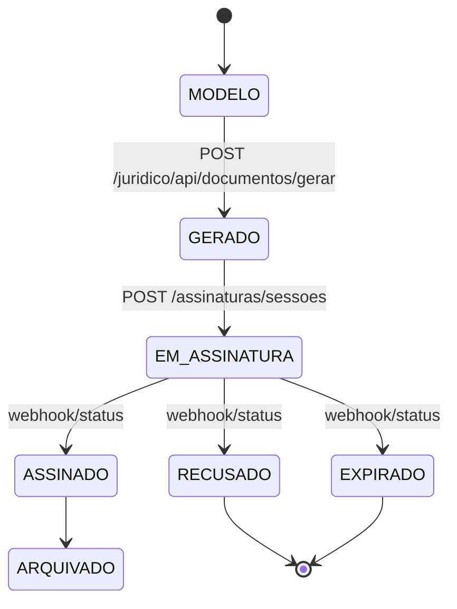
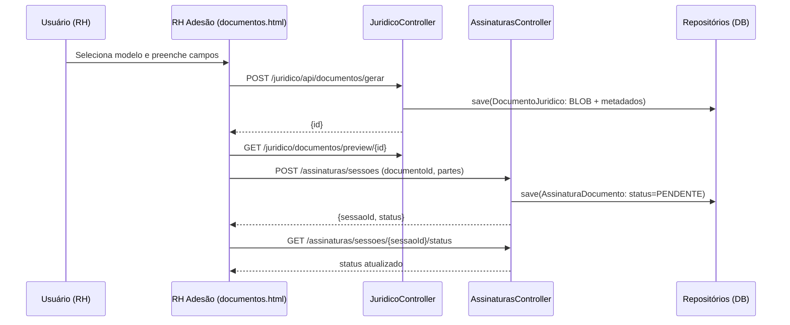
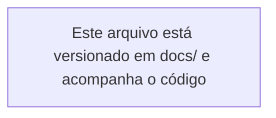

# Fluxo Profissional — Assinaturas e Adesão de Colaboradores

## 1. Visão Geral

- Integra Jurídico (modelos e documentos) com RH (adesão), contemplando personalização, geração de BLOB, sessão de assinatura, auditoria e notificações.
- Segurança com controle de perfis e proteção de endpoints sensíveis.

## 2. Fluxograma de Navegação

```mermaid
flowchart LR
  subgraph RH[RH - Adesão]
    RH_DOC[rh/colaboradores/adesao/documentos.html]
  end
  subgraph JUR[Jurídico]
    J_DOC_LIST[juridico/documentos.html]
    J_API_MODEL[/juridico/api/modelos]
    J_API_GEN[/juridico/api/documentos/gerar]
    J_API_PREV[/juridico/documentos/preview/{id}]
    J_API_DOWN[/juridico/documentos/download/{id}]
  end
  subgraph ASS[Assinaturas]
    A_SESS[/assinaturas/sessoes]
    A_STATUS[/assinaturas/sessoes/{id}/status]
    A_HOOK[/assinaturas/webhook]
  end

  RH_DOC -- Busca modelos --> J_API_MODEL
  RH_DOC -- Gerar documento --> J_API_GEN
  RH_DOC -- Pré-visualizar --> J_API_PREV
  RH_DOC -- Assinar --> A_SESS
  A_SESS -- Status --> A_STATUS
  A_HOOK -- Atualiza status --> A_STATUS
  RH_DOC -. Consulta status .-> A_STATUS
```

## 3. Estados e Transições



## 4. Passo a Passo

- RH Adesão (documentos.html)
  - Seleciona modelo (combo "Modelos") via `GET /juridico/api/modelos`.
  - Preenche título, categoria e descrição.
  - Personaliza campos (nome, CPF, cargo, data, salário) — nesta versão, persistidos em metadados.
  - Gera documento (BLOB) com `POST /juridico/api/documentos/gerar`.
  - Pré-visualiza via `GET /juridico/documentos/preview/{id}`.
  - Cria sessão de assinatura com `POST /assinaturas/sessoes`.
  - Consulta `GET /assinaturas/sessoes/{id}/status` para rastrear.

## 5. Interconexões Técnicas

- Endpoints principais
  - Jurídico
    - Listagem: `JuridicoController.java:1028`
    - Métricas: `JuridicoController.java:1066`
    - Upload → BLOB: `JuridicoController.java:1306`
    - Gerar → BLOB: `JuridicoController.java:1258`
    - Preview protegido: `JuridicoController.java:1389`
    - Download protegido: `JuridicoController.java:1366`
  - Assinaturas
    - Criar sessão: `AssinaturasController.java:23`
    - Status: `AssinaturasController.java:54`
    - Webhook: `AssinaturasController.java:64`
  - RH Adesão UI
    - Seção contratos: `src/main/resources/templates/rh/colaboradores/adesao/documentos.html:30`

- Dados
  - `DocumentoJuridico`: metadados + `conteudo` (BLOB), `contentType`, `originalFilename`, `tamanho`.
  - `AssinaturaDocumento`: `documentoId`, `tipo`, `status`, `partes`, `externalId`, `evidencias`.

## 6. Segurança e Auditoria

- Segurança
  - Preview/Download protegidos via `@PreAuthorize("hasAnyRole('ROLE_ADMIN','ROLE_MASTER')")`.
  - Sessões de assinatura protegidas por `ROLE_ADMIN`, `ROLE_MASTER`, `ROLE_RH`, `ROLE_JURIDICO`.

- Auditoria
  - `AuditService` registra criação de sessão e eventos críticos.
  - Estrutura de log com `AUDIT_EVENT` e dados mascarados quando necessário.

## 7. Notificações

- Notificações automáticas
  - Em criação de sessão e atualizações de status (webhook), disparar notificação às partes.
  - Integração opcional com topbar através de endpoint de consulta.

## 8. Validação

- Cenários
  - Modelo inexistente → 404.
  - Documento gerado sem bytes → 410.
  - Falta de permissão em preview/download → 403.
  - Sessão de assinatura inválida → 404.

- Compatibilidade
  - Preview inline para `pdf`/imagens; outros tipos via download.
  - Metadados de personalização persistidos para auditoria.

## 9. Fluxo de Assinatura (Sequência)



## 10. Passo a Passo (Execução)

1. Abrir `RH → Adesão → Documentos`.
2. Selecionar um modelo publicado.
3. Preencher título/categoria/descrição e campos de personalização.
4. Gerar documento (BLOB) e habilitar preview/assinatura.
5. Pré-visualizar o documento.
6. Criar sessão de assinatura com partes (colaborador, RH).
7. Acompanhar status da assinatura e concluir.

## 11. Referências no Código

- `AssinaturasController`: `src/main/java/com/jaasielsilva/portalceo/controller/AssinaturasController.java:1`
- `AssinaturaDocumento`: `src/main/java/com/jaasielsilva/portalceo/model/juridico/AssinaturaDocumento.java:1`
- `AssinaturaDocumentoRepository`: `src/main/java/com/jaasielsilva/portalceo/repository/juridico/AssinaturaDocumentoRepository.java:1`
- `DocumentoJuridico` (BLOB): `src/main/java/com/jaasielsilva/portalceo/model/juridico/DocumentoJuridico.java:6`
- `JuridicoController` (geração/preview/download): `src/main/java/com/jaasielsilva/portalceo/controller/JuridicoController.java:1258`, `:1366`, `:1389`
- UI RH Adesão: `src/main/resources/templates/rh/colaboradores/adesao/documentos.html:30`



## 12. Termos do Processo de Adesão (Fluxo Manual)

- Publicação manual
  - Administradores criam e publicam o termo em `Termo` com tipo `OUTROS` e título contendo "Processo de Adesão".
  - Não há criação automática de termo na finalização da adesão.
  - A finalização apenas registra aceite quando existir termo publicado vigente.

- Visualização na revisão
  - Link de atalho na página de revisão abre os termos em nova aba: `src/main/resources/templates/rh/colaboradores/adesao/revisao.html:431`.
  - Rota de visualização dos termos: `src/main/java/com/jaasielsilva/portalceo/controller/TermosController.java:212` (`GET /termos/adesao`).

- Registro de aceite (auditoria)
  - Na finalização, quando autenticado e havendo termo publicado, o sistema registra o aceite com IP e `User-Agent`.
  - Assinatura digital SHA-256 dos dados essenciais garante integridade do registro.
  - Implementação de aceite: `src/main/java/com/jaasielsilva/portalceo/service/TermoService.java:286`.
  - Chamada do aceite na finalização da adesão: `src/main/java/com/jaasielsilva/portalceo/controller/rh/colaborador/AdesaoColaboradorController.java:1074`.

- Comportamento sem termo publicado
  - Se não houver termo publicado vigente, a finalização prossegue sem registrar `TermoAceite`.
  - Busca do termo publicado por título "Processo de Adesão": `src/main/java/com/jaasielsilva/portalceo/controller/rh/colaborador/AdesaoColaboradorController.java:1094`.

## 13. Resumo do Fluxo Atualizado

- Etapas
  - RH gera e assina documentos conforme seções anteriores.
  - Revisão final exibe link "Ver Termos do Processo de Adesão".
  - Aceites obrigatórios na UI: termos, desconto em folha, veracidade dos dados.
  - Registro de aceite dos termos ocorre apenas se houver termo publicado vigente.

- Segurança
  - Visualização dos termos e registro de aceite respeitam autenticação e perfis.
  - Auditoria persistente para criação, mudança de status e aceites de termos.
