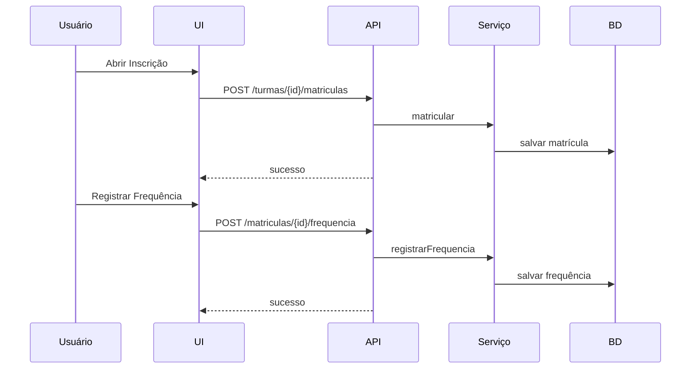

# Manual do Usuário — RH/Treinamentos

## Acesso

- Relatórios: `http://localhost:8080/rh/treinamentos/relatorios`
- Cadastro unificado: `http://localhost:8080/rh/treinamentos/cadastro`
- Inscrição: `http://localhost:8080/rh/treinamentos/inscricao`
- Certificado: `http://localhost:8080/rh/treinamentos/certificado`

## Casos de Uso

- Cadastrar curso
- Cadastrar instrutor
- Criar turma
- Matricular colaborador
- Registrar frequência
- Avaliar treinamento
- Emitir certificado

## Passo a Passo

- Criar curso via API ou UI
- Criar instrutor
- Criar turma informando curso, período, local, capacidade
- Matricular colaboradores na turma
- Registrar frequência por sessão
- Avaliar treinamento por matrícula
- Gerar certificado por matrícula

## Screenshots

- Cadastro: cursos, instrutores e turmas
- Inscrição: formulário de matrícula
- Relatórios: participação, presença, avaliação
- Certificado: geração de PDF

## Perguntas Frequentes

- Turma lotada: reduzir matrícula ou aumentar capacidade
- Erro de período: verificar datas início/fim
- Não aparece curso/instrutor: ver IDs e listagem; opcional implementar selects dinâmicos

## Solução de Problemas

- Falha ao carregar turmas: verificar API e permissões
- PDF vazio: checar dependência de renderização e conteúdo
- E-mail não recebido: validar endereço e servidor SMTP

## Explicação de Campos e Configurações

- Curso: título (obrigatório), categoria, carga horária, descrição
- Instrutor: nome (obrigatório), e-mail (opcional), bio
- Turma: curso (ID), instrutor (ID), capacidade, local, início, fim
- Matrícula: turma (ID), colaborador (ID)
- Frequência: matrícula (ID), data/hora, presença, observações
- Avaliação: matrícula (ID), nota (0–10), feedback

## Benefícios e Aplicações

- Centralização do ciclo de treinamentos
- Evidências auditáveis (presença, avaliação, certificados)
- Integração com Agenda e e-mail para lembretes
- Exportação para BI e compartilhamento (CSV/PDF)

## Comparativo com Processo Manual

- Antes: planilhas e e-mails dispersos, controle falho de presença
- Depois: registros transacionais, relatórios consolidados, automações de lembrete

## Métricas de Eficiência

- Taxa de presença média por turma
- Média de avaliação por curso
- Tempo de emissão de certificados

## Requisitos e Configurações

- Acesso com perfis adequados
- SMTP configurado para envio de e-mails
- Dependência `openhtmltopdf` para PDFs

## Fluxos (mermaid)

## Histórico de Versões

- v1.0 – Funcionalidades básicas
- v1.1 – Relatórios e exportações
- v1.2 – Certificados e páginas dedicadas
