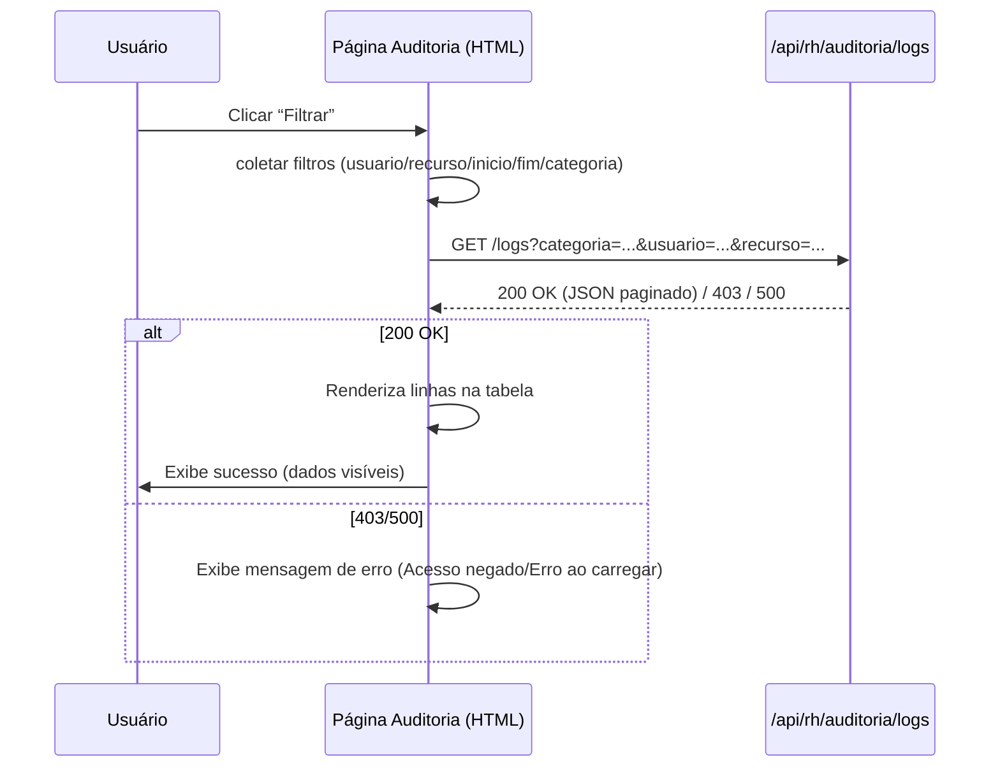

# Documentação Completa — RH/Auditoria

## Inventário das Páginas
- `src/main/resources/templates/rh/auditoria/index.html`
- `src/main/resources/templates/rh/auditoria/acessos.html`
- `src/main/resources/templates/rh/auditoria/alteracoes.html`
- `src/main/resources/templates/rh/auditoria/exportacoes.html`
- `src/main/resources/templates/rh/auditoria/revisoes.html`

## Descrição Técnica por Página

### index.html
- Estrutura:
  - Layout base com Sidebar/Topbar/Footer (`th:replace`)
  - Conteúdo: título e descrição estática
- Campos/Formulários: nenhum
- Botões/Links: nenhum específico; navegação via Sidebar
- Navegação:
  - Via Sidebar para: Acessos, Alterações, Exportações, Revisões
  - Sidebar: `src/main/resources/templates/components/sidebar.html:290-315`

### acessos.html
- Estrutura:
  - Form de filtros (`onsubmit` → `carregarLogs()`) em `src/main/resources/templates/rh/auditoria/acessos.html:29-51`
  - Tabela responsiva com `tbody#logsTableBody` em `src/main/resources/templates/rh/auditoria/acessos.html:53-73`
  - Scripts: `resetarFiltro()` e `carregarLogs()` em `src/main/resources/templates/rh/auditoria/acessos.html:82-144`
- Campos:
  - `categoriaPadrao` (hidden, valor padrão `ACESSO`) em `acessos.html:30`
  - `filtroUsuario` (`text`, placeholder `email ou usuário`) em `acessos.html:33`
  - `filtroRecurso` (`text`, placeholder `/rota`) em `acessos.html:37`
  - `filtroInicio` (`datetime-local`) em `acessos.html:41`
  - `filtroFim` (`datetime-local`) em `acessos.html:45`
- Validações:
  - Client-side: sem `required`; sem `pattern`; submissão bloqueada via `event.preventDefault()`
  - Server-side: filtros enviados via querystring para `/api/rh/auditoria/logs`
- Botões:
  - `Filtrar` (submit) → chama `carregarLogs()`
  - `Limpar` (button) → `resetarFiltro()` zera campos e recarrega
- Eventos/Funções:
  - `resetarFiltro()` limpa inputs e chama `carregarLogs()` em `acessos.html:83-89`
  - `carregarLogs(page=0)` monta `URLSearchParams`, chama `fetch('/api/rh/auditoria/logs?...')`, trata 403/erro, popula tabela em `acessos.html:90-143`
- Navegação:
  - Link `Voltar` → `/rh/auditoria` em `acessos.html:26`

### alteracoes.html
- Estrutura idêntica a `acessos.html` com categoria padrão `ALTERACAO`
- Campos:
  - `categoriaPadrao` (hidden, valor padrão `ALTERACAO`) em `alteracoes.html:29-31`
  - `filtroUsuario`, `filtroRecurso`, `filtroInicio`, `filtroFim` em `alteracoes.html:31-45`
- Botões/Validações/Eventos:
  - Iguais à página `acessos.html` (funções em `alteracoes.html:82-141`)
- Navegação:
  - `Voltar` → `/rh/auditoria` em `alteracoes.html:26`

### exportacoes.html
- Estrutura similar, categoria padrão `EXPORTACAO`
- Campos:
  - `categoriaPadrao` (hidden, valor padrão `EXPORTACAO`) em `exportacoes.html:29-31`
  - `filtroUsuario`, `filtroRecurso`, `filtroInicio`, `filtroFim` em `exportacoes.html:31-45`
- Botões/Validações/Eventos:
  - Funções em `exportacoes.html:81-140`; comportamento idêntico
- Navegação:
  - `Voltar` → `/rh/auditoria` em `exportacoes.html:26`

### revisoes.html
- Estrutura similar, categoria padrão `REVISAO`
- Campos:
  - `categoriaPadrao` (hidden, valor padrão `REVISAO`) em `revisoes.html:29-31`
  - `filtroUsuario`, `filtroRecurso`, `filtroInicio`, `filtroFim` em `revisoes.html:31-45`
- Botões/Validações/Eventos:
  - Funções em `revisoes.html:81-140`; comportamento idêntico
- Navegação:
  - `Voltar` → `/rh/auditoria` em `revisoes.html:26`

## Fluxos de Navegação
- Sidebar → Auditoria RH →
  - `Log de Acessos` (`/rh/auditoria/acessos`)
  - `Alterações de Dados` (`/rh/auditoria/alteracoes`)
  - `Exportações` (`/rh/auditoria/exportacoes`)
  - `Revisões Periódicas` (`/rh/auditoria/revisoes`)
- Cada página tem `Voltar` → `/rh/auditoria`

## Fluxos de Teste

### Fluxo de Sucesso (exemplo em Acessos)
- Passo 1: Acessar `index.html` (`/rh/auditoria`)
- Passo 2: Navegar para `Log de Acessos`
- Passo 3: Preencher `Usuário` com `master@sistema.com`
- Passo 4: Preencher `Recurso` com `/login`
- Passo 5: Informar `Início` e `Fim` com intervalo válido
- Passo 6: Clicar no botão `Filtrar`
- Passo 7: Visualizar tabela preenchida com registros
- Resultado esperado: “Operação realizada com sucesso” e/ou dados carregados; tabela mostra linhas com `OK`

### Fluxo de Erro (exemplo em Acessos)
- Passo 1: Acessar `index.html` (`/rh/auditoria`)
- Passo 2: Navegar para `Log de Acessos`
- Passo 3: Deixar todos os campos em branco (ou simular acesso sem permissão)
- Passo 4: Clicar em `Filtrar`
- Passo 5: Backend retorna `403` (sem permissão) ou erro
- Resultado esperado: “Campo X é obrigatório” (quando aplicável) ou alerta “Acesso negado”/“Erro ao carregar”; tabela mostra linha em vermelho conforme tratamento em `acessos.html:100-110`

Observação: As páginas não usam `required` no HTML; erros visualizados são do backend (403/500) e exibidos como textos na tabela e via `globalToast` quando disponível.

## Diagrama de Sequência (Mermaid)

## Tabela de Casos de Teste
| Caso | Página | Entrada | Ação | Saída Esperada |
|---|---|---|---|---|
| CT-01 | Acessos | Usuário=master@sistema.com, Recurso=/login, Intervalo válido | Filtrar | Tabela com registros “LOGIN_SUCESSO”; badge `OK` |
| CT-02 | Acessos | Campos em branco, sem permissão | Filtrar | Alerta “Acesso negado”; tabela linha vermelha |
| CT-03 | Alterações | Usuário=julia@empresa.com, Recurso=/rh/colaboradores/editar | Filtrar | Registros “ALTERACAO_DADOS”; badge `OK` |
| CT-04 | Exportações | Usuário=auditor@empresa.com, Recurso=/export/csv | Filtrar | Registros de exportação; badge `OK` |
| CT-05 | Revisões | Intervalo inválido (início>fim) | Filtrar | “Erro ao carregar” (se backend validar); sem sucesso |

## Instruções de Teste no Navegador
- Acesse `/rh/auditoria` com perfil `ADMIN`, `MASTER` ou `RH_GERENTE`.
- Entre na página desejada via Sidebar.
- Preencha filtros conforme os casos de teste.
- Clique em `Filtrar` e observe a tabela.
- Use `Limpar` para resetar e repetir.

## Screenshots Anotados
- Salvar imagens em `docs/img/rh-auditoria/`
  - `index.png` — Título/descrição, navegação via Sidebar
  - `acessos.png` — Filtros marcados, tabela destacada
  - `alteracoes.png` — Filtros, tabela
  - `exportacoes.png` — Filtros, tabela
  - `revisoes.png` — Filtros, tabela
- Anotações sugeridas: destacar campos, botões e mensagens.

## Entregáveis
- PDF: imprimir este documento via navegador (Arquivo → Imprimir → “Salvar como PDF”).
- TXT: passos dos fluxos disponível em `docs/RH-Auditoria-Flows.txt`.
- HTML: versão rápida dos fluxos em `docs/RH-Auditoria-Flows.html`.

## Referências de Código
- `acessos.html` campos e eventos: `src/main/resources/templates/rh/auditoria/acessos.html:29-51`, `82-144`
- `alteracoes.html` campos e eventos: `src/main/resources/templates/rh/auditoria/alteracoes.html:28-50`, `82-141`
- `exportacoes.html` campos e eventos: `src/main/resources/templates/rh/auditoria/exportacoes.html:28-50`, `81-140`
- `revisoes.html` campos e eventos: `src/main/resources/templates/rh/auditoria/revisoes.html:28-50`, `81-140`
- Controller e rotas: `src/main/java/com/jaasielsilva/portalceo/controller/rh/RhAuditoriaController.java:9-19,30-37,48-56`
