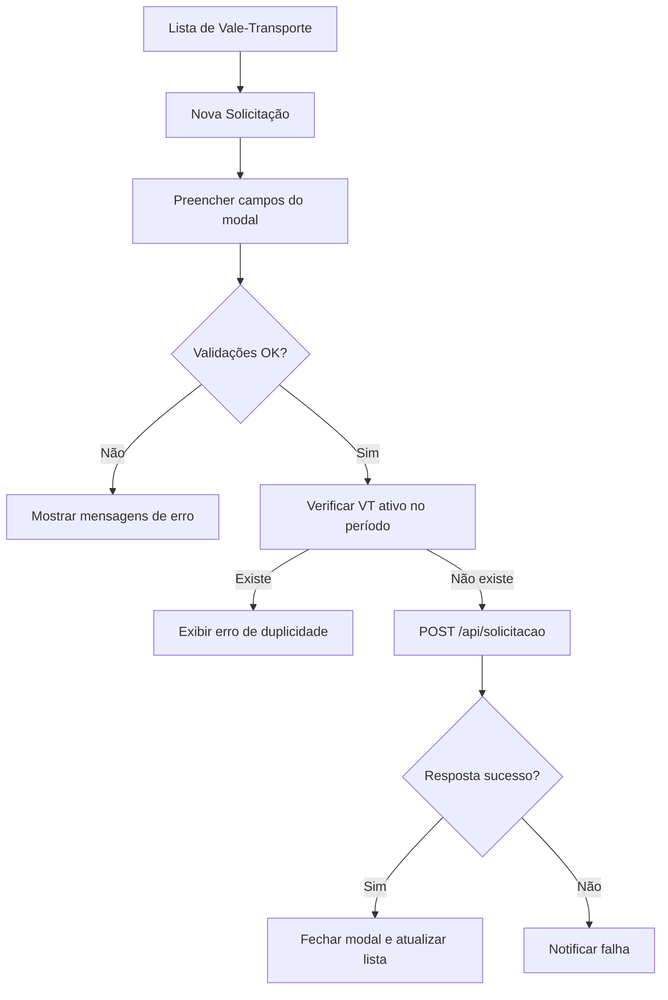
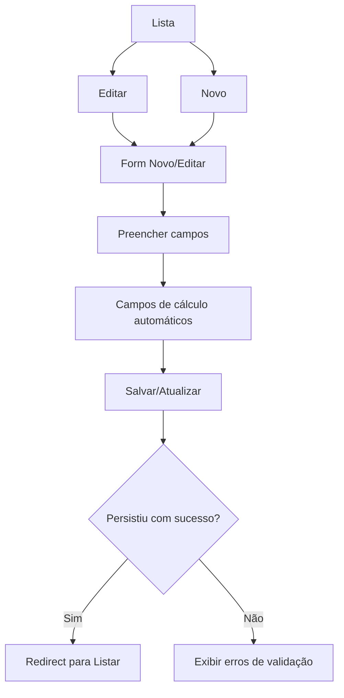
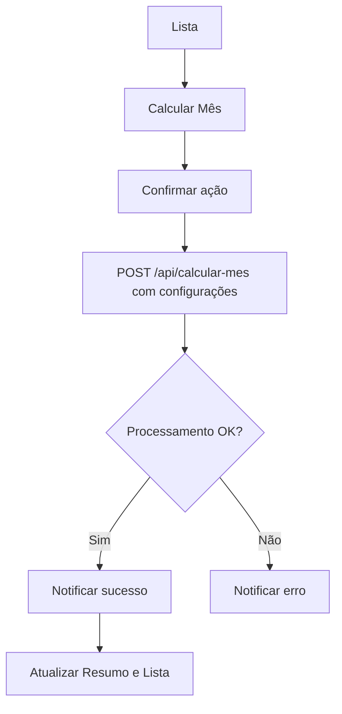

# Módulo RH/Benefícios/Transporte

- Data da análise: 2025-12-14
- Versão do sistema: 0.0.1-SNAPSHOT
- Controlador principal: `src/main/java/com/jaasielsilva/portalceo/controller/rh/beneficios/ValeTransporteController.java`
- Templates: `src/main/resources/templates/rh/beneficios/vale-transporte/`

## Páginas Principais

- Menu Principal → RH → Benefícios → Vale-Transporte → Listar (`rh/beneficios/vale-transporte/listar`)
  - Ações:
    - Nova Solicitação (abre modal) → `abrirModalSolicitacao()`
    - Calcular Mês (processa lote) → `calcularVales()` chama `POST /rh/beneficios/vale-transporte/api/calcular-mes` (ValeTransporteController.java:231)
    - Exportar → Excel (`/api/export/excel`) e PDF (`/api/export/pdf`)
  - Resumo Mensal: total de vales ativos, custo total, desconto colaboradores, subsídio empresa
  - Configurações (form `ConfiguracaoValeTransporteDTO`)
    - Campos:
      - Percentual de Desconto (numérico %, `*{percentualDesconto}`)
      - Valor da Passagem (numérico R$, `*{valorPassagem}`)
      - Dias Úteis do Mês (numérico, `*{diasUteisPadrao}`)
    - Botão: Salvar Configurações (valida preenchimento local)
  - Filtros (GET em `listar`)
    - Campos:
      - Mês de Referência (`input type="month"`, nome `mesReferencia`)
      - Status (`select name="status"`: ATIVO, SUSPENSO, CANCELADO)
      - Colaborador (texto com sugestões + `hidden` id)
      - Departamento (`select` carregado via `/api/departamentos`)
    - Botões:
      - Filtrar (aplica e atualiza tabela via `GET /api/listar`)
      - Suspender Duplicados (POST `/api/duplicados/suspender?mes=&ano=`)
  - Lista por Colaborador (tabela paginada via `GET /api/listar`)
    - Colunas: Colaborador, Departamento, Trajeto, Viagens/Dia, Dias Úteis, Valor Total, Desconto, Subsídio Empresa, Status, Ações
    - Ações por linha:
      - Editar → `/editar/{id}` (ValeTransporteController.java:153)
      - Ver Detalhes (modal) → `verDetalhes(id)` usa `GET /api/detalhe/{id}` (ValeTransporteController.java:420)
      - Suspender/Reativar/Cancelar (funções JS chamam `POST` nos respectivos endpoints)
  - Modal “Cadastro de Transporte” (inline na página)
    - Campos:
      - Colaborador (texto com busca + `hidden` id, obrigatório)
      - Data de Início (texto, máscara `dd/mm/aaaa`, obrigatório)
      - Endereço de Residência (textarea, obrigatório)
      - Tipo de Transporte 1 (`select`, obrigatório)
      - Linha/Número (texto, obrigatório se Tipo 1 selecionado)
      - Possui integração/baldeação (checkbox)
      - Tipo de Transporte 2 (`select`, opcional)
      - Linha/Número (texto, opcional)
      - Viagens por Dia (`select`, obrigatório)
      - Valor Diário Calculado (texto, somente leitura)
      - Observações (textarea, opcional)
    - Botões:
      - Cancelar (fecha modal)
      - Salvar (valida e envia `POST /api/solicitacao`)

- Menu Principal → RH → Benefícios → Vale-Transporte → Novo/Editar (`rh/beneficios/vale-transporte/form`)
  - Informações Básicas
    - Campos:
      - Colaborador (`select`, obrigatório) [form.html:51–61]
      - Status (`select`: ATIVO, SUSPENSO, CANCELADO) [form.html:64–70]
      - Mês Referência (`select`, obrigatório) [form.html:75–91]
      - Ano Referência (`input number`, min 2020, max 2030, obrigatório) [form.html:94–99]
  - Informações de Transporte
    - Campos:
      - Dias Úteis do Mês (`input number`, min 1, max 31, obrigatório) [form.html:108–112]
      - Viagens por Dia (`select`, obrigatório) [form.html:115–121]
      - Valor da Passagem (`input number`, step 0.01, obrigatório) [form.html:125–131]
      - Linha/Transporte (`input text`, opcional) [form.html:136–139]
      - Endereço de Origem (`input text`, opcional) [form.html:144–147]
      - Endereço de Destino (`input text`, opcional) [form.html:150–153]
  - Cálculos Automáticos (somente leitura)
    - Valor Total do Mês (`input text`, readonly) [form.html:163–169]
    - Desconto do Colaborador (6%) (`input text`, readonly) [form.html:172–178]
    - Subsídio da Empresa (`input text`, readonly) [form.html:181–187]
  - Observações
    - Observações (`textarea`) [form.html:196–199]
  - Botões
    - Cancelar (volta histórico) [form.html:204–206]
    - Salvar/Atualizar (submit) [form.html:207–210]

## Caso de Uso: Cadastrar Vale-Transporte

1. Acesse Menu Principal → RH → Benefícios → Vale-Transporte
2. Opção A: Pela lista, clique em “Nova Solicitação” (abre modal)
   - Preencha:
     - Colaborador: “Ana Costa” (busca e selecione)
     - Data de Início: “15/12/2025”
     - Endereço: “Rua Exemplo, 100, Centro, São Paulo/SP”
     - Tipo de Transporte 1: “Ônibus”
     - Linha/Número: “123”
     - Possui integração: marcado, selecione Tipo 2 “Metrô” e Linha “Linha Azul”
     - Viagens por Dia: “4” (ida, volta + integração)
     - Observações: “Trajeto com integração metrô”
   - Clique “Salvar”
   - Se o colaborador já tiver VT ativo no período, aparece erro “Colaborador já possui vale transporte ativo neste período”
3. Opção B: Pela rota “Novo” (`/rh/beneficios/vale-transporte/novo`)
   - Preencha no formulário:
     - Colaborador: “Pedro Lima”
     - Status: “ATIVO”
     - Mês Referência: “12”
     - Ano Referência: “2025”
     - Dias Úteis: “22”
     - Viagens por Dia: “2”
     - Valor da Passagem: “4,40”
     - Linha/Transporte: “Ônibus 789”
     - Origem: “Av. Principal, 500”
     - Destino: “Rua das Empresas, 20”
     - Observe os campos de cálculo serem preenchidos automaticamente
   - Clique “Salvar”
4. Verifique na lista se o registro aparece; use filtros por mês/status/colaborador
5. Ações adicionais:
   - Calcular Mês: processa todos os colaboradores ativos com base nas configurações
   - Editar: ajuste de dados específicos do colaborador
   - Ver Detalhes: abre modal com resumo do VT
   - Suspender/Reativar/Cancelar: gestão de status via botões

## Anotações Técnicas

- Campos obrigatórios
  - Form (Novo/Editar): Colaborador, Mês Referência, Ano Referência, Dias Úteis, Viagens por Dia, Valor da Passagem
  - Modal (Nova Solicitação): Colaborador, Data de Início (formato `dd/mm/aaaa` e não anterior ao dia atual), Endereço de Residência, Tipo de Transporte 1, Linha/Número (se Tipo 1 selecionado), Viagens por Dia
- Validações de campo
  - Form: atributos `required`, faixas numéricas (Dias Úteis 1–31; Ano 2020–2030; Valor Passagem `step=0.01`) [form.html:75–99,108–131]
  - Modal: validações JS de obrigatoriedade, formato de data e limites de “Viagens por Dia” (1–8) [listar.html:437–469]
  - Cálculos automáticos: atualização de “Valor Total”, “Desconto (6%)” e “Subsídio” [form.html:221–239]
- Mensagens de erro comuns
  - “Erros de validação” (agregadas no topo do formulário) [form.html:33–38]
  - “Erro ao salvar”/“Erro ao atualizar” (flash) do controlador [ValeTransporteController.java:145–149, 184–188]
  - “Erro de comunicação” (falha de rede nas chamadas `fetch`) [listar.html:498–500, 541–542]
  - “Colaborador já possui vale transporte ativo neste período” (checagem prévia) [listar.html:474–476]
- Endpoints relevantes
  - Listar página: `GET /rh/beneficios/vale-transporte/listar` [ValeTransporteController.java:62–99]
  - Novo: `GET /rh/beneficios/vale-transporte/novo` [ValeTransporteController.java:101–118]
  - Salvar: `POST /rh/beneficios/vale-transporte/salvar` [ValeTransporteController.java:120–149]
  - Editar: `GET /rh/beneficios/vale-transporte/editar/{id}` [ValeTransporteController.java:153–163]
  - Atualizar: `POST /rh/beneficios/vale-transporte/atualizar/{id}` [ValeTransporteController.java:167–188]
  - Deletar: `GET /rh/beneficios/vale-transporte/deletar/{id}` [ValeTransporteController.java:192–202]
  - Listagem API: `GET /rh/beneficios/vale-transporte/api/listar` (paginado, filtros) [ValeTransporteController.java:371–406]
  - Departamentos API: `GET /rh/beneficios/vale-transporte/api/departamentos` [ValeTransporteController.java:408–418]
  - Detalhe API: `GET /rh/beneficios/vale-transporte/api/detalhe/{id}` [ValeTransporteController.java:420–445]
  - Estatísticas API: `GET /rh/beneficios/vale-transporte/api/estatisticas` [ValeTransporteController.java:209–226]
  - Calcular Mês API: `POST /rh/beneficios/vale-transporte/api/calcular-mes` [ValeTransporteController.java:231–260]
  - Suspender: `POST /rh/beneficios/vale-transporte/api/suspender/{id}` [ValeTransporteController.java:266–285]
  - Reativar: `POST /rh/beneficios/vale-transporte/api/reativar/{id}` [ValeTransporteController.java:290–305]
  - Cancelar: `POST /rh/beneficios/vale-transporte/api/cancelar/{id}` [ValeTransporteController.java:311–330]
  - Relatório (JSON): `GET /rh/beneficios/vale-transporte/api/relatorio` [ValeTransporteController.java:335–368]
  - Exportar Excel: `GET /rh/beneficios/vale-transporte/api/export/excel` [ValeTransporteController.java:447–461]

## Fluxo de Navegação (→)

- RH → Benefícios → Vale-Transporte → Listar →
  - Nova Solicitação → Modal “Cadastro de Transporte” → Salvar → Lista atualizada
  - Calcular Mês → Processa lote → Resumo e Lista atualizados
  - Exportar → Excel/PDF
  - Filtros → Atualiza Lista e Totais
  - Ações por linha → Editar → Form → Atualizar → Voltar para Lista
  - Ações por linha → Ver Detalhes → Modal Detalhe

## Diagramas de Fluxo







```mermaid
flowchart TD
  AA[Ação por linha]
  AA --> AB[Suspender]
  AA --> AC[Reativar]
  AA --> AD[Cancelar]
  AB --> AE[POST /api/suspender/{id}]
  AC --> AF[POST /api/reativar/{id}]
  AD --> AG[POST /api/cancelar/{id}]
  AE --> AH{Sucesso?}
  AF --> AH
  AG --> AH
  AH -- Sim --> AI[Atualizar lista]
  AH -- Não --> AJ[Exibir mensagem de erro]
```

## Metadados

- Base técnica: Spring MVC + Thymeleaf
- Origem dos dados: `ValeTransporteService` e endpoints do controlador
- Atualização futura: adicionar campos nas páginas e atualizar as seções “Páginas Principais” e “Anotações Técnicas” deste documento
