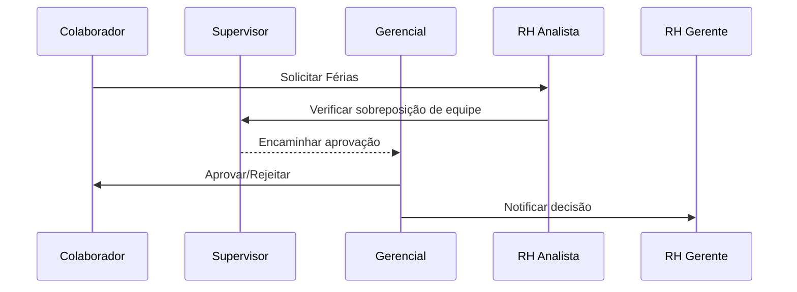
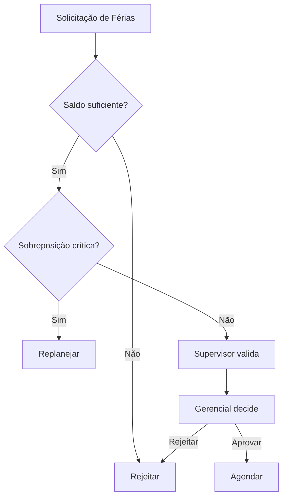

# Governança e Controle de Acesso — Módulo RH Corporativo

## Perfis de Usuário

### Perfis e Hierarquia

- MASTER: superadmin corporativo, autoridade máxima transversal
- ADMIN: administrador de sistema, configurações e governança técnica
- RH_GERENTE: gestão de pessoas e operações, aprovações e dados sensíveis
- RH_ANALISTA: operações de RH com criação/edição e relatórios do escopo
- RH_ASSISTENTE: suporte operacional com cadastros simples e consultas
- GERENCIAL: gestor de área, visibilidade de equipe e aprovações operacionais
- SUPERVISOR: coordenação tática, aprovação de solicitações e correções
- COLABORADOR: acesso mínimo, autosserviço e documentos próprios

Hierarquia: MASTER > ADMIN > RH_GERENTE > GERENCIAL > SUPERVISOR > RH_ANALISTA > RH_ASSISTENTE > COLABORADOR

### Matriz de Ações x Autorizações

| Ação | Autorizações mínimas |
|---|---|
| Ver item de menu RH | RH_ASSISTENTE, RH_ANALISTA, RH_GERENTE, GERENCIAL, SUPERVISOR, ADMIN, MASTER |
| Criar cadastro de colaborador | RH_ANALISTA, RH_GERENTE, ADMIN, MASTER |
| Editar colaborador | RH_ANALISTA, RH_GERENTE, ADMIN, MASTER |
| Excluir colaborador | RH_GERENTE, ADMIN, MASTER |
| Aprovar processos (férias, workflow) | GERENCIAL, SUPERVISOR, RH_GERENTE, ADMIN, MASTER |
| Exportar relatórios RH | RH_GERENTE, ADMIN, MASTER |
| Acessar configurações avançadas RH | RH_GERENTE, ADMIN, MASTER |
| Interações sensíveis (salários, folha, benefícios) | RH_GERENTE, ADMIN, MASTER |

## Arquitetura de Níveis de Acesso

- Leitura: visualizar menus, páginas e relatórios do próprio escopo
- Escrita: cadastrar e editar registros dentro do escopo autorizado
- Aprovação: concluir fluxos com decisão vinculante (ex.: férias, correções)
- Administração: configuração de políticas, integrações e governança

### Herança de Permissões

- Herança cumulativa: perfis superiores herdam capacidades de inferiores
- Exceções: dados sensíveis exigem papel específico mesmo com herança
- Limites: perfis de negócio (GERENCIAL, SUPERVISOR) não herdam configurações técnicas

### Restrições Cruzadas

- Escopo RH: perfis RH atuam no módulo RH; ADMIN/MASTER são transversais
- Visibilidade por equipe: GERENCIAL/SUPERVISOR limitados à própria unidade
- Dados pessoais e folha: somente RH_GERENTE/ADMIN/MASTER

## Processos de Aprovação

### Férias

- Solicitação: COLABORADOR → RH_ASSISTENTE valida cadastro → RH_ANALISTA revisa → GERENCIAL/SUPERVISOR aprova
- Critérios: saldo de férias, sobreposição de equipe, políticas de blackout
- Prazo: análise até 5 dias úteis; escalonamento após 7 dias
- Recurso: reabertura com justificativa + segunda análise por RH_GERENTE

### Ponto e Correções

- Fluxo: COLABORADOR solicita → SUPERVISOR/GERENCIAL corrige → RH_ANALISTA audita → RH_GERENTE valida
- Critérios: logs biométricos, justificativa, regras legais
- Prazo: correção em 3 dias úteis; revisão mensal por RH

### Benefícios

- Adesão: COLABORADOR solicita → RH_ANALISTA confere → RH_GERENTE aprova
- Critérios: elegibilidade, carência, orçamento
- Prazo: até 10 dias corridos; revisão semestral de elegibilidade

### Avaliação de Desempenho

- Ciclo: RH_GERENTE define periodicidade → GERENCIAL aplica → RH_ANALISTA consolida → ADMIN publica
- Critérios: metas, competências, 9-box
- Prazo: janelas definidas por ciclo; recursos em até 15 dias

## Matriz RACI (Responsabilidade)

| Atividade | R | A | C | I |
|---|---|---|---|---|
| Cadastro de Colaborador | RH_ANALISTA | RH_GERENTE | RH_ASSISTENTE | GERENCIAL |
| Aprovação de Adesão | RH_GERENTE | ADMIN | RH_ANALISTA | COLABORADOR |
| Geração de Folha | RH_GERENTE | ADMIN | RH_ANALISTA | GERENCIAL |
| Aprovação de Férias | GERENCIAL/SUPERVISOR | RH_GERENTE | RH_ANALISTA | COLABORADOR |
| Correções de Ponto | SUPERVISOR | GERENCIAL | RH_ANALISTA | COLABORADOR |
| Relatórios RH | RH_ANALISTA | RH_GERENTE | ADMIN | GERENCIAL |
| Gestão de Treinamentos | RH_ANALISTA | RH_GERENTE | GERENCIAL | COLABORADOR |
| Integrações RH | ADMIN | MASTER | RH_GERENTE | Segurança TI |

## Auditoria

- Registro: ação, recurso, usuário, perfil, departamento, timestamp, IP, resultado
- Escopo: criação/edição/exclusão, aprovações, acessos a dados sensíveis, exportações
- Retenção: mínimo 24 meses; dados sensíveis 36 meses
- Revisão: relatório mensal para RH_GERENTE; auditoria trimestral com Segurança da Informação

## Artefatos Técnicos

### Diagramas de Sequência (Mermaid)

### Fluxograma de Aprovação de Férias

### Tabela de Cargos x Permissões

| Cargo | Leitura | Escrita | Aprovação | Administração | Dados Sensíveis |
|---|---|---|---|---|---|
| MASTER | Sim | Sim | Sim | Sim | Sim |
| ADMIN | Sim | Sim | Sim | Sim | Sim |
| RH_GERENTE | Sim | Sim | Sim | Config RH | Sim |
| RH_ANALISTA | Sim | Sim | Não | Não | Não |
| RH_ASSISTENTE | Sim | Parcial | Não | Não | Não |
| GERENCIAL | Sim | Parcial | Sim | Não | Parcial |
| SUPERVISOR | Sim | Parcial | Sim | Não | Não |
| COLABORADOR | Sim | Autosserviço | Não | Não | Próprios |

### Políticas de Controle de Acesso

- Princípio de menor privilégio; revisões semestrais de acesso
- Segregação de funções: aprovar ≠ cadastrar para mesma pessoa no mesmo caso
- Acesso a dados pessoais e folha somente via perfis autorizados e com propósito
- Exportações registradas e justificadas; trilha de auditoria obrigatória

### Procedimentos Operacionais de Identidade

- Onboarding: criação de identidade, atribuição de perfil e escopos por departamento
- Movimentação interna: revisão de perfil; remoção de privilégios anteriores
- Offboarding: revogação imediata; retenção de logs conforme política
- Delegação temporária: janela com expiração; auditoria dedicada

## Validação dos Requisitos

- Revisão técnica pela Segurança da Informação
- Aprovação por gestores das áreas envolvidas
- Validação jurídica (LGPD) para dados pessoais e logs
- Testes de conceito com usuários-chave
- Assinatura formal antes da implementação

## Referências de Implementação (Código)

- Sidebar com visibilidade por perfil: `src/main/resources/templates/components/sidebar.html:145`
- Autorização por perfil no Sidebar: `src/main/resources/templates/components/sidebar.html:183`
- Segurança por método nos controllers RH: `src/main/java/com/jaasielsilva/portalceo/controller/rh/FeriasController.java:12`
- Segurança global: `src/main/java/com/jaasielsilva/portalceo/config/SecurityConfig.java:33`
- Tratamento de 401/403/404: `src/main/java/com/jaasielsilva/portalceo/config/GlobalRestExceptionHandler.java:72`
