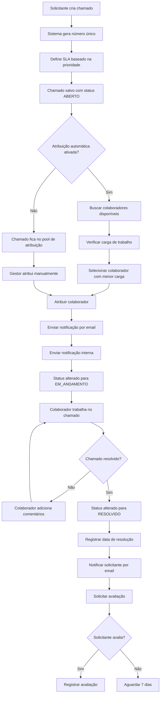

# Fluxograma Completo - Módulo de Suporte

## Fluxo Principal do Sistema de Suporte

```mermaid
graph TD
    A[Solicitante cria chamado] --> B[Sistema gera número único]
    B --> C[Define SLA baseado na prioridade]
    C --> D[Chamado salvo com status ABERTO]
    D --> E{Atribuição automática ativada?}
    
    E -->|Sim| F[Buscar colaboradores disponíveis]
    E -->|Não| G[Chamado fica no pool de atribuição]
    
    F --> H[Verificar carga de trabalho]
    H --> I[Selecionar colaborador com menor carga]
    I --> J[Atribuir colaborador]
    
    G --> K[Gestor atribui manualmente]
    K --> J
    
    J --> L[Enviar notificação por email]
    L --> M[Enviar notificação interna]
    M --> N[Status alterado para EM_ANDAMENTO]
    
    N --> O[Colaborador trabalha no chamado]
    O --> P{Chamado resolvido?}
    
    P -->|Não| Q[Colaborador adiciona comentários]
    Q --> O
    
    P -->|Sim| R[Status alterado para RESOLVIDO]
    R --> S[Registrar data de resolução]
    S --> T[Notificar solicitante por email]
    T --> U[Solicitar avaliação]
    
    U --> V{Solicitante avalia?}
    V -->|Sim| W[Registrar avaliação]
    V -->|Não| X[Aguardar 7 dias]
```
