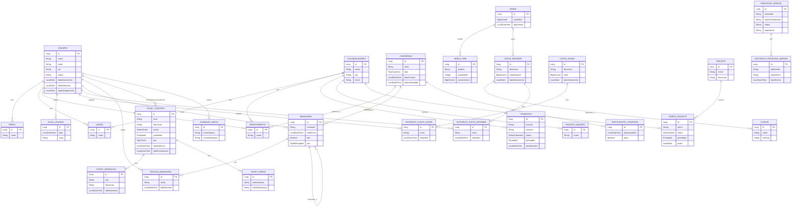

```mermaid
erDiagram
    USUARIO ||--o{ PERFIL : "tem"
    USUARIO ||--o{ CARGO : "tem"
    USUARIO ||--o{ DEPARTAMENTO : "tem"
    USUARIO ||--o{ ACAO_USUARIO : "realiza"
    USUARIO ||--o{ HISTORICO_CONTA_PAGAR : "registra"
    USUARIO ||--o{ HISTORICO_CONTA_RECEBER : "registra"
    USUARIO ||--o{ MENSAGEM : "envia"
    USUARIO ||--o{ REACAO_MENSAGEM : "reage"
    USUARIO ||--o{ TICKET_SUPORTE : "solicita/responsavel/cria"
    USUARIO ||--o{ CHAMADO_ANEXO : "anexa"

    COLABORADORES ||--o{ CARGO : "tem"
    COLABORADORES ||--o{ DEPARTAMENTO : "tem"
    COLABORADORES ||--o{ CHAMADOS : "responsavel"
    COLABORADORES ||--o{ PROJETO_EQUIPES : "membro"
    COLABORADORES ||--o{ TAREFA_PROJETO : "atribuido_a"

    CONVERSAS ||--o{ DEPARTAMENTO : "pertence_a"
    CONVERSAS ||--o{ MENSAGEM : "contem"
    CONVERSAS ||--o{ PARTICIPANTE_CONVERSA : "tem"

    MENSAGEM ||--o{ REACAO_MENSAGEM : "tem"
    MENSAGEM ||--o{ MENSAGEM : "responde_a"

    TICKET_SUPORTE ||--o{ TICKET_INTERACAO : "tem"
    TICKET_SUPORTE ||--o{ TICKET_ANEXO : "tem"

    VENDA ||--o{ VENDA_ITEM : "contem"
    VENDA ||--o{ CONTA_RECEBER : "gera"

    CONTA_RECEBER ||--o{ CLIENTE : "pertence_a"
    CONTA_RECEBER ||--o{ HISTORICO_CONTA_RECEBER : "tem"

    CONTA_PAGAR ||--o{ HISTORICO_CONTA_PAGAR : "tem"

    PROJETO ||--o{ TAREFA_PROJETO : "contem"

    PROCESSO_ADESAO ||--o{ HISTORICO_PROCESSO_ADESAO : "tem"

    USUARIO {
        Long id PK
        String nome
        String email
        String cpf
        Status status
        LocalDate dataNascimento
        LocalDate dataAdmissao
        LocalDate dataDesligamento
    }
    PERFIL {
        Long id PK
        String nome
    }
    CARGO {
        Long id PK
        String nome
    }
    DEPARTAMENTO {
        Long id PK
        String nome
    }
    ACAO_USUARIO {
        Long id PK
        LocalDateTime data
        String acao
    }
    HISTORICO_CONTA_PAGAR {
        Long id PK
        String acao
        LocalDateTime dataHora
    }
    HISTORICO_CONTA_RECEBER {
        Long id PK
        String acao
        LocalDateTime dataHora
    }
    MENSAGEM {
        Long id PK
        String conteudo
        LocalDateTime dataEnvio
        Boolean lida
        TipoMensagem tipo
    }
    REACAO_MENSAGEM {
        Long id PK
        String emoji
        LocalDateTime dataReacao
    }
    TICKET_SUPORTE {
        Long id PK
        String titulo
        String descricao
        StatusTicket status
        Prioridade prioridade
        TipoTicket tipo
        LocalDateTime dataAbertura
        LocalDateTime dataFechamento
    }
    TICKET_INTERACAO {
        Long id PK
        String tipo
        String descricao
        LocalDateTime dataInteracao
    }
    TICKET_ANEXO {
        Long id PK
        String nomeArquivo
        String caminhoArquivo
    }
    VENDA {
        Long id PK
        BigDecimal valorTotal
        LocalDateTime dataVenda
    }
    VENDA_ITEM {
        Long id PK
        String produto
        Integer quantidade
        BigDecimal precoUnitario
    }
    CONTA_RECEBER {
        Long id PK
        String descricao
        BigDecimal valorOriginal
        LocalDate dataVencimento
    }
    CLIENTE {
        Long id PK
        String nome
        String cpfCnpj
    }
    CONTA_PAGAR {
        Long id PK
        String descricao
        BigDecimal valor
        LocalDate dataVencimento
    }
    PROJETO {
        Long id PK
        String nome
        String descricao
    }
    TAREFA_PROJETO {
        Long id PK
        String nome
        StatusTarefa status
        Prioridade prioridade
        LocalDate prazo
    }
    PROJETO_EQUIPES {
        Long id PK
        String nome
    }
    COLABORADORES {
        Long id PK
        String nome
        String cpf
        String email
    }
    CHAMADOS {
        Long id PK
        String numero
        String assunto
        StatusChamado status
        Prioridade prioridade
        LocalDateTime dataAbertura
    }
    CHAMADO_ANEXO {
        Long id PK
        String nomeArquivo
        String caminhoArquivo
    }
    CONVERSAS {
        Long id PK
        String titulo
        TipoConversa tipo
        LocalDateTime dataCriacao
        LocalDateTime ultimaAtividade
    }
    PARTICIPANTE_CONVERSA {
        Long id PK
        LocalDateTime adicionadoEm
        Boolean ativo
    }
    PROCESSO_ADESAO {
        Long id PK
        String sessionId
        String nomeColaborador
        Status status
        String etapaAtual
    }
    HISTORICO_PROCESSO_ADESAO {
        Long id PK
        String tipoEvento
        String etapaAtual
        LocalDateTime dataEvento
    }
```