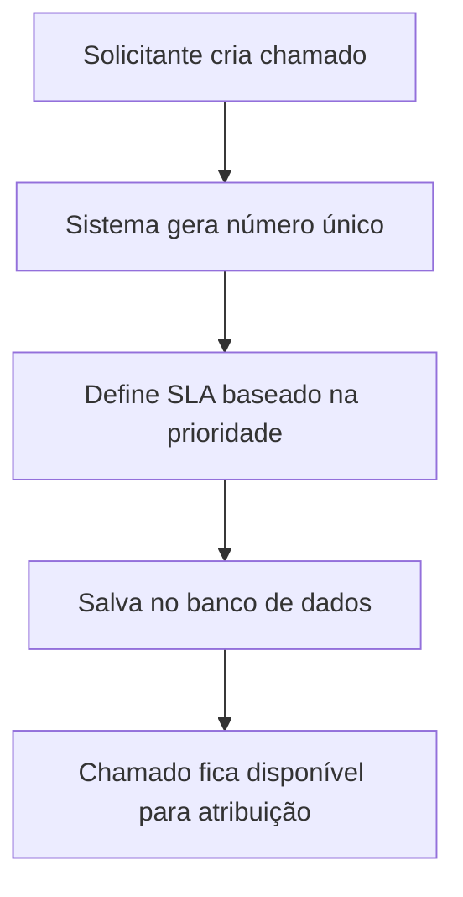
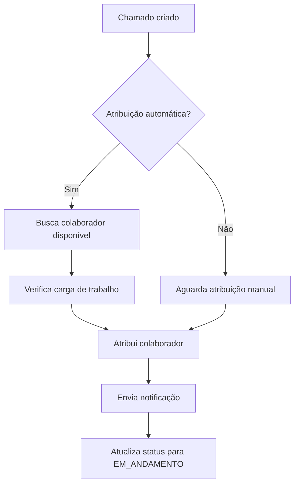
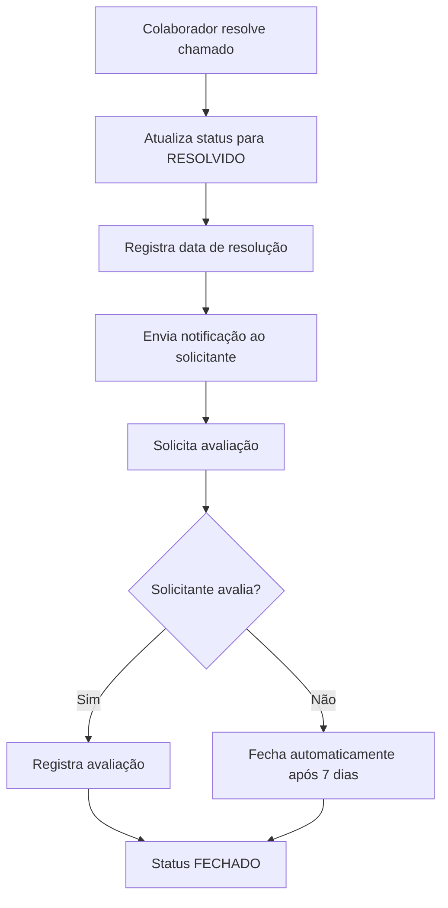

# Documentação Técnica - Módulo de Suporte

## Índice
1. [Visão Geral](#visão-geral)
2. [Arquitetura do Sistema](#arquitetura-do-sistema)
3. [Modelos de Dados](#modelos-de-dados)
4. [Serviços Implementados](#serviços-implementados)
5. [APIs e Endpoints](#apis-e-endpoints)
6. [Sistema de Notificações](#sistema-de-notificações)
7. [Monitoramento de SLA](#monitoramento-de-sla)
8. [Fluxos de Trabalho](#fluxos-de-trabalho)
9. [Configuração e Deploy](#configuração-e-deploy)
10. [Testes e Validação](#testes-e-validação)

---

## Visão Geral

O módulo de suporte do Portal CEO é um sistema completo para gerenciamento de chamados técnicos, incluindo:

- **Gestão de Chamados**: Criação, atribuição, acompanhamento e resolução
- **Atribuição de Colaboradores**: Sistema automático e manual de distribuição
- **Notificações**: Email corporativo e notificações internas
- **Monitoramento de SLA**: Alertas automáticos e estatísticas
- **Dashboard**: Métricas e indicadores de performance

### Tecnologias Utilizadas
- **Backend**: Spring Boot 3.x, JPA/Hibernate
- **Frontend**: Thymeleaf, Bootstrap, JavaScript
- **Banco de Dados**: MySQL/MariaDB
- **Email**: Spring Mail
- **Agendamento**: Spring Scheduler

---

## Arquitetura do Sistema

### Estrutura de Pacotes
```
com.jaasielsilva.portalceo
├── controller/
│   ├── SuporteController.java          # Controller MVC
│   └── ChamadoRestController.java      # REST API
├── service/
│   ├── ChamadoService.java             # Lógica de negócio principal
│   ├── AtribuicaoColaboradorService.java # Atribuição de colaboradores
│   ├── NotificacaoSuporteService.java  # Sistema de notificações
│   └── SlaMonitoramentoService.java    # Monitoramento de SLA
├── model/
│   ├── Chamado.java                    # Entidade principal
│   ├── Colaborador.java               # Colaboradores do sistema
│   └── BacklogChamado.java            # Backlog de chamados
└── repository/
    ├── ChamadoRepository.java          # Repositório de chamados
    └── ColaboradorRepository.java      # Repositório de colaboradores
```

### Padrões Arquiteturais
- **MVC**: Separação clara entre Model, View e Controller
- **Repository Pattern**: Abstração da camada de dados
- **Service Layer**: Lógica de negócio centralizada
- **DTO Pattern**: Transferência de dados entre camadas

---

## Modelos de Dados

### Entidade Chamado
```java
@Entity
@Table(name = "chamados")
public class Chamado {
    @Id
    @GeneratedValue(strategy = GenerationType.IDENTITY)
    private Long id;
    
    @Column(unique = true, nullable = false)
    private String numero;                    // Número único do chamado
    
    @Column(nullable = false)
    private String assunto;                   // Assunto do chamado
    
    @Column(columnDefinition = "TEXT")
    private String descricao;                 // Descrição detalhada
    
    @Enumerated(EnumType.STRING)
    private StatusChamado status;             // ABERTO, EM_ANDAMENTO, RESOLVIDO, FECHADO
    
    @Enumerated(EnumType.STRING)
    private Prioridade prioridade;            // BAIXA, MEDIA, ALTA, CRITICA
    
    @ManyToOne
    @JoinColumn(name = "colaborador_responsavel_id")
    private Colaborador colaboradorResponsavel; // Colaborador atribuído
    
    private String solicitanteNome;           // Nome do solicitante
    private String solicitanteEmail;          // Email do solicitante
    private String categoria;                 // Categoria do chamado
    
    private LocalDateTime dataAbertura;       // Data de abertura
    private LocalDateTime dataResolucao;     // Data de resolução
    private LocalDateTime slaVencimento;     // Data limite do SLA
    
    private Integer avaliacao;                // Avaliação (1-5)
    private String comentarioAvaliacao;       // Comentário da avaliação
}
```

### Relacionamentos
- **Chamado ↔ Colaborador**: ManyToOne (um colaborador pode ter vários chamados)
- **Chamado ↔ BacklogChamado**: OneToOne (chamado pode estar no backlog)

---

## Serviços Implementados

### 1. ChamadoService
**Responsabilidades:**
- CRUD de chamados
- Cálculo de SLA
- Métricas e estatísticas
- Gestão de status

**Métodos Principais:**
```java
public Chamado criarChamado(Chamado chamado)
public Chamado iniciarAtendimento(Long id, String tecnico)
public Chamado resolverChamado(Long id)
public List<Chamado> listarAbertos()
public Double calcularTempoMedioResolucao()
```

### 2. AtribuicaoColaboradorService
**Responsabilidades:**
- Atribuição manual e automática
- Verificação de disponibilidade
- Balanceamento de carga
- Gestão de workload

**Métodos Principais:**
```java
public Chamado atribuirColaboradorEspecifico(Long chamadoId, Long colaboradorId)
public Chamado atribuirColaboradorAutomatico(Long chamadoId)
public boolean verificarDisponibilidade(Long colaboradorId)
public List<Colaborador> listarColaboradoresDisponiveis()
```

### 3. NotificacaoSuporteService
**Responsabilidades:**
- Notificações por email
- Notificações internas
- Templates personalizados
- Gestão de alertas

**Métodos Principais:**
```java
public void notificarNovoColaborador(Chamado chamado, Colaborador colaborador)
public void notificarResolucao(Chamado chamado)
public void notificarSlaProximoVencimento(Chamado chamado)
public void notificarReabertura(Chamado chamado)
```

### 4. SlaMonitoramentoService
**Responsabilidades:**
- Monitoramento automático de SLA
- Alertas preventivos
- Estatísticas de performance
- Escalação automática

**Configurações:**
- **Alerta Crítico**: 1 hora antes do vencimento
- **Alerta de Aviso**: 4 horas antes do vencimento
- **Verificação**: A cada 30 minutos

---

## APIs e Endpoints

### REST API - ChamadoRestController

#### Endpoints Básicos
```http
GET    /api/chamados                    # Listar todos os chamados
GET    /api/chamados/{id}               # Buscar por ID
GET    /api/chamados/numero/{numero}    # Buscar por número
POST   /api/chamados                    # Criar novo chamado
PUT    /api/chamados/{id}/status        # Atualizar status
```

#### Endpoints de Atribuição
```http
POST   /api/chamados/{id}/atribuir                    # Atribuir colaborador específico
POST   /api/chamados/{id}/atribuir-automatico        # Atribuição automática
DELETE /api/chamados/{id}/atribuir                    # Remover atribuição
GET    /api/chamados/colaboradores-disponiveis       # Listar colaboradores disponíveis
GET    /api/chamados/colaborador/{id}                # Chamados de um colaborador
```

#### Endpoints de Monitoramento
```http
GET    /api/chamados/estatisticas                     # Estatísticas gerais
GET    /suporte/api/sla-estatisticas                 # Estatísticas de SLA
GET    /suporte/api/tempo-medio-primeira-resposta    # Tempo médio de resposta
```

### Exemplos de Uso

#### Criar Chamado
```javascript
const novoChamado = {
    assunto: "Problema no sistema",
    descricao: "Descrição detalhada do problema",
    prioridade: "ALTA",
    solicitanteNome: "João Silva",
    solicitanteEmail: "joao@empresa.com",
    categoria: "Técnico"
};

fetch('/api/chamados', {
    method: 'POST',
    headers: { 'Content-Type': 'application/json' },
    body: JSON.stringify(novoChamado)
});
```

#### Atribuir Colaborador
```javascript
fetch(`/api/chamados/${chamadoId}/atribuir`, {
    method: 'POST',
    headers: { 'Content-Type': 'application/x-www-form-urlencoded' },
    body: `colaboradorId=${colaboradorId}`
});
```

---

## Sistema de Notificações

### Tipos de Notificação

#### 1. Email Corporativo
- **Novo Chamado Atribuído**: Enviado ao colaborador responsável
- **Chamado Resolvido**: Enviado ao solicitante
- **Alerta de SLA**: Enviado quando próximo do vencimento
- **Reabertura**: Enviado quando chamado é reaberto

#### 2. Notificações Internas
- **Dashboard**: Alertas visuais no sistema
- **Badges**: Contadores de notificações
- **Pop-ups**: Alertas em tempo real

### Templates de Email

#### Template de Novo Chamado
```html
<h2>Novo Chamado Atribuído - Portal CEO</h2>
<p>Olá <strong>{nome}</strong>,</p>
<p>Um novo chamado foi atribuído para você:</p>

<div style="background-color: #f8f9fa; padding: 15px;">
    <p><strong>Número:</strong> {numero}</p>
    <p><strong>Assunto:</strong> {assunto}</p>
    <p><strong>Prioridade:</strong> {prioridade}</p>
    <p><strong>SLA:</strong> {sla}</p>
</div>

<a href="{link}" style="background-color: #007bff; color: white; padding: 10px 20px;">
    Visualizar Chamado
</a>
```

### Configuração de Email
```properties
# application.properties
spring.mail.host=smtp.empresa.com
spring.mail.port=587
spring.mail.username=sistema@empresa.com
spring.mail.password=${EMAIL_PASSWORD}
spring.mail.properties.mail.smtp.auth=true
spring.mail.properties.mail.smtp.starttls.enable=true
```

---

## Monitoramento de SLA

### Configurações de Alerta
```java
// SlaMonitoramentoService.java
private static final int ALERTA_CRITICO = 1;  // 1 hora antes
private static final int ALERTA_AVISO = 4;    // 4 horas antes

@Scheduled(fixedRate = 1800000) // 30 minutos
public void verificarSlasChamados()
```

### Cálculo de SLA
```java
// Baseado na prioridade do chamado
public LocalDateTime calcularSlaVencimento(Prioridade prioridade) {
    LocalDateTime agora = LocalDateTime.now();
    return switch (prioridade) {
        case CRITICA -> agora.plusHours(2);   // 2 horas
        case ALTA -> agora.plusHours(8);      // 8 horas
        case MEDIA -> agora.plusDays(1);      // 24 horas
        case BAIXA -> agora.plusDays(3);      // 72 horas
    };
}
```

### Métricas de SLA
- **Chamados Vencidos**: Quantidade de SLAs violados
- **Próxima Hora**: Chamados que vencem na próxima hora
- **Próximas 2 Horas**: Chamados que vencem em 2 horas
- **Próximas 4 Horas**: Chamados que vencem em 4 horas

---

## Fluxos de Trabalho

### 1. Criação de Chamado


### 2. Atribuição de Colaborador


### 3. Resolução de Chamado


---

## Configuração e Deploy

### Dependências Maven
```xml
<dependencies>
    <dependency>
        <groupId>org.springframework.boot</groupId>
        <artifactId>spring-boot-starter-web</artifactId>
    </dependency>
    <dependency>
        <groupId>org.springframework.boot</groupId>
        <artifactId>spring-boot-starter-data-jpa</artifactId>
    </dependency>
    <dependency>
        <groupId>org.springframework.boot</groupId>
        <artifactId>spring-boot-starter-mail</artifactId>
    </dependency>
    <dependency>
        <groupId>org.springframework.boot</groupId>
        <artifactId>spring-boot-starter-thymeleaf</artifactId>
    </dependency>
</dependencies>
```

### Configurações de Banco
```sql
-- Criação das tabelas principais
CREATE TABLE chamados (
    id BIGINT AUTO_INCREMENT PRIMARY KEY,
    numero VARCHAR(20) UNIQUE NOT NULL,
    assunto VARCHAR(255) NOT NULL,
    descricao TEXT,
    status VARCHAR(20) NOT NULL,
    prioridade VARCHAR(20) NOT NULL,
    colaborador_responsavel_id BIGINT,
    solicitante_nome VARCHAR(255),
    solicitante_email VARCHAR(255),
    categoria VARCHAR(100),
    data_abertura DATETIME NOT NULL,
    data_resolucao DATETIME,
    sla_vencimento DATETIME,
    avaliacao INT,
    comentario_avaliacao TEXT,
    FOREIGN KEY (colaborador_responsavel_id) REFERENCES colaboradores(id)
);
```

### Variáveis de Ambiente
```bash
# Banco de dados
DB_URL=jdbc:mysql://localhost:3306/portal_ceo
DB_USERNAME=usuario
DB_PASSWORD=senha

# Email
EMAIL_HOST=smtp.empresa.com
EMAIL_PORT=587
EMAIL_USERNAME=sistema@empresa.com
EMAIL_PASSWORD=senha_email

# Aplicação
SERVER_PORT=8080
SPRING_PROFILES_ACTIVE=production
```

---

## Testes e Validação

### Testes Unitários
```java
@SpringBootTest
class ChamadoServiceTest {
    
    @Autowired
    private ChamadoService chamadoService;
    
    @Test
    void deveCriarChamadoComSucesso() {
        Chamado chamado = new Chamado();
        chamado.setAssunto("Teste");
        chamado.setPrioridade(Prioridade.MEDIA);
        
        Chamado resultado = chamadoService.criarChamado(chamado);
        
        assertNotNull(resultado.getId());
        assertNotNull(resultado.getNumero());
        assertEquals(StatusChamado.ABERTO, resultado.getStatus());
    }
}
```

### Testes de Integração
```java
@SpringBootTest(webEnvironment = SpringBootTest.WebEnvironment.RANDOM_PORT)
class ChamadoRestControllerTest {
    
    @Autowired
    private TestRestTemplate restTemplate;
    
    @Test
    void deveListarChamados() {
        ResponseEntity<List> response = restTemplate.getForEntity("/api/chamados", List.class);
        assertEquals(HttpStatus.OK, response.getStatusCode());
    }
}
```

### Cenários de Teste

#### 1. Criação de Chamado
- ✅ Criar chamado com dados válidos
- ✅ Validar geração de número único
- ✅ Verificar cálculo de SLA
- ❌ Tentar criar chamado sem assunto

#### 2. Atribuição de Colaborador
- ✅ Atribuir colaborador disponível
- ✅ Atribuição automática
- ✅ Verificar limite de chamados por colaborador
- ❌ Atribuir colaborador inexistente

#### 3. Notificações
- ✅ Envio de email para novo chamado
- ✅ Notificação de resolução
- ✅ Alerta de SLA próximo do vencimento
- ✅ Notificação interna no dashboard

#### 4. Monitoramento de SLA
- ✅ Detecção de chamados próximos do vencimento
- ✅ Envio de alertas automáticos
- ✅ Cálculo de estatísticas de SLA
- ✅ Identificação de SLAs violados

---

## Métricas e KPIs

### Indicadores Principais
1. **Tempo Médio de Primeira Resposta**: Tempo entre abertura e primeiro atendimento
2. **Tempo Médio de Resolução**: Tempo entre abertura e resolução
3. **Taxa de Cumprimento de SLA**: Percentual de chamados resolvidos dentro do prazo
4. **Satisfação do Cliente**: Média das avaliações recebidas
5. **Produtividade por Colaborador**: Chamados resolvidos por período

### Dashboard de Métricas
```javascript
// Exemplo de consumo da API de métricas
async function carregarMetricas() {
    const [estatisticas, sla, tempoMedio] = await Promise.all([
        fetch('/api/chamados/estatisticas').then(r => r.json()),
        fetch('/suporte/api/sla-estatisticas').then(r => r.json()),
        fetch('/suporte/api/tempo-medio-primeira-resposta').then(r => r.json())
    ]);
    
    atualizarDashboard(estatisticas, sla, tempoMedio);
}
```

---

## Considerações de Segurança

### Autenticação e Autorização
- **Spring Security**: Controle de acesso baseado em roles
- **CSRF Protection**: Proteção contra ataques CSRF
- **Session Management**: Gestão segura de sessões

### Validação de Dados
```java
@Valid
public ResponseEntity<Chamado> criarChamado(@RequestBody @Valid Chamado chamado) {
    // Validações automáticas via Bean Validation
}
```

### Logs de Auditoria
```java
@EventListener
public void onChamadoCriado(ChamadoCriadoEvent event) {
    auditService.registrar("CHAMADO_CRIADO", event.getChamado().getId(), 
                          event.getUsuario().getId());
}
```

---

## Roadmap e Melhorias Futuras

### Próximas Funcionalidades
1. **Chat em Tempo Real**: Comunicação direta entre solicitante e colaborador
2. **Base de Conhecimento**: Artigos e soluções para problemas comuns
3. **Relatórios Avançados**: Dashboards personalizáveis e exportação
4. **Integração com WhatsApp**: Notificações via WhatsApp Business
5. **IA para Classificação**: Classificação automática de chamados
6. **Mobile App**: Aplicativo móvel para colaboradores

### Otimizações Técnicas
1. **Cache Redis**: Cache para consultas frequentes
2. **Elasticsearch**: Busca avançada em chamados
3. **Microserviços**: Separação em serviços independentes
4. **Event Sourcing**: Histórico completo de mudanças
5. **API Gateway**: Centralização de APIs

---

## Suporte e Manutenção

### Contatos da Equipe
- **Desenvolvedor Principal**: Jasiel Silva
- **Email**: jasiel@empresa.com
- **Documentação**: [Portal Interno](http://portal.empresa.com/docs)

### Procedimentos de Manutenção
1. **Backup Diário**: Backup automático do banco de dados
2. **Monitoramento**: Logs e métricas em tempo real
3. **Atualizações**: Deploy automatizado via CI/CD
4. **Rollback**: Procedimento de reversão em caso de problemas

### Troubleshooting Comum

#### Problema: Emails não estão sendo enviados
**Solução:**
1. Verificar configurações SMTP
2. Validar credenciais de email
3. Checar logs do EmailService
4. Testar conectividade com servidor SMTP

#### Problema: SLA não está sendo calculado
**Solução:**
1. Verificar se o scheduler está ativo
2. Validar configurações de prioridade
3. Checar logs do SlaMonitoramentoService
4. Verificar se há dados de teste interferindo

---

*Documentação atualizada em: Janeiro 2025*
*Versão: 1.0*