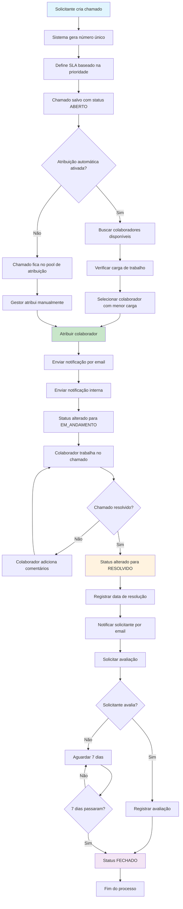
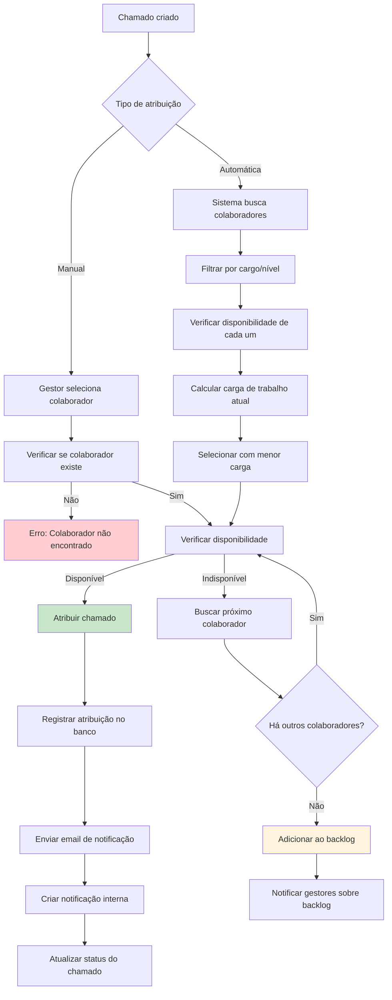
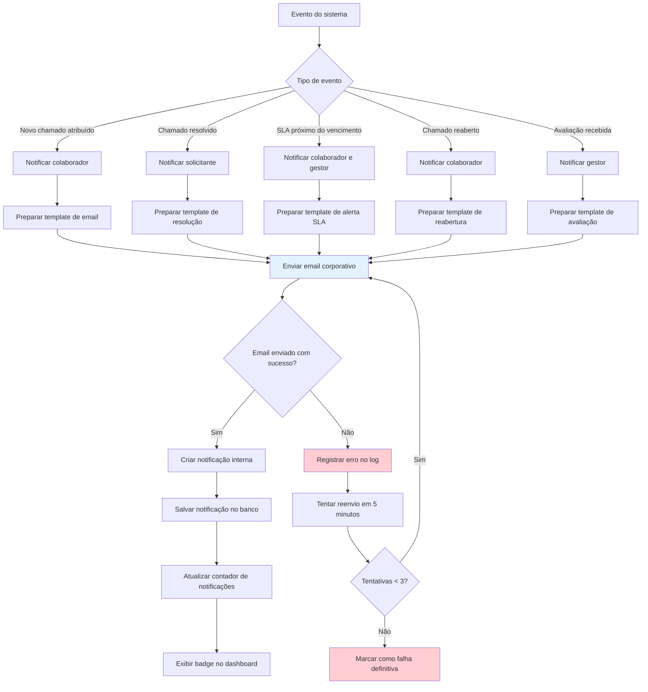
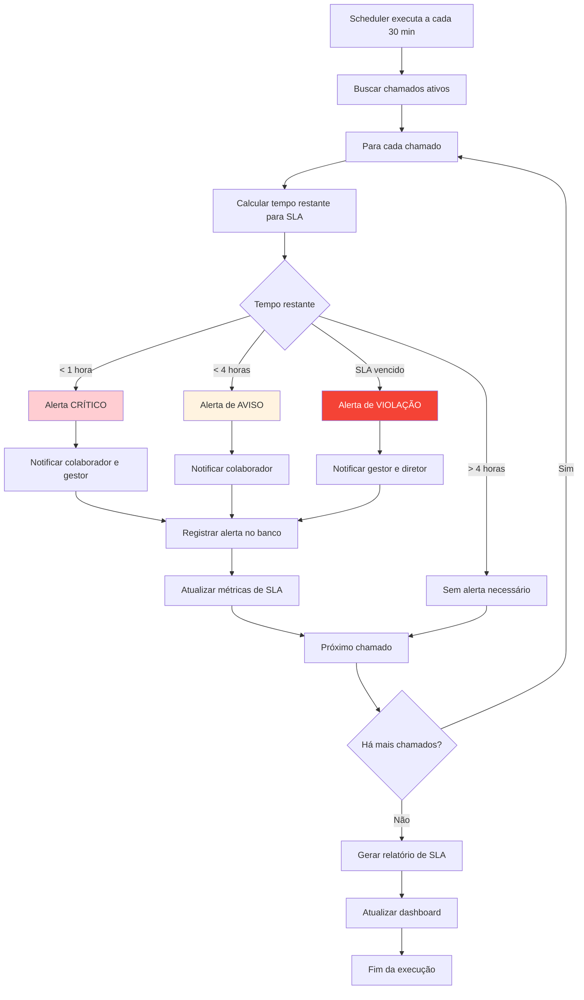
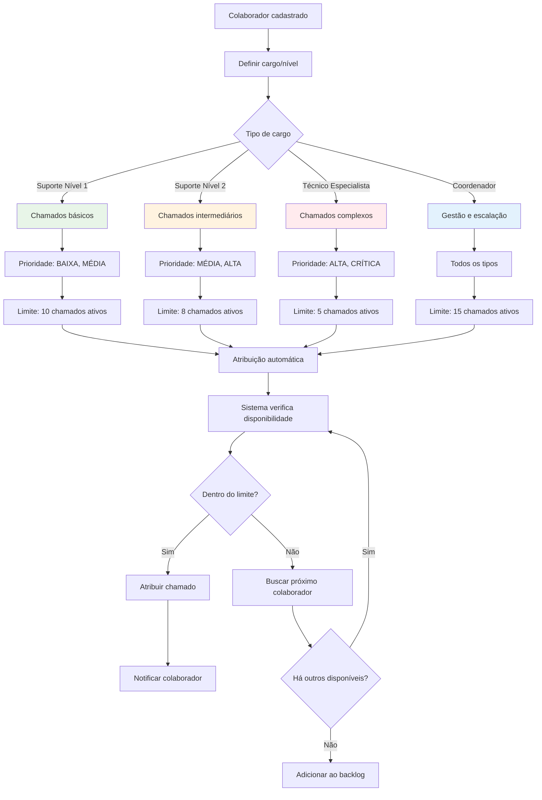
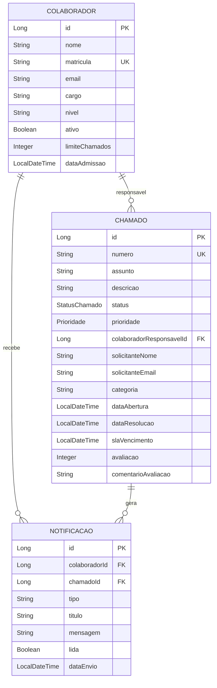
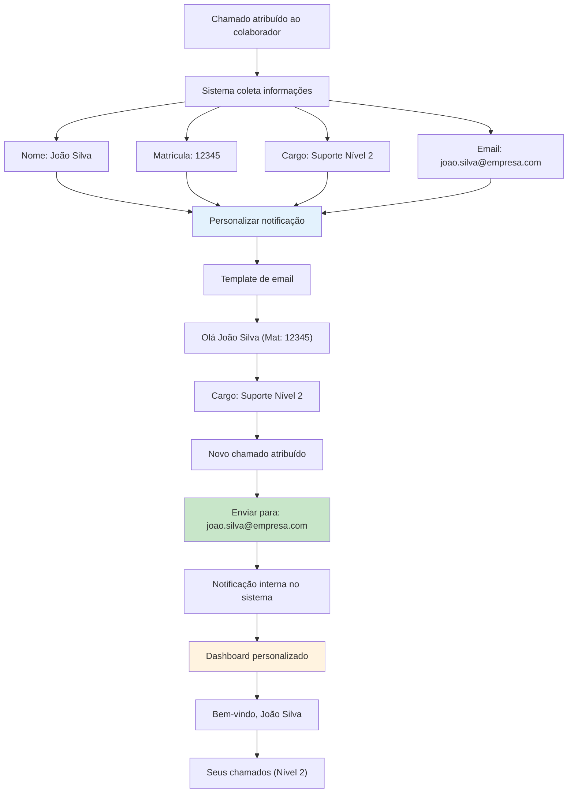
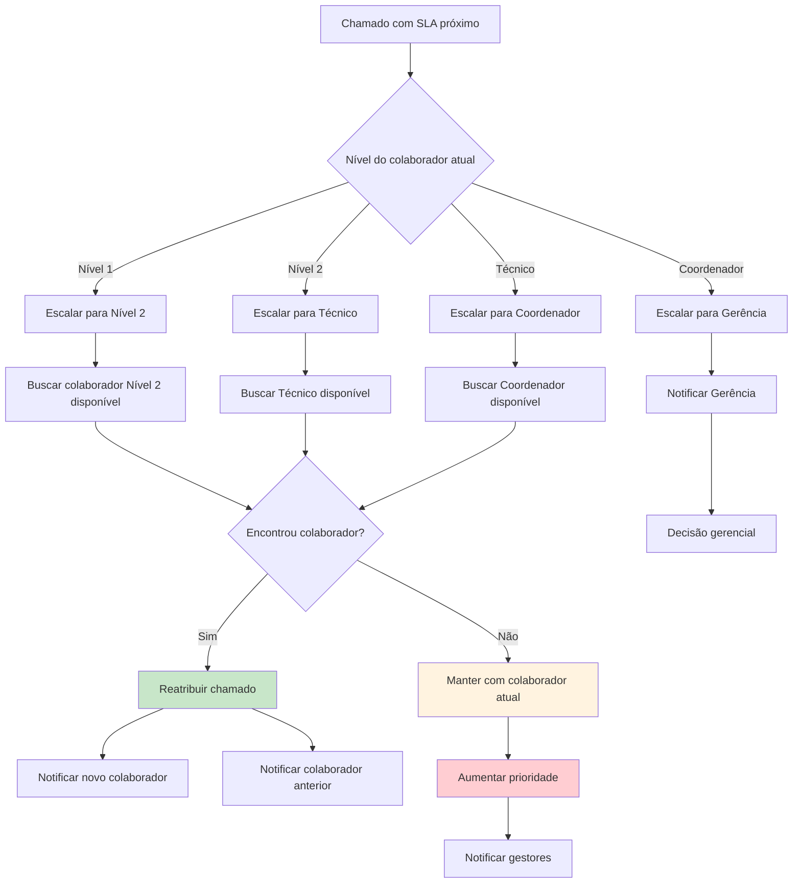
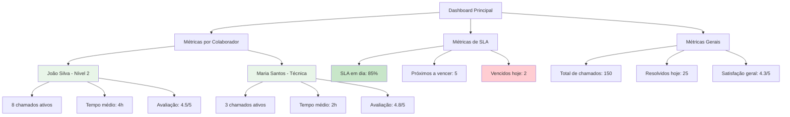

# Fluxograma Completo - Módulo de Suporte

## Fluxo Principal do Sistema de Suporte

## Fluxo de Atribuição de Colaboradores

## Fluxo de Notificações

## Fluxo de Monitoramento de SLA

## Fluxo de Cargos e Níveis de Suporte

## Estrutura de Dados do Colaborador

## Fluxo de Informações do Colaborador

## Processo de Escalação

## Dashboard de Métricas

---

## Legenda dos Fluxogramas

### Cores e Significados
- 🟢 **Verde**: Processos bem-sucedidos
- 🟡 **Amarelo**: Processos de atenção/aviso
- 🔴 **Vermelho**: Processos de erro/crítico
- 🔵 **Azul**: Processos informativos
- ⚪ **Branco**: Processos neutros

### Símbolos
- **Retângulo**: Processo/Ação
- **Losango**: Decisão/Condição
- **Círculo**: Início/Fim
- **Retângulo arredondado**: Dados/Informação

### Tipos de Notificação
1. **Email Corporativo**: Notificação formal via email
2. **Notificação Interna**: Alert no sistema/dashboard
3. **SMS** (futuro): Mensagem de texto para urgências
4. **WhatsApp** (futuro): Mensagem via WhatsApp Business

---

*Fluxograma atualizado em: Janeiro 2025*
*Versão: 1.0*