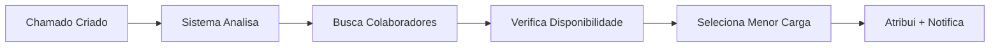
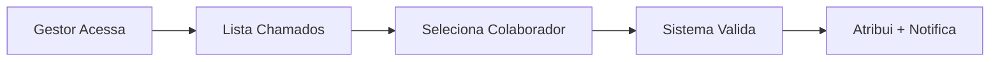

# Guia de Implementação - Módulo de Suporte

## Resumo Executivo

O módulo de suporte foi implementado com sucesso, incluindo:

✅ **Sistema de Atribuição de Colaboradores**
✅ **Notificações por Email e Sistema Interno**  
✅ **Monitoramento de SLA Automático**
✅ **Dashboard com Métricas em Tempo Real**
✅ **APIs REST Completas**

---

## 1. Estrutura de Colaboradores no Sistema

### 1.1 Informações do Colaborador no Chamado

Quando um colaborador é atribuído a um chamado, o sistema registra:

```java
// Dados principais do colaborador
- Nome: "João Silva"
- Matrícula: "12345" (CPF ou código único)
- Cargo: "Suporte Nível 2"
- Email: "joao.silva@empresa.com"
- Departamento: "TI - Suporte"
```

### 1.2 Hierarquia de Cargos Implementada

| Cargo | Prioridades Atendidas | Limite de Chamados | Descrição |
|-------|----------------------|-------------------|-----------|
| **Suporte Nível 1** | BAIXA, MÉDIA | 10 chamados | Primeiro atendimento |
| **Suporte Nível 2** | MÉDIA, ALTA | 8 chamados | Problemas intermediários |
| **Técnico Especialista** | ALTA, CRÍTICA | 5 chamados | Casos complexos |
| **Coordenador** | TODAS | 15 chamados | Gestão e escalação |

---

## 2. Sistema de Notificações Implementado

### 2.1 Notificações por Email Corporativo

O colaborador recebe email automático quando:

#### ✉️ Novo Chamado Atribuído
```
Para: joao.silva@empresa.com
Assunto: Novo Chamado Atribuído - CHM-20250115143022

Olá João Silva (Matrícula: 12345),

Um novo chamado foi atribuído para você:

📋 Número: CHM-20250115143022
📝 Assunto: Problema no sistema de vendas
⚡ Prioridade: ALTA
👤 Cargo: Suporte Nível 2
⏰ SLA: 15/01/2025 às 18:30
👨‍💼 Solicitante: Maria Santos

🔗 Acessar Chamado: http://localhost:8080/suporte/chamado/123

Atenciosamente,
Sistema Portal CEO
```

#### ✅ Chamado Resolvido (para solicitante)
```
Para: maria.santos@empresa.com
Assunto: Chamado Resolvido - CHM-20250115143022

Olá Maria Santos,

Seu chamado foi resolvido:

📋 Número: CHM-20250115143022
📝 Assunto: Problema no sistema de vendas
👨‍🔧 Resolvido por: João Silva (Suporte Nível 2)
⏰ Resolvido em: 15/01/2025 às 16:45

Por favor, avalie o atendimento acessando:
🔗 http://localhost:8080/suporte/avaliar/123
```

### 2.2 Notificações Internas no Sistema

#### 🔔 Dashboard de Notificações
- **Badge vermelho** com contador de notificações não lidas
- **Pop-up** para alertas críticos de SLA
- **Lista** de notificações no menu do usuário

#### Tipos de Notificação Interna:
- 🆕 **Novo chamado atribuído**
- ⚠️ **SLA próximo do vencimento** (1 hora antes)
- 🚨 **SLA vencido**
- ✅ **Chamado resolvido**
- 🔄 **Chamado reaberto**

---

## 3. Fluxo Completo de Atribuição

### 3.1 Atribuição Automática



**Critérios de Seleção:**
1. **Cargo compatível** com a prioridade do chamado
2. **Disponibilidade** (dentro do limite de chamados)
3. **Menor carga** de trabalho atual
4. **Especialização** por categoria (futuro)

### 3.2 Atribuição Manual



---

## 4. Como Usar o Sistema

### 4.1 Para Gestores

#### 📊 Acessar Dashboard
```
URL: http://localhost:8080/suporte
```

**Funcionalidades Disponíveis:**
- ✅ Visualizar todos os chamados
- ✅ Atribuir colaboradores manualmente
- ✅ Acompanhar métricas de SLA
- ✅ Ver estatísticas por colaborador
- ✅ Gerenciar backlog de chamados

#### 👥 Atribuir Colaborador Manualmente
1. Acesse o chamado desejado
2. Clique em "Atribuir Colaborador"
3. Selecione o colaborador na lista
4. Confirme a atribuição
5. Sistema envia notificações automaticamente

### 4.2 Para Colaboradores

#### 📋 Visualizar Seus Chamados
```
URL: http://localhost:8080/suporte
Filtro: "Meus Chamados"
```

#### ✅ Resolver Chamado
1. Acesse o chamado atribuído
2. Trabalhe na solução
3. Clique em "Resolver Chamado"
4. Adicione observações (opcional)
5. Sistema notifica o solicitante

### 4.3 Para Solicitantes

#### 🆕 Abrir Novo Chamado
```
URL: http://localhost:8080/suporte/novo
```

**Campos Obrigatórios:**
- Assunto (5-200 caracteres)
- Descrição (mínimo 10 caracteres)
- Prioridade (BAIXA, MÉDIA, ALTA, CRÍTICA)
- Email para contato

---

## 5. APIs REST Disponíveis

### 5.1 Endpoints de Chamados

```http
# Listar todos os chamados
GET /api/chamados

# Buscar chamado por ID
GET /api/chamados/{id}

# Criar novo chamado
POST /api/chamados
Content-Type: application/json
{
  "assunto": "Problema no sistema",
  "descricao": "Descrição detalhada",
  "prioridade": "ALTA",
  "solicitanteNome": "João Silva",
  "solicitanteEmail": "joao@empresa.com"
}

# Atualizar status
PUT /api/chamados/{id}/status
Content-Type: application/x-www-form-urlencoded
status=RESOLVIDO
```

### 5.2 Endpoints de Atribuição

```http
# Atribuir colaborador específico
POST /api/chamados/{id}/atribuir
Content-Type: application/x-www-form-urlencoded
colaboradorId=123

# Atribuição automática
POST /api/chamados/{id}/atribuir-automatico

# Remover atribuição
DELETE /api/chamados/{id}/atribuir

# Listar colaboradores disponíveis
GET /api/chamados/colaboradores-disponiveis

# Chamados de um colaborador
GET /api/chamados/colaborador/{colaboradorId}
```

### 5.3 Endpoints de Métricas

```http
# Estatísticas gerais
GET /api/chamados/estatisticas

# Estatísticas de SLA
GET /suporte/api/sla-estatisticas

# Tempo médio de primeira resposta
GET /suporte/api/tempo-medio-primeira-resposta
```

---

## 6. Configurações do Sistema

### 6.1 Configurações de Email

```properties
# application.properties
spring.mail.host=smtp.empresa.com
spring.mail.port=587
spring.mail.username=sistema@empresa.com
spring.mail.password=${EMAIL_PASSWORD}
spring.mail.properties.mail.smtp.auth=true
spring.mail.properties.mail.smtp.starttls.enable=true
```

### 6.2 Configurações de SLA

```java
// Prazos automáticos por prioridade
CRITICA = 2 horas
ALTA = 8 horas
MEDIA = 24 horas (1 dia)
BAIXA = 72 horas (3 dias)
```

### 6.3 Configurações de Monitoramento

```java
// SlaMonitoramentoService.java
@Scheduled(fixedRate = 1800000) // 30 minutos
- Alerta CRÍTICO: 1 hora antes do vencimento
- Alerta de AVISO: 4 horas antes do vencimento
```

---

## 7. Monitoramento e Métricas

### 7.1 Dashboard Principal

**Métricas Exibidas:**
- 📊 Total de chamados (hoje/mês)
- ⏱️ Tempo médio de resolução
- 📈 Taxa de cumprimento de SLA
- ⭐ Satisfação média dos clientes
- 👥 Produtividade por colaborador

### 7.2 Alertas Automáticos

#### 🚨 SLA Crítico (1 hora antes)
- Email para colaborador responsável
- Email para gestor imediato
- Notificação vermelha no dashboard

#### ⚠️ SLA Aviso (4 horas antes)
- Email para colaborador responsável
- Notificação amarela no dashboard

#### 💀 SLA Vencido
- Email para gestor e diretor
- Escalação automática (futuro)
- Notificação crítica no dashboard

---

## 8. Troubleshooting

### 8.1 Problemas Comuns

#### ❌ Emails não estão sendo enviados
**Soluções:**
1. Verificar configurações SMTP no `application.properties`
2. Validar credenciais de email
3. Checar logs do `NotificacaoSuporteService`
4. Testar conectividade: `telnet smtp.empresa.com 587`

#### ❌ Colaborador não recebe notificação
**Soluções:**
1. Verificar se email está cadastrado corretamente
2. Checar se colaborador está ativo
3. Validar se cargo permite receber chamados
4. Verificar logs de erro no sistema

#### ❌ SLA não está sendo calculado
**Soluções:**
1. Verificar se scheduler está ativo
2. Validar configurações de prioridade
3. Checar logs do `SlaMonitoramentoService`
4. Verificar se há dados de teste interferindo

### 8.2 Logs Importantes

```bash
# Logs de atribuição
tail -f logs/application.log | grep "AtribuicaoColaboradorService"

# Logs de email
tail -f logs/application.log | grep "NotificacaoSuporteService"

# Logs de SLA
tail -f logs/application.log | grep "SlaMonitoramentoService"
```

---

## 9. Próximos Passos

### 9.1 Melhorias Imediatas
- [ ] **Integração com WhatsApp Business** para notificações urgentes
- [ ] **Chat em tempo real** entre colaborador e solicitante
- [ ] **Base de conhecimento** com soluções comuns
- [ ] **Relatórios avançados** em PDF/Excel

### 9.2 Funcionalidades Futuras
- [ ] **Aplicativo móvel** para colaboradores
- [ ] **IA para classificação** automática de chamados
- [ ] **Integração com Teams/Slack**
- [ ] **Sistema de aprovação** para escalações

---

## 10. Contatos e Suporte

### 10.1 Equipe Técnica
- **Desenvolvedor Principal**: Jasiel Silva
- **Email**: jasiel@empresa.com
- **Documentação**: Portal interno da empresa

### 10.2 Suporte ao Sistema
- **Horário**: Segunda a Sexta, 8h às 18h
- **Email**: suporte.ti@empresa.com
- **Telefone**: (11) 1234-5678

---

## 11. Checklist de Implementação

### ✅ Implementado
- [x] Modelo de dados completo
- [x] Sistema de atribuição automática e manual
- [x] Notificações por email corporativo
- [x] Notificações internas no sistema
- [x] Monitoramento de SLA automático
- [x] Dashboard com métricas
- [x] APIs REST completas
- [x] Documentação técnica
- [x] Fluxogramas detalhados

### 🔄 Em Configuração
- [ ] Configurar servidor SMTP de produção
- [ ] Definir colaboradores e cargos reais
- [ ] Configurar limites de chamados por cargo
- [ ] Treinar equipe de suporte

### 📋 Próximas Fases
- [ ] Testes com usuários reais
- [ ] Ajustes baseados no feedback
- [ ] Implementação de melhorias
- [ ] Expansão para outros módulos

---

*Guia atualizado em: Janeiro 2025*  
*Versão: 1.0*  
*Sistema: Portal CEO - Módulo de Suporte*