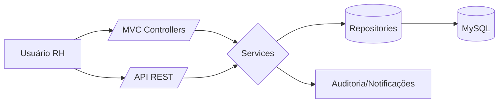

# Produto RH — ERP Corporativo (Padrões SAP)

## Visão Geral
- Módulo RH completo para gestão de colaboradores, ponto, benefícios, folha, avaliação, recrutamento e treinamentos.
- Arquitetado em camadas (Controllers, Services, Repositories, Models, Templates) com Spring Boot 3, Thymeleaf e MySQL.
- Segurança baseada em perfis com `@PreAuthorize` e políticas granulares.

## Arquitetura do Sistema
- Backend: `Spring Boot 3.5.x` (Java 21), validações com `jakarta.validation` e auditoria em serviços RH.
- Frontend: `Thymeleaf`, `Bootstrap 5`, `jQuery` nos templates em `src/main/resources/templates/rh/*`.
- Banco de Dados: `MySQL 8`, entidades JPA com índices e relacionamentos.
- Segurança: Spring Security (sessão), perfis `ROLE_RH`, `ROLE_ADMIN`, `ROLE_MASTER`, `ROLE_GERENCIAL`.
- Padrões: controllers finos, services com regra de negócio, repositórios com consultas e projections.

## Mapa de Funcionalidades
- Colaboradores: cadastro, edição, documentos, histórico, ficha, relatórios.
- Benefícios: adesão e gestão de `vale-transporte`, `vale-refeição`, `plano de saúde`.
- Folha de Pagamento: geração, visualização, holerites, descontos, relatórios.
- Ponto e Escalas: registros, correções, escalas, vigências, exceções, espelho.
- Férias: solicitar, aprovar, planejamento, calendário.
- Avaliação de Desempenho: periodicidade, feedbacks, relatórios.
- Recrutamento: vagas, pipeline, triagem, entrevistas, relatórios.
- Treinamentos: cadastro, cursos, turmas, inscrição, frequência, avaliação, certificados.
- Workflow de Aprovação (Adesão): aprovação/rejeição com métricas.
- Relatórios RH: turnover, admissões/demissões, férias/benefícios, headcount, indicadores.

## Principais Componentes (caminhos)
- Colaboradores: `src/main/java/com/jaasielsilva/portalceo/controller/rh/colaborador/ColaboradorController.java`
- Folha: `src/main/java/com/jaasielsilva/portalceo/controller/rh/folha/FolhaPagamentoController.java`
- Ponto/Escalas: `src/main/java/com/jaasielsilva/portalceo/controller/rh/PontoEscalasController.java`
- Recrutamento API/MVC: `src/main/java/com/jaasielsilva/portalceo/controller/rh/RecrutamentoApiController.java` / `RecrutamentoController.java`
- Treinamentos API/MVC: `src/main/java/com/jaasielsilva/portalceo/controller/rh/TreinamentosApiController.java` / `TreinamentosController.java`
- Workflow: `src/main/java/com/jaasielsilva/portalceo/controller/rh/WorkflowAdesaoController.java`
- Relatórios RH: `src/main/java/com/jaasielsilva/portalceo/controller/rh/RhRelatoriosController.java`

## Fluxos de Dados (Mermaid)

## Modelagem de Banco de Dados (Entidades-chave)
- Colaborador: dados pessoais, profissionais, endereço, benefícios, supervisor, histórico.
- Benefício: catálogo e associação `ColaboradorBeneficio` com valor e status.
- RegistroPonto: marcações, totais, atraso/hora extra, status e correções.
- EscalaTrabalho: horários, dias, tolerâncias, vigências.
- FolhaPagamento/Holerite: totais, proventos/descontos, vínculos a colaborador.
- AvaliacaoDesempenho: período, status, nota, feedback.
- Recrutamento: candidato, vaga, candidatura, entrevista, avaliação, divulgação.
- Treinamentos: curso, instrutor, turma, matrícula, frequência, avaliação.

## Especificações Técnicas por Módulo
- Colaboradores: validações robustas, criação/edição via MVC e REST; benefícios tratados em `BeneficioService`.
- Folha: geração e listagem paginada com projections (`HoleriteRepository`), renderização de PDF (`openhtmltopdf`).
- Ponto/Escalas: cálculo automático de horas, atraso e hora extra em `RegistroPonto`.
- Recrutamento: endpoints REST completos, integração agenda e métricas.
- Treinamentos: serviços para turma, matrícula, frequência e avaliação, lembretes e certificados.
- Workflow: API de aprovação/rejeição, relatórios e métricas consolidadas.
- Relatórios RH: endpoints com agregações e páginas Chart.js.

## Segurança e Conformidade
- RBAC por perfis; validações server-side em DTOs/Models.
- Auditoria de acessos/alterações no RH; logs operacionais em controllers/services.
- Boas práticas LGPD: mascaramento de dados sensíveis em relatórios, restrição de campos.

## Integrações
- Email corporativo para notificações (serviços RH).
- Agenda corporativa para entrevistas e turmas.
- Exportações CSV/PDF em relatórios RH, recrutamento e treinamentos.

## Padrões de ERP (inspirado SAP)
- Processos com aprovação e histórico.
- Catálogo de benefícios e políticas parametrizáveis.
- Relatórios gerenciais com métricas e filtros.
- Separação clara entre operação (MVC) e exposição (API).

