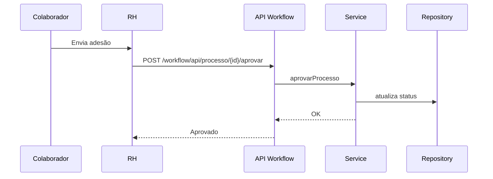

# Workflows e Processos — Módulo RH

## Processos Padrão
- Admissão (Adesão): coleta de documentos, benefícios, revisão e envio para aprovação.
- Folha: processamento mensal, geração de holerites, distribuição e ajustes.
- Ponto: registro diário, correções e exceções, espelho e consolidação.
- Benefícios: adesão e manutenção; controle de custos e vigências.
- Férias: solicitações, aprovações, planejamento.
- Avaliação: abertura de período, submissão, aprovação/reprovação.
- Recrutamento: vaga → candidaturas → entrevistas → avaliações → decisão.
- Treinamentos: criação de turmas, matrícula, frequência e avaliação.

## Workflow de Aprovação (Adesão)
- Páginas: `templates/rh/workflow-aprovacao.html`, `workflow-relatorios.html`, `processo-detalhes.html`.
- API de processos: listar, buscar, aprovar, rejeitar, relatórios, métricas.
  - Listar processos: `src/main/java/com/jaasielsilva/portalceo/controller/rh/WorkflowAdesaoController.java:51-79`
  - Detalhes: `.../WorkflowAdesaoController.java:92-119`
  - Aprovar: `.../WorkflowAdesaoController.java:151-215`
  - Relatórios: `.../WorkflowAdesaoController.java:364-392`
  - Métricas: `.../WorkflowAdesaoController.java:405-432`

## Fluxo Admissão (Mermaid)

## Integrações
- E-mail: notificações de novos processos e decisões.
- Agenda: entrevistas e turmas de treinamento.
- Relatórios: exportações CSV/PDF em RH, recrutamento e treinamentos.

## Fluxos Alternativos e Exceções
- Rejeição de processo com motivo e auditoria — `AdesaoColaboradorController.java:1209-1234`.
- Correção de ponto e abono — `PontoEscalasController.java:450-455`, `RegistroPonto.java:193-201`.
- Reprocessamento de folha e emissão de holerites por colaborador — `FolhaPagamentoController.java:324-371,451-478`.

