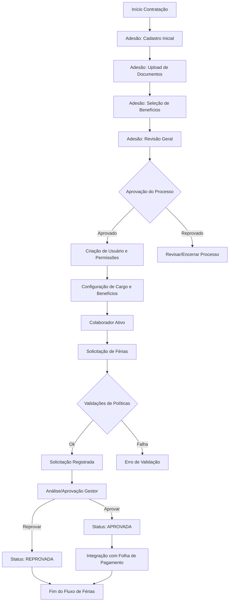
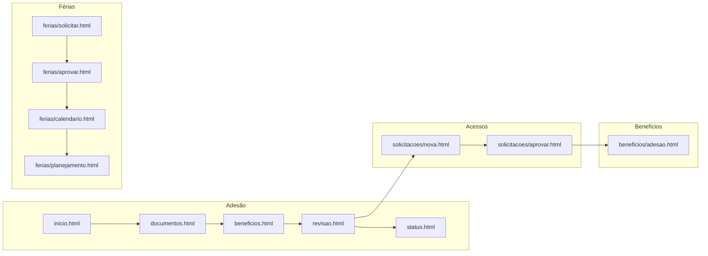
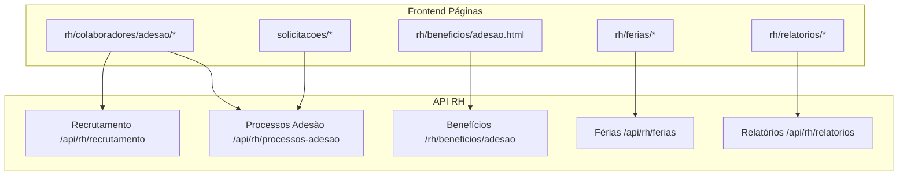
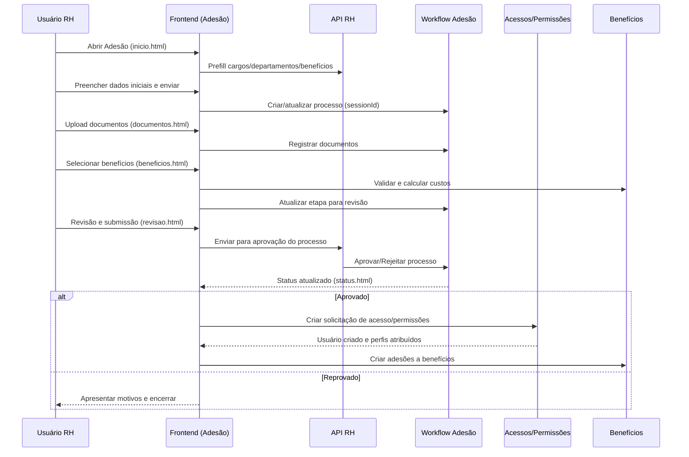
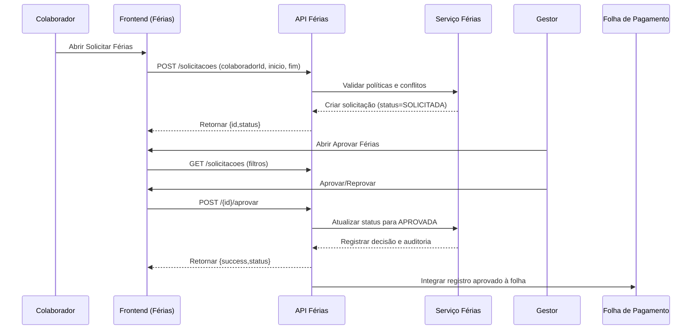

# Fluxograma Completo do Módulo de RH: Contratação → Solicitação/Aprovação de Férias

Este documento apresenta o fluxograma completo do sistema de RH, cobrindo desde a contratação de um colaborador até a solicitação e aprovação de férias. Inclui mapeamento de páginas, diagrama dos endpoints da API, detalhamento dos fluxos de contratação e de férias, padronização visual e uma seção de validação.

## 1. Visão Geral do Fluxo

## 2. Mapeamento de Páginas do Frontend

- `rh/colaboradores/adesao/inicio.html`
  - Descrição: primeira etapa do processo de adesão do colaborador (cadastro inicial).
  - Relacionamentos: conduz para `documentos.html` → `beneficios.html` → `revisao.html` → `status.html`.
  - Campos/Formulários: dados pessoais (nome, email), vínculos (cargo, departamento), supervisor, benefícios iniciais sugeridos.
- `rh/colaboradores/adesao/documentos.html`
  - Descrição: envio/gestão de documentos do colaborador.
  - Relacionamentos: depende do cadastro inicial; segue para seleção de benefícios.
  - Campos/Formulários: anexos obrigatórios (RG, CPF, comprovante de residência), observações.
- `rh/colaboradores/adesao/beneficios.html`
  - Descrição: seleção de benefícios e cálculo de custos.
  - Relacionamentos: após documentos; antes da revisão final.
  - Campos/Formulários: seleção de plano de saúde, vale-transporte, vale-refeição, dependentes, datas de vigência.
- `rh/colaboradores/adesao/revisao.html`
  - Descrição: revisão geral dos dados para submissão do processo.
  - Relacionamentos: valida com o workflow e prepara aprovação.
  - Campos/Formulários: confirmação de dados, resumo de custos de benefícios.
- `rh/colaboradores/adesao/status.html`
  - Descrição: visualização do status em tempo real do processo de adesão.
  - Relacionamentos: consulta ao workflow e histórico.
  - Campos/Formulários: nenhum formulário principal; painéis de status e histórico.
- `rh/beneficios/adesao.html`
  - Descrição: gestão de adesões a benefícios (plano de saúde, vale-transporte etc.).
  - Relacionamentos: usado na etapa de configuração pós-aprovação.
  - Campos/Formulários: seleção de plano, quantidade de dependentes, datas e observações.
- `rh/ferias/solicitar.html`
  - Descrição: formulário de solicitação de férias pelo colaborador.
  - Relacionamentos: cria solicitação que vai para análise do gestor.
  - Campos/Formulários: período início/fim, observações.
- `rh/ferias/aprovar.html`
  - Descrição: tela para gestores aprovarem/reprovarem solicitações.
  - Relacionamentos: consome lista de solicitações e executa decisão.
  - Campos/Formulários: campo de observações; ações de aprovar/reprovar.
- `rh/ferias/calendario.html`
  - Descrição: visão de calendário de férias por equipe/departamento.
  - Relacionamentos: apoiado por relatórios e políticas de férias.
  - Campos/Formulários: filtros por departamento, período.
- `rh/ferias/planejamento.html`
  - Descrição: planejamento de férias em escala anual.
  - Relacionamentos: integração com políticas e headcount.
  - Campos/Formulários: ajustes de períodos, aprovações em lote.
- `solicitacoes/nova.html`
  - Descrição: abertura de solicitação de acesso/permissões.
  - Relacionamentos: suporte ao onboarding para criação de usuário e permissões.
  - Campos/Formulários: tipo de usuário, módulos, nível de acesso, prazo, justificativa.
- `solicitacoes/aprovar.html`
  - Descrição: aprovação de solicitações de acesso.
  - Relacionamentos: atribui permissões ao colaborador; notifica solicitante e administradores.
  - Campos/Formulários: nível aprovado, email corporativo, observações.

## 3. Diagrama de Endpoints da API

- Recrutamento (`/api/rh/recrutamento`)
  - `POST /candidatos` → cria candidato; entrada: `nome`, `email`, `telefone`, `genero`, `dataNascimento`; saída: `{success,id}`; status: `200`, `400`.
  - `GET /candidatos` → lista candidatos; filtros: `q`, `nome`, `email`, `telefone`, `genero`, `nasc`, paginação `page/size`; saída: `Page<Candidato>`; status: `200`.
  - `POST /candidaturas` → vincula candidato à vaga; entrada: `candidatoId`, `vagaId`, `origem`; saída `{success,id}`; status: `200`, `400`.
  - `POST /candidaturas/{id}/entrevistas` → agenda entrevista; entrada: `inicio`, `fim`, `local`, `tipo`; saída `{success,id,agendaEventoId}`; status: `200`.
  - `POST /candidaturas/{id}/avaliacao` → registra avaliação; entrada: `nota`, `feedback`; saída `{success,id}`; status: `200`.
  - `POST /candidaturas/{id}/etapa` → altera etapa do pipeline; entrada: `etapa`; saída `{success,etapa}`; status: `200`.
  - `GET /vagas` → lista vagas; filtros: `status`, `page`, `size`; saída: `Page<Vaga>`; status: `200`.
  - `GET /cargos` → prefill de cargos e benefícios; saída: lista de mapas com cargo/departamentos/benefícios; status: `200`.
  - `GET /departamentos` → lista departamentos; status: `200`.
  - Relação com páginas: `rh/recrutamento/*` e `rh/colaboradores/adesao/inicio.html` para prefill.
- Processo de Adesão (`/api/rh/processos-adesao`)
  - `GET /aguardando-aprovacao` → processos pendentes; status: `200`.
  - `GET /status/{status}` → por status; status: `200`, `400`.
  - `GET /{id}` → processo específico; status: `200`, `404`.
  - `GET /sessao/{sessionId}` → por sessão; status: `200`, `404`.
  - `POST /{id}/aprovar` → aprova processo; entrada JSON: `aprovadoPor`, `observacoes`; saída `{success,message,processo}`; status: `200`, `400`.
  - `POST /{id}/rejeitar` → rejeita processo; entrada JSON: `rejeitadoPor`, `motivoRejeicao`; status: `200`, `400`.
  - `GET /{id}/historico` e `GET /sessao/{sessionId}/historico` → histórico; status: `200`.
  - `GET /sessao/{sessionId}/revisao` → dados de revisão; status: `200`.
  - `GET /estatisticas` → métricas; status: `200`.
  - `POST /sessao/{sessionId}/cancelar` → cancelamento; entrada opcional `motivo`; saída `{success,message,processo}`; status: `200`, `400`.
  - Relação com páginas: `rh/colaboradores/adesao/revisao.html`, `status.html` e telas gerenciais.
- Benefícios (`/rh/beneficios/adesao`)
  - `GET /` → lista adesões/colaboradores/planos; status: `200`.
  - `GET /verificar-colaborador/{colaboradorId}` → verifica adesão ativa; saída `{possuiAdesaoAtiva,...}`; status: `200`, `400`.
  - `POST /salvar` → cria adesão a plano; entrada: `colaboradorId`, `planoId?`, `tipoAdesao`, `quantidadeDependentes?`, `dataVigencia`, `observacoes?`; status: `200`, `400`.
  - `POST /salvar/{id}` → edita adesão; entrada JSON com campos opcionais; status: `200`, `400`.
  - `POST /vale-transporte/salvar` → salva VT; entrada JSON: `colaboradorId`, `valorMensal`, `dataInicio`, etc.; status: `200`, `400`.
  - Relação com páginas: `rh/beneficios/adesao.html` e `rh/colaboradores/adesao/beneficios.html`.
- Férias (`/api/rh/ferias`)
  - `POST /solicitacoes` → solicita férias; entrada: `colaboradorId`, `inicio`, `fim`, `observacoes?`; saída `{success,id,status}`; status: `200`, `400`.
  - `GET /solicitacoes` → lista solicitações; filtros: `status`, `inicio?`, `fim?`, `page`, `size`; saída `Page<SolicitacaoFeriasDTO>`; status: `200`.
  - `POST /{id}/aprovar` → aprova; entrada: `observacoes?`; saída `{success,id,status}`; status: `200`, `400`.
  - Relação com páginas: `rh/ferias/solicitar.html`, `rh/ferias/aprovar.html`, `rh/ferias/calendario.html`.
- Relatórios RH (`/api/rh/relatorios`)
  - `GET /ferias-beneficios` → agrega métricas de férias e benefícios; entrada: `inicio`, `fim`; status: `200`.
  - `GET /ferias-beneficios/orcamento` → orçamento estimado; entrada: `inicio`, `fim`; status: `200`.
  - `GET /headcount` e outros relatórios; entradas: período e filtros; status: `200`.
  - Relação com páginas: `rh/relatorios/ferias-beneficios.html`, `rh/relatorios/headcount.html`.

## 4. Fluxo Detalhado da Contratação

- Cadastro inicial do colaborador: preenche dados pessoais, cargo, departamento e supervisor.
- Atribuição de acessos e permissões: cria solicitação e, após aprovação, o usuário recebe perfis e autorizações conforme políticas.
- Configuração do cargo e benefícios: vincula cargo ao colaborador e registra adesões (plano de saúde, VT, VR), com cálculo de custos e vigência.

## 5. Fluxo de Solicitação e Aprovação de Férias

- Páginas de solicitação pelo colaborador: período e observações, com validação de políticas e blackouts.
- Páginas de análise/aprovação pelo gestor: listagem, filtros e ações com observações.
- Notificações e status intermediários: atualização de status e auditoria; notificações a solicitante e administradores.
- Integração com folha de pagamento: registros aprovados alimentam relatórios e cálculos de custos.

## 6. Padronização Visual do Fluxo

- Representação clara das interações: cada etapa nomeada e conectada, sem ambiguidade.
- Sequência lógica das ações: ordem linear com pontos de retorno apenas em decisão.
- Destaque de pontos de decisão/validação: nós com formato de losango indicam validações (ex.: política de férias, aprovação do processo).
- Ícones consistentes e nomenclatura padrão: Adesão, Benefícios, Férias, Acessos, Folha.
- Cores por domínio (sugestão): Adesão (azul), Acessos (roxo), Benefícios (verde), Férias (laranja), Folha (cinza).

## 7. Validação e Consistência do Sistema

- Verificar páginas e navegação
  - Acessar `rh/colaboradores/adesao/inicio.html` → seguir etapas até `status.html` sem erros.
  - Validar que os modelos carregam `cargos`, `departamentos`, `beneficios`, `supervisores` conforme esperado.
- Verificar endpoints
  - Recrutamento: criar candidato e listar; validar status `200/400` e payloads esperados.
  - Processo de adesão: aprovar/rejeitar; verificar transições de status e histórico.
  - Benefícios: salvar adesão e VT; validar regras de negócio e dados persistidos.
  - Férias: solicitar e aprovar; validar prevenção de conflitos e política de dias.
- Verificar segurança e perfis
  - Checar `@PreAuthorize` nas rotas sensíveis (RH, GERENCIAL, ADMIN, MASTER).
  - Garantir que somente perfis adequados acessam aprovação e configurações.
- Verificar integração com folha
  - Geração de relatórios (`headcount`, `ferias-beneficios`) para períodos com solicitações aprovadas.
- Auditoria e notificações
  - Confirmar registros de auditoria em solicitações/decisões e envio de notificações aos usuários.

---

Referências de Código (principais pontos):

- Páginas Férias: mapeadas em `FeriasController` (`src/main/java/com/jaasielsilva/portalceo/controller/rh/FeriasController.java`).
- API Férias: `FeriasApiController` → `POST /solicitacoes`, `GET /solicitacoes`, `POST /{id}/aprovar` (`src/main/java/com/jaasielsilva/portalceo/controller/rh/FeriasApiController.java`).
- Serviço Férias: validações e políticas em `SolicitacaoFeriasService` (`src/main/java/com/jaasielsilva/portalceo/service/rh/SolicitacaoFeriasService.java`).
- Adesão Colaborador (páginas e APIs auxiliares): `AdesaoColaboradorController` (`src/main/java/com/jaasielsilva/portalceo/controller/rh/colaborador/AdesaoColaboradorController.java`).
- Processo de Adesão (API): `ProcessoAdesaoController` (`src/main/java/com/jaasielsilva/portalceo/controller/ProcessoAdesaoController.java`).
- Benefícios: `AdesaoPlanoSaudeController` (`src/main/java/com/jaasielsilva/portalceo/controller/rh/beneficios/AdesaoPlanoSaudeController.java`).
- Recrutamento: `RecrutamentoApiController` (`src/main/java/com/jaasielsilva/portalceo/controller/rh/RecrutamentoApiController.java`).
- Relatórios RH: `RhRelatoriosApiController` (`src/main/java/com/jaasielsilva/portalceo/controller/rh/RhRelatoriosApiController.java`).

